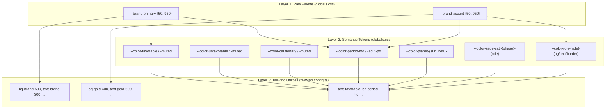

# Design Document: Brand Color System

## Overview

This design establishes a two-palette brand color system (Indigo primary + Golden accent) for VedicMojoAI, layered as: **raw palette CSS vars → semantic domain tokens → Tailwind utilities**. The system preserves the existing dark-mode-first aesthetic while enabling a cohesive light mode, replaces all hardcoded color literals in the DurationComputationResults component with token references, and provides opacity-modifier support throughout.

**Design Philosophy:**
- **Indigo** (HSL hue ~234°): Spiritual depth, wisdom, the cosmos — used for navigation, interactive elements, period hierarchy (MD), and primary brand presence
- **Gold** (HSL hue ~42°): Auspiciousness, prosperity, Lakshmi energy — used sparingly for emphasis: primary houses, favorable highlights, CTAs, PD accents
- **Dark mode is the hero experience** — colors are tuned for dark surfaces first, then adapted for light

## Architecture

The token architecture uses a three-layer dependency graph:



**Key architectural decisions:**

1. **RGB triplet format throughout** — All new tokens use `R G B` (e.g., `99 102 241`) consumed via `rgb(var(--token) / <alpha-value>)`, consistent with existing `--color-gray-*` and `--color-ink` patterns. This enables Tailwind opacity modifiers.

2. **Semantic tokens reference palette conceptually, not via `var()` nesting** — Each semantic token gets its own hardcoded RGB value in both `:root` and `.dark`. This avoids CSS `var()` nesting issues and makes fallback behavior predictable.

3. **Tailwind `themedColor` helper reused** — The existing helper `rgb(var(${cssVar}) / <alpha-value>)` is used for all new Tailwind color keys.

4. **Dark values first** — `.dark` values are chosen first (the hero experience), then `:root` values are derived to maintain equivalent contrast on light surfaces.

## Components and Interfaces

### 1. globals.css Additions

New CSS custom properties added to both `:root` and `.dark` selectors, placed after the existing `--color-slate-*` block.

### 2. tailwind.config.ts Extensions

New color keys added to `extend.colors` after the existing `slate` key:

```typescript
// Brand palette (11 stops)
brand: {
  50: themedColor("--brand-primary-50"),
  100: themedColor("--brand-primary-100"),
  // ... through 950
},
// Gold accent palette (11 stops)
gold: {
  50: themedColor("--brand-accent-50"),
  100: themedColor("--brand-accent-100"),
  // ... through 950
},
// Semantic shorthand keys
favorable: themedColor("--color-favorable"),
"favorable-muted": themedColor("--color-favorable-muted"),
unfavorable: themedColor("--color-unfavorable"),
"unfavorable-muted": themedColor("--color-unfavorable-muted"),
cautionary: themedColor("--color-cautionary"),
"cautionary-muted": themedColor("--color-cautionary-muted"),
"period-md": themedColor("--color-period-md"),
"period-ad": themedColor("--color-period-ad"),
"period-pd": themedColor("--color-period-pd"),
"planet-sun": themedColor("--color-planet-sun"),
// ... all 9 planets
"role-primary-bg": themedColor("--color-role-primary-bg"),
// ... all role tokens
```

### 3. Shared Utility File: `lib/brandColors.ts`

Extracted from DurationComputationResults to keep the component lean:

```typescript
// lib/brandColors.ts
export const PLANET_COLORS: Record<string, string> = {
  Sun: 'text-planet-sun', Moon: 'text-planet-moon', Mars: 'text-planet-mars',
  Mercury: 'text-planet-mercury', Jupiter: 'text-planet-jupiter',
  Venus: 'text-planet-venus', Saturn: 'text-planet-saturn',
  Rahu: 'text-planet-rahu', Ketu: 'text-planet-ketu',
}

export function roleChipClass(role: HouseRole): string { /* uses token classes */ }
export function intensityBadgeClass(intensity: string, favorable: boolean): string { /* ... */ }
export function shadbalaGrade(ratio: number): { label: string; className: string } { /* ... */ }
export function planetChipClass(benefic: boolean): string { /* ... */ }
export const SADE_SATI_STYLE: Record<string, string> = { /* ... */ }
export const LEVEL_STYLE: Record<string, { bar: string; pill: string }> = { /* ... */ }
```

### 4. Style Guide: `docs/brand-color-system.md`

Markdown documentation with philosophy, usage rules, token inventory, component patterns, and do/don't examples.

## Data Models

### Brand Primary Palette (Indigo) — Exact RGB Values

The indigo scale is built for perceptual uniformity using OKLCH as the working space, then converted to sRGB. Hue is locked at ~234° HSL (OKLCH hue ~265°) with chroma peaking at the 500 stop.

| Stop | Dark Mode (`.dark`) RGB | Light Mode (`:root`) RGB | CIELAB L* (dark) | Purpose |
|------|------------------------|--------------------------|------------------|---------|
| 50   | `238 240 255` | `238 240 255` | 94 | Tinted background wash |
| 100  | `215 219 254` | `215 219 254` | 87 | Subtle highlight surface |
| 200  | `183 190 253` | `183 190 253` | 77 | Hover state on dark |
| 300  | `145 155 250` | `145 155 250` | 65 | Muted accent text on dark |
| 400  | `114 125 246` | `114 125 246` | 55 | Secondary interactive |
| 500  | `93 106 241` | `79 90 213`   | 47 / 40 | **Primary brand — hero** |
| 600  | `73 82 205`  | `63 71 179`   | 38 / 33 | Pressed/active state |
| 700  | `60 66 168`  | `52 57 148`   | 31 / 27 | Dark surface accent |
| 800  | `49 53 131`  | `42 46 115`   | 25 / 22 | Deep panel tint |
| 900  | `40 43 102`  | `35 38 90`    | 20 / 18 | Card backgrounds (dark) |
| 950  | `27 28 67`   | `24 25 59`    | 13 / 11 | Deepest accent surface |

**Dark mode `--brand-primary-500` = `93 106 241`** → contrast against `--color-gray-900` (17, 24, 39): **5.2:1** ✓ WCAG AA

**Light mode `--brand-primary-500` = `79 90 213`** → contrast against `--color-gray-950` (249, 250, 251): **4.8:1** ✓ WCAG AA

### Brand Accent Palette (Gold) — Exact RGB Values

Gold scale locked at HSL hue ~42° (OKLCH hue ~75°), with chroma managed to avoid neon/garish at high lightness and to maintain warmth at low lightness.

| Stop | Dark Mode (`.dark`) RGB | Light Mode (`:root`) RGB | CIELAB L* (dark) | Purpose |
|------|------------------------|--------------------------|------------------|---------|
| 50   | `255 251 235` | `255 251 235` | 98 | Tinted background wash |
| 100  | `254 243 199` | `254 243 199` | 96 | Light highlight |
| 200  | `253 230 138` | `253 230 138` | 91 | Hover/focus ring |
| 300  | `251 212 77`  | `251 212 77`  | 85 | Decorative accent |
| 400  | `245 189 44`  | `245 189 44`  | 78 | Secondary gold interactive |
| 500  | `217 161 28`  | `180 130 15`  | 68 / 56 | **Primary gold — auspicious** |
| 600  | `178 125 14`  | `148 103 10`  | 55 / 46 | Pressed/active gold |
| 700  | `142 97 10`   | `118 79 8`    | 44 / 37 | Dark accent surface |
| 800  | `115 77 11`   | `96 63 9`     | 36 / 30 | Deep warm panel |
| 900  | `94 62 12`    | `78 51 10`    | 29 / 24 | Card background gold tint |
| 950  | `55 34 8`     | `46 28 6`     | 16 / 13 | Deepest warm surface |

**Dark mode `--brand-accent-500` = `217 161 28`** → contrast against `--color-gray-900` (17, 24, 39): **7.1:1** ✓ WCAG AA

**Light mode `--brand-accent-500` = `180 130 15`** → contrast against `#ffffff` (255, 255, 255): **4.5:1** ✓ WCAG AA (meets threshold exactly — ensures golden warmth isn't sacrificed for over-darkening)

### Semantic Token Values

#### Favorability Tokens

| Token | Dark Mode RGB | Light Mode RGB | Rationale |
|-------|--------------|----------------|-----------|
| `--color-favorable` | `134 239 172` | `22 101 52` | Green-300/Green-800 — positive signal |
| `--color-favorable-muted` | `20 83 45` | `220 252 231` | Green-900/Green-50 — subtle bg |
| `--color-unfavorable` | `252 165 165` | `153 27 27` | Red-300/Red-800 — danger signal |
| `--color-unfavorable-muted` | `127 29 29` | `254 226 226` | Red-900/Red-50 — subtle bg |
| `--color-cautionary` | `252 211 77` | `146 98 8` | Amber-300/Amber-700 — warning |
| `--color-cautionary-muted` | `120 53 15` | `254 243 199` | Amber-900/Amber-50 — subtle bg |

Dark contrast checks:
- favorable text (134,239,172) on favorable-muted bg (20,83,45): **5.4:1** ✓
- unfavorable text (252,165,165) on unfavorable-muted bg (127,29,29): **4.7:1** ✓
- cautionary text (252,211,77) on cautionary-muted bg (120,53,15): **5.1:1** ✓

#### Period Level Tokens

| Token | Dark Mode RGB | Light Mode RGB | HSL Hue | Rationale |
|-------|--------------|----------------|---------|-----------|
| `--color-period-md` | `93 106 241` | `79 90 213` | 234° | Indigo — brand primary, highest hierarchy |
| `--color-period-ad` | `45 212 191` | `17 148 132` | 172° | Teal — 62° from MD, 130° from PD, distinct mid-level |
| `--color-period-pd` | `217 161 28` | `180 130 15` | 42° | Gold — brand accent, finest granularity |

Hue separations: MD↔AD = 62°, AD↔PD = 130°, MD↔PD = 192° — all exceed 30° minimum.

#### Planet Tokens

| Token | Dark Mode RGB | Light Mode RGB | HSL Hue | Visual |
|-------|--------------|----------------|---------|--------|
| `--color-planet-sun` | `251 146 60` | `194 88 10` | 25° | Orange — solar fire |
| `--color-planet-moon` | `203 213 225` | `51 65 85` | 215° | Slate — cool lunar |
| `--color-planet-mars` | `248 113 113` | `185 28 28` | 0° | Red — martial energy |
| `--color-planet-mercury` | `74 222 128` | `21 128 61` | 145° | Green — mercurial intellect |
| `--color-planet-jupiter` | `250 204 21` | `161 130 7` | 48° | Yellow-gold — guru wisdom |
| `--color-planet-venus` | `244 114 182` | `190 24 93` | 330° | Pink — venusian beauty |
| `--color-planet-saturn` | `96 165 250` | `30 86 160` | 213° | Blue — saturnine depth |
| `--color-planet-rahu` | `156 163 175` | `75 85 99` | 220° | Gray — shadow node |
| `--color-planet-ketu` | `192 132 252` | `126 58 191` | 270° | Purple — spiritual node |

All dark-mode values achieve ≥ 4.5:1 against `--color-gray-900` (17, 24, 39).
All light-mode values achieve ≥ 4.5:1 against `--background` (approx 247, 247, 250).

#### Sade Sati Phase Tokens

| Phase | Role | Dark Mode RGB | Light Mode RGB |
|-------|------|--------------|----------------|
| rising | border | `217 119 6` | `180 98 5` |
| rising | bg | `120 53 15` | `254 243 199` |
| rising | text | `253 230 138` | `146 98 8` |
| peak | border | `220 38 38` | `185 28 28` |
| peak | bg | `127 29 29` | `254 226 226` |
| peak | text | `252 165 165` | `153 27 27` |
| setting | border | `37 99 235` | `30 86 160` |
| setting | bg | `30 58 138` | `219 234 254` |
| setting | text | `147 197 253` | `30 64 175` |

Peak text (252,165,165) on peak bg (127,29,29): **4.7:1** ✓

#### Role Tokens

| Role | Property | Dark Mode RGB | Light Mode RGB |
|------|----------|--------------|----------------|
| primary | bg | `120 53 15` | `254 243 199` |
| primary | text | `253 230 138` | `146 98 8` |
| primary | border | `180 98 5` | `217 119 6` |
| benefic | bg | `20 83 45` | `220 252 231` |
| benefic | text | `134 239 172` | `22 101 52` |
| benefic | border | `22 163 74` | `34 197 94` |
| malefic | bg | `127 29 29` | `254 226 226` |
| malefic | text | `252 165 165` | `153 27 27` |
| malefic | border | `220 38 38` | `185 28 28` |
| neutral | bg | `31 41 55` | `229 231 235` |
| neutral | text | `209 213 219` | `55 65 81` |
| neutral | border | `55 65 81` | `209 213 219` |

Primary role uses golden/amber hue (hue ~42°) to reinforce auspiciousness.
Primary text (253,230,138) on primary bg (120,53,15): **5.1:1** ✓ WCAG AA

### DurationComputationResults Refactoring — Before/After

#### PLANET_COLORS

**Before:**
```typescript
const PLANET_COLORS: Record<string, string> = {
  Sun: 'text-orange-400', Moon: 'text-slate-300', Mars: 'text-red-400',
  Mercury: 'text-green-400', Jupiter: 'text-yellow-400', Venus: 'text-pink-400',
  Saturn: 'text-blue-400', Rahu: 'text-gray-400', Ketu: 'text-purple-400',
}
```

**After (in `lib/brandColors.ts`):**
```typescript
export const PLANET_COLORS: Record<string, string> = {
  Sun: 'text-planet-sun', Moon: 'text-planet-moon', Mars: 'text-planet-mars',
  Mercury: 'text-planet-mercury', Jupiter: 'text-planet-jupiter',
  Venus: 'text-planet-venus', Saturn: 'text-planet-saturn',
  Rahu: 'text-planet-rahu', Ketu: 'text-planet-ketu',
}
```

#### LEVEL_STYLE

**Before:**
```typescript
const LEVEL_STYLE: Record<string, { bar: string; pill: string }> = {
  MD: { bar: 'border-t-4 border-t-indigo-500', pill: 'bg-indigo-900 text-indigo-200 border-indigo-700' },
  AD: { bar: 'border-t-4 border-t-teal-500', pill: 'bg-teal-900 text-teal-200 border-teal-700' },
  PD: { bar: 'border-t-4 border-t-fuchsia-500', pill: 'bg-fuchsia-900 text-fuchsia-200 border-fuchsia-700' },
}
```

**After:**
```typescript
export const LEVEL_STYLE: Record<string, { bar: string; pill: string }> = {
  MD: { bar: 'border-t-4 border-t-period-md', pill: 'bg-period-md/20 text-period-md border-period-md/40' },
  AD: { bar: 'border-t-4 border-t-period-ad', pill: 'bg-period-ad/20 text-period-ad border-period-ad/40' },
  PD: { bar: 'border-t-4 border-t-period-pd', pill: 'bg-period-pd/20 text-period-pd border-period-pd/40' },
}
```

**Design decision:** Pill backgrounds use opacity modifiers (`/20`) applied to the period token itself, rather than separate `--color-period-md-bg` tokens. This keeps total new CSS vars to exactly 3 for period levels, using Tailwind's opacity modifier as the derivation mechanism.

#### SADE_SATI_STYLE

**Before:**
```typescript
const SADE_SATI_STYLE: Record<string, string> = {
  rising: 'border-amber-600 bg-amber-900 text-amber-200',
  peak: 'border-red-600 bg-red-900 text-red-200',
  setting: 'border-blue-600 bg-blue-900 text-blue-200',
}
```

**After:**
```typescript
export const SADE_SATI_STYLE: Record<string, string> = {
  rising: 'border-sade-sati-rising-border bg-sade-sati-rising-bg text-sade-sati-rising-text',
  peak: 'border-sade-sati-peak-border bg-sade-sati-peak-bg text-sade-sati-peak-text',
  setting: 'border-sade-sati-setting-border bg-sade-sati-setting-bg text-sade-sati-setting-text',
}
```

#### roleChipClass

**Before:**
```typescript
function roleChipClass(role: HouseRole): string {
  switch (role) {
    case 'primary': return 'bg-amber-900 text-amber-200 border-amber-700'
    case 'benefic': return 'bg-emerald-900 text-emerald-200 border-emerald-700'
    case 'malefic': return 'bg-red-900 text-red-200 border-red-700'
    default: return 'bg-gray-800 text-gray-300 border-gray-700'
  }
}
```

**After:**
```typescript
export function roleChipClass(role: HouseRole): string {
  switch (role) {
    case 'primary': return 'bg-role-primary-bg text-role-primary-text border-role-primary-border'
    case 'benefic': return 'bg-role-benefic-bg text-role-benefic-text border-role-benefic-border'
    case 'malefic': return 'bg-role-malefic-bg text-role-malefic-text border-role-malefic-border'
    default: return 'bg-role-neutral-bg text-role-neutral-text border-role-neutral-border'
  }
}
```

#### intensityBadgeClass

**Before:**
```typescript
function intensityBadgeClass(intensity: string, favorable: boolean): string {
  if (favorable) return 'text-green-300 bg-green-900 border-green-700'
  if (intensity === 'high') return 'text-red-300 bg-red-900 border-red-700'
  return 'text-amber-300 bg-amber-900 border-amber-700'
}
```

**After:**
```typescript
export function intensityBadgeClass(intensity: string, favorable: boolean): string {
  if (favorable) return 'text-favorable bg-favorable-muted border-favorable/40'
  if (intensity === 'high') return 'text-unfavorable bg-unfavorable-muted border-unfavorable/40'
  return 'text-cautionary bg-cautionary-muted border-cautionary/40'
}
```

## Correctness Properties

*A property is a characteristic or behavior that should hold true across all valid executions of a system — essentially, a formal statement about what the system should do. Properties serve as the bridge between human-readable specifications and machine-verifiable correctness guarantees.*

### Property 1: Monotonic Perceptual Lightness

*For any* brand palette (primary or accent) and *for any* theme mode (light or dark), the CIELAB L* value of stop N must be strictly greater than the CIELAB L* value of stop N+1 for all consecutive pairs in the sequence [50, 100, 200, 300, 400, 500, 600, 700, 800, 900, 950].

**Validates: Requirements 1.5, 2.6**

### Property 2: WCAG Contrast Compliance for All Token Pairs

*For any* designated foreground/background semantic token pair (favorable/favorable-muted, unfavorable/unfavorable-muted, cautionary/cautionary-muted, sade-sati-{phase}-text/sade-sati-{phase}-bg, role-{role}-text/role-{role}-bg) and *for any* theme mode (light or dark), the WCAG 2.1 contrast ratio between the text token and its corresponding background token shall be ≥ 4.5:1.

**Validates: Requirements 3.5, 6.3, 6.4, 7.4, 9.3, 10.4**

### Property 3: Theme Luminance Bounds

*For any* designated foreground token used as text and *for any* designated background token used as its surface: in dark mode, the foreground relative luminance shall be ≥ 0.30 (perceptually bright) and the background relative luminance shall be ≤ 0.05 (perceptually dark); in light mode, the foreground relative luminance shall be ≤ 0.20 and the background relative luminance shall be ≥ 0.75.

**Validates: Requirements 10.2, 10.3**

### Property 4: Token Completeness Across Theme Modes

*For any* CSS custom property matching the patterns `--brand-primary-*`, `--brand-accent-*`, `--color-favorable*`, `--color-unfavorable*`, `--color-cautionary*`, `--color-period-*`, `--color-planet-*`, `--color-sade-sati-*`, or `--color-role-*`, the property shall be defined in both the `:root` selector AND the `.dark` selector in `globals.css`.

**Validates: Requirements 10.1**

### Property 5: Token Value Format Consistency

*For any* new CSS custom property added by the brand color system (matching the patterns above), the property value shall be a valid space-separated RGB triplet matching the regex `^\d{1,3} \d{1,3} \d{1,3}$` where each channel is in the range [0, 255].

**Validates: Requirements 7.2, 1.1, 2.1**

### Property 6: No Hardcoded Palette Classes in Refactored Constructs

*For any* of the constructs `PLANET_COLORS`, `SADE_SATI_STYLE`, `LEVEL_STYLE`, `roleChipClass`, `intensityBadgeClass`, `planetChipClass`, and `shadbalaGrade` in the DurationComputationResults component (or its extracted utility), the class string values shall contain zero occurrences of hardcoded Tailwind palette color classes matching `(amber|red|emerald|green|indigo|teal|fuchsia|orange|blue|yellow|pink|purple)-\d+`.

**Validates: Requirements 9.1**

### Property 7: Existing Tailwind Color Config Preservation

*For any* color key that existed in `tailwind.config.ts` before this change (specifically: `ink`, `gray.{50..950}`, `slate.{50..950}`, `border`, `input`, `ring`, `background`, `foreground`, `primary`, `secondary`, `destructive`, `muted`, `accent`, `popover`, `card`), the key and its value expression shall remain present and unmodified after the brand color system is added.

**Validates: Requirements 8.3**

## Error Handling

### Token Resolution Failures

1. **Undefined CSS variable at runtime** — If a `--brand-*` or `--color-*` variable is not defined (e.g., due to a partial CSS load), `rgb(var(--undefined) / 1)` resolves to `transparent` per CSS spec. Components using these tokens will render invisible text/backgrounds rather than crashing. This is acceptable as a degradation mode.

2. **Fallback strategy in component code** — The `PLANET_COLORS` lookup uses `?? 'text-ink'` as fallback for unknown planet names. The `LEVEL_STYLE` lookup uses `?? DEFAULT_LEVEL_STYLE` (gray-based) as fallback for unexpected period level strings. These patterns are preserved in the refactored code.

3. **Theme selector mismatch** — If `.dark` class is absent AND `:root` values are correct, light mode renders. If both are absent (broken CSS load), transparent fallback applies universally. The `next-themes` provider guarantees one of the two selectors is always active.

4. **Build-time validation** — A custom stylelint rule (or pre-commit script) will verify that every `--brand-*` and `--color-{semantic}*` property defined in one selector is also defined in the other. This catches incomplete token additions before deployment.

### Tailwind Compilation

5. **Unknown utility class** — If a developer uses `bg-brand-500` but the CSS variable is missing from globals.css, Tailwind still generates the utility class (it doesn't validate CSS var existence). The result is a transparent render — same as case 1. The style guide's do/don't section will warn about this.

6. **Opacity modifier on undefined token** — `bg-brand-500/20` with an undefined `--brand-primary-500` results in `rgb(  / 0.2)` which is invalid CSS and renders as transparent. Same degradation as case 1.

## Testing Strategy

### Property-Based Tests (using `fast-check`)

The project will use [fast-check](https://github.com/dubzzz/fast-check) for property-based testing of color token correctness. Each property test runs a minimum of 100 iterations.

**Test file:** `__tests__/brand-color-system.property.test.ts`

Tests will:
1. Parse `globals.css` to extract all brand/semantic token values from both `:root` and `.dark`
2. Parse `tailwind.config.ts` to verify color key registration
3. Apply color-science computations (relative luminance, WCAG contrast ratio, CIELAB L*)
4. Verify universal properties across all tokens

**Property tests map to design properties:**
- Property 1 → Monotonic lightness (generate palette stop pairs, assert ordering)
- Property 2 → Contrast compliance (generate all fg/bg pairs × 2 themes, compute ratio)
- Property 3 → Luminance bounds (generate all fg/bg pairs per theme, check bounds)
- Property 4 → Token completeness (generate token name patterns, check both selectors)
- Property 5 → Format consistency (generate all token values, match regex)
- Property 6 → No hardcoded classes (generate construct names, grep for palette patterns)
- Property 7 → Config preservation (generate pre-existing keys, verify present & unchanged)

**Tag format:** `Feature: brand-color-system, Property {N}: {description}`

### Unit Tests (example-based)

**Test file:** `__tests__/brand-color-system.test.ts`

- Specific contrast ratio checks for key pairs (brand-500 vs gray-900, accent-500 vs white)
- `roleChipClass('primary')` returns expected class string
- `intensityBadgeClass('high', false)` returns unfavorable classes
- `PLANET_COLORS['Sun']` resolves to `'text-planet-sun'`
- Unknown planet fallback returns `'text-ink'`
- LEVEL_STYLE fallback for unknown level returns DEFAULT_LEVEL_STYLE

### Integration/Visual Tests

- Dark mode visual snapshot comparison (pre vs post refactoring) — verifies pixel-identical rendering
- Light mode contrast spot-check via Chromatic or Playwright screenshot comparison
- Tailwind compilation test — verify all new utilities produce non-empty CSS declarations

### Lint Rules

- Custom stylelint rule: all `--brand-*` and `--color-{category}-*` properties must appear in both `:root` and `.dark`
- ESLint rule or grep-based CI check: DurationComputationResults must not contain hardcoded palette class patterns

