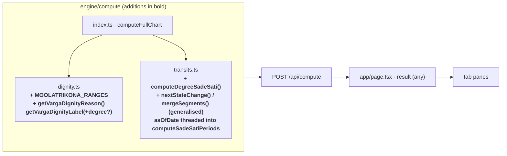
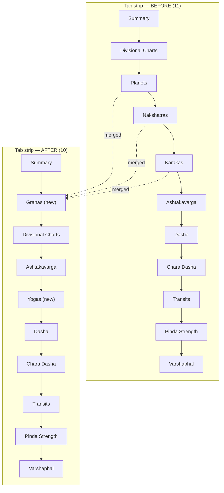
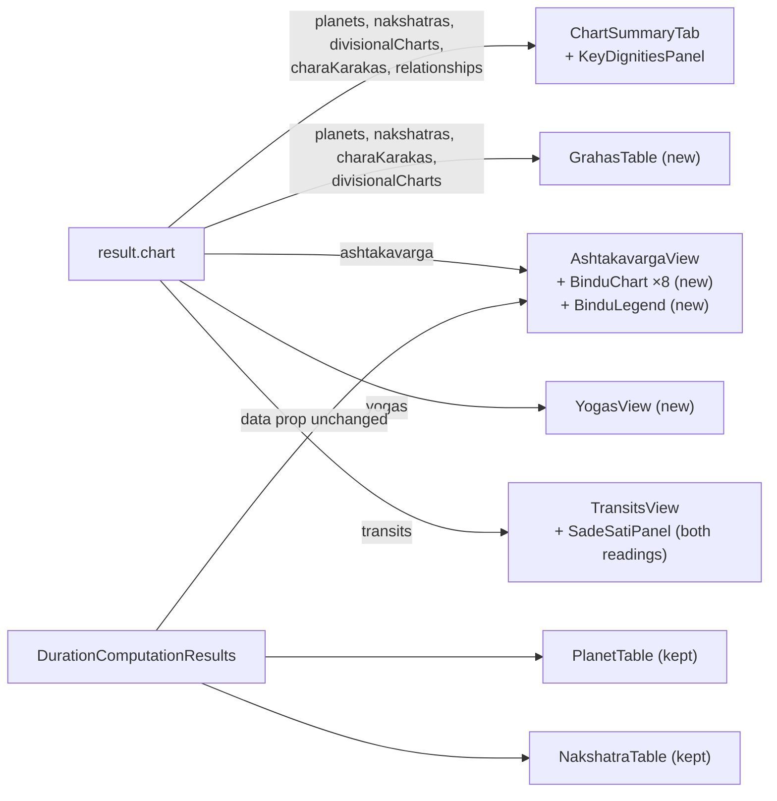

# Design Document

## Overview

Six practitioner-facing changes to the Generate Chart page (`app/page.tsx` + `app/components/`).
Four are pure presentation of data `POST /api/compute` already returns. Two reach into
`engine/compute/`:

- **Degree-based Sade Sati** — a new scanner in `transits.ts` reporting one contiguous dated period per
  passage of Saturn through a ±45° window on the natal Moon, per PVR Narasimha Rao's model, plus a fix
  to an existing `isCurrent` / `asOfDate` disagreement in the sign-based scan.
- **Dignity** — a **reason** derivation (UI-driven, but it belongs in `dignity.ts` because it must
  share the label's precedence and tables) *and* a genuine **behaviour change**: moolatrikona becomes a
  degree-range test rather than a whole-sign test, so `getVargaDignityLabel` will return `own` where it
  returns `moolatrikona` today for out-of-range D1 placements. That one is not additive, and its
  blast radius across eight call sites is documented in Data Models rather than assumed to be small.

### What was verified in the codebase

| Claim | Verified in |
|---|---|
| `result` is typed `any` and threaded field-by-field to each pane | `app/page.tsx` — `useState<any \| null>` |
| The Summary tab holds `selectedDivision` + `chartStyle` locally; the N/S control is a two-button toggle, defaulting `'north'` | `ChartSummaryTab.tsx` |
| `PlanetTable` + `NakshatraTable` are also imported by `DurationComputationResults` | `DurationComputationResults.tsx:14–15, 756, 763` |
| `KarakaTable` has exactly one consumer (`app/page.tsx`) | repo-wide grep |
| `AshtakavargaView` is embedded as `<AshtakavargaView data={categoryData.ashtakavarga} />` — one prop | `DurationComputationResults.tsx:792` |
| `NorthIndianChart`/`SouthIndianChart` take `{ chart: ChartData; size?: number }` and derive cell content from planet placement + `lagnaSignNumber` arithmetic | both components |
| `UnifiedChart.transits` is a nullable `Json` column | `prisma/schema.prisma:62` |
| No Zod schema gates the transits shape (`lib/validation.ts` only has an unrelated `saturn_transits: z.record(z.unknown()).optional()` on the paste-path `ChartInputV1`) | `lib/validation.ts:221` |
| Test runner is Vitest (`vitest.config.ts`, `environment: 'node'`, `globals: true`, `@` alias). Existing tests: `engine/compute/yogas.*.test.ts`, `engine/durationAnalysis/scoring*.test.ts` | `package.json`, `vitest.config.ts` |
| `fast-check` is **not** a dependency | `package.json` |
| Semantic favourability tokens exist (`favorable`, `cautionary`, `unfavorable`, each with a `-muted` pair) but there is **no** semantic token for the middle "gray" band used by `getBinduColor` | `tailwind.config.ts`, `app/globals.css:100–105, 231–236` |
| The transit types are declared **twice**: once in `engine/compute/transits.ts:11–86` (what the functions are typed against) and again, structurally identical, in `engine/compute/types.ts:194–248`. `engine/compute/index.ts:44–46` re-exports `TransitPlanet` / `TransitAnalysis` / `SadeSatiInfo` **from `./types`**, and `ComputedChart.transits: TransitAnalysis` (`types.ts:656`) is the `types.ts` copy | both files + `index.ts` |
| `nextSignChange` and `prevSignChange` both run a **fixed 42-iteration** bisection; `docs/computation_transits_sadesati.md` documents this as sub-second | `transits.ts:151–199`, the doc's "How Periods Are Computed" step 3 |
| `computeSadeSatiPeriods` scans `1 Jan (birthYear − 33)` → `1 Jan (wall-clock year + 35)`, with an inline comment justifying the 33 | `transits.ts:230–232` |
| `computeSadeSatiPeriods` derives `isCurrent` from its own `const now = new Date()` while `computeTransits` derives `sadeSati.active`/`phase` from its `asOfDate` parameter — the two disagree for any non-present `asOfDate` | `transits.ts:216, 271–283` vs `computeTransits` |
| `getVargaDignityLabel` has **8 call sites** across 3 modules; `MOOLATRIKONA_SIGNS` has **three independent declarations** (`dignity.ts:37`, `shadbala.ts:68`, `varshaphal.ts:69`); `yogas.ts:830–842` re-exports both `getVargaDignityLabel` and `MOOLATRIKONA_SIGNS` | repo-wide grep |
| `yogas.detectors.test.ts`'s `mkPlanet` defaults `degreeInSign = 15`, and its Hamsa test asserts `evidence.dignity.Jupiter === 'moolatrikona'` for Jupiter at Sagittarius 15° | `yogas.detectors.test.ts:11, 39–49` |

### Three corrections to earlier design claims

1. **The transit types are duplicated, not single-sourced in `transits.ts`.** An earlier note asserted the new types belong only in `transits.ts` and that `types.ts` needs no change. That is wrong, and the evidence is above: `types.ts` carries its own structurally-identical copy, `index.ts` re-exports the `types.ts` copy, and `ComputedChart.transits` is typed with it. Adding `sadeSatiByDegree` to only one copy would mean `computeTransits` returns a field that `ComputedChart` does not admit. So **both** declarations change, and the design keeps the existing (pre-existing, not introduced here) duplication rather than de-duplicating it as a side quest — collapsing `types.ts` onto `transits.ts` would make `types.ts` import a module that pulls in `swisseph-v2`, which is exactly why the copy exists. That duplication is recorded as an open question, not silently fixed.
2. **Bisection precision is already fixed at 42 iterations, so no tolerance parameter is introduced.** An earlier draft proposed a 0.5-day tolerance with a 40-iteration cap; that would make the new scanner *less* precise than `nextSignChange` sitting three functions above it. The degree scanner reuses the existing 42-iteration loop verbatim (R6.8).
3. **The scan horizon is the existing one, not birth + 120 years.** R6.9 requires both readings to share `computeSadeSatiPeriods`' window.

**Consequence of the Prisma finding:** `transits` is schema-less JSON and no validator gates its
shape, so adding a sibling field inside `TransitAnalysis` needs **no migration and no validator
change**. Charts stored before the addition simply lack the field, which is why it is declared
optional (R8.3, R8.6).

### Architecture at a glance



### Data-flow / tab-strip change





## Architecture

### Component inventory

| File | Change | Why |
|---|---|---|
| `app/page.tsx` | Modify | `Tab` union + `TABS` reordered; three panes replaced by two |
| `app/components/GrahasTable.tsx` | **New** | R3 merged table |
| `app/components/KeyDignitiesPanel.tsx` | **New** (extracted from `ChartSummaryTab`) | R1 + R2; the card grew from ~30 lines of inline JSX to a section with chips, combustion ordering and accessible descriptions |
| `app/components/ChartSummaryTab.tsx` | Modify | renders `<KeyDignitiesPanel>`; passes `relationships` through |
| `app/components/BinduChart.tsx` | **New** | R5 12-cell numeric diagram, both styles |
| `app/components/BinduLegend.tsx` | **New** | R4.2/R4.3 legends |
| `app/components/chartGeometry.ts` | **New** | shared North/South SVG geometry constants |
| `app/components/AshtakavargaView.tsx` | Modify | 8 diagrams, style control, legends, token migration, guards |
| `app/components/YogasView.tsx` | **New** | R7 |
| `app/components/SadeSatiPanel.tsx` | **New** (extracted from `TransitsView`) | R6 two labelled groups |
| `app/components/TransitsView.tsx` | Modify | renders `<SadeSatiPanel>` |
| `app/components/SectionUnavailable.tsx` | **New** | R8.1/8.4/8.5 shared mechanism |
| `app/components/sectionGuards.ts` | **New** | shape guards used by every pane |
| `lib/ashtakavargaBands.ts` | **New** | pure band + slot derivation (testable in the `node` Vitest env) |
| `lib/brandColors.ts` | Modify | add `MODERATE` band token + `binduBandClass()` |
| `tailwind.config.ts`, `app/globals.css` | Modify | wire the new `moderate` / `moderate-muted` CSS variables |
| `engine/compute/dignity.ts` | Modify | add `MOOLATRIKONA_RANGES`, the optional degree parameter on `getVargaDignityLabel`, `getVargaDignityReason()` + `SIGN_NAMES` (stays dependency-free) |
| `engine/compute/divisional.ts` | Modify | pass the D1 degree-in-sign to `getVargaDignityLabel` for `division === 1` only (two call sites) |
| `engine/compute/yogas.ts` | Modify | pass the D1 degree-in-sign at its four `getVargaDignityLabel` call sites |
| `engine/durationAnalysis/scoring.ts` | Modify | widen `findPlanet` to carry `degreeInSign`; pass it at the D1 dignity call site only |
| `engine/compute/transits.ts` | Modify | add degree-based scanner; generalise the bisection + merge helpers; thread `asOfDate` into `computeSadeSatiPeriods` |
| `engine/compute/types.ts` | Modify | mirror the two new transit types and the sibling field into the second declaration (see correction 1 above) |
| `engine/compute/index.ts` | Modify | pass natal Moon longitude + birth JD into `computeTransits` |
| `engine/compute/shadbala.ts`, `engine/compute/varshaphal.ts` | **Deliberately unchanged** | each holds its own sign-only `MOOLATRIKONA_SIGNS` for a *scoring* ladder, not a label; see the blast-radius table |
| `app/components/PlanetTable.tsx`, `NakshatraTable.tsx` | **Kept unchanged** | still consumed by `DurationComputationResults` |
| `app/components/KarakaTable.tsx` | **Deleted** | sole consumer was the Karakas tab; its columns become Grahas columns and its `KARAKA_DESCRIPTIONS` map moves into `GrahasTable` |

### Final tab order

`Summary · Grahas · Divisional Charts · Ashtakavarga · Yogas · Dasha (Vimshottari) · Chara Dasha ·
Transits · Pinda Strength · Varshaphal`

`Grahas` takes the slot `Planets` held. `Yogas` is placed with the natal-geometry group (after
Ashtakavarga, before the three timing tabs) because the yoga catalogue is a statement about natal
geometry, not about timing. All eight tabs R3.7 requires are preserved (R3.1, R3.7, R7.1).

### Dependency rules honoured

- `engine/compute/dignity.ts` stays a dependency-free leaf: the reason derivation adds only a local
  `SIGN_NAMES` array and reuses the module's own tables and private relation helpers.
- `lib/ashtakavargaBands.ts` is pure TypeScript with no React import, so the band and slot
  properties run in the existing `environment: 'node'` Vitest setup.
- Engine never imports from `app/` (`skills/coding-standards.md`).

## Components and Interfaces

### R1 + R2 — `KeyDignitiesPanel`

```ts
export interface KeyDignitiesPanelProps {
  planets: PlanetRow[]
  divisionalCharts: DivisionalChart[]
  /** Division currently selected on the Summary tab; dignity/vargottama chips read this varga. */
  selectedDivision: number
  /** Undefined / malformed → dignity + vargottama chips still render, combustion chips omitted (R1.6). */
  combustion?: CombustionResult[]
}
```

Chip rendering:

- Each chip is a native `<button type="button">` — focusable without `tabIndex` juggling — carrying
  `aria-describedby={reasonId}` and a sibling `<span id={reasonId} className="sr-only">` holding the
  reason sentence. A popover mirrors the same text on `:hover` and `:focus-visible`. This satisfies
  R2.1/R2.4: the reason is keyboard reachable and is the chip's accessible description, and is not
  hover-only.
- Dignity/vargottama chips keep the current filter (skip `neutral`/`friend`/`great_friend`, skip
  Rahu/Ketu) — Rahu/Ketu carry no label, so both the chip and the reason are omitted (R2.7).
- Combustion chips: one per entry, built from a single derived record so a planet can never get two
  chips (R1.8). Ordering: `[...combustion].sort((a, b) => a.degreeFromSun - b.degreeFromSun)` —
  `Array.prototype.sort` is stable in every engine Next 14 targets, so equal separations keep source
  order (R1.8).

Combustion chip label assembly (R1.1–R1.5, R1.7, R1.9, R1.10):

| Entry state | Chip text |
|---|---|
| `combust` | `"Combust"` |
| `combust && cazimi` | `"Combust · Cazimi"`, styled with the favourable token family, which overrides the ordinary combust styling (R1.2) |
| `nearCombust && !combust` | `"Near combust"` — never the word `Combust` alone (R1.3) |
| `moonStrictCombust === true` | adds `"Combust (8° strict)"`; emitted under no other condition (R1.5) |
| all three flags false and no `moonStrictCombust` | no chip (R1.9) |

Separation text: `Number.isFinite(degreeFromSun) && Number.isFinite(threshold)` →
`` `${roundHalfAwayFromZero1(degreeFromSun)}° of ${threshold}°` ``, where

```ts
/** Rounds half away from zero to one fractional digit, retaining the trailing zero ("0.0"). */
function roundHalfAwayFromZero1(v: number): string {
  const scaled = Math.round(Math.abs(v) * 10 + Number.EPSILON) / 10
  return (v < 0 ? -scaled : scaled).toFixed(1)
}
```

`toFixed(1)` keeps the trailing zero; `Math.round` on the absolute value then re-signing gives
half-away-from-zero rather than JavaScript's half-up (R1.4). Non-finite values → labels render
without numbers plus the marker `"separation unavailable"` (R1.10).

### R3 — `GrahasTable`

```ts
export interface GrahasTableProps {
  planets: PlanetRow[]
  nakshatras?: NakshatraRow[]
  charaKarakas?: KarakaEntry[]
  divisionalCharts?: DivisionalChart[]   // D1 supplies the dignity column
  lagna: string
}
```

One row per `planets` entry, in payload order, with no rows for Lagna / upagrahas / special lagnas /
arudha padas (R3.2). Columns are a **superset** of the three merged tables so nothing is dropped:

| Column | Source | Came from |
|---|---|---|
| Graha (`<th scope="row">`) | `planets[].planet` | all three |
| Sign | `planets[].sign` | PlanetTable |
| Degree | `formatDMS(planets[].degreeInSign)` — the exact `d°mm'ss"` helper lifted from `PlanetTable` | PlanetTable |
| House | `planets[].house` | PlanetTable |
| R | `planets[].retrograde` → literal `"R"` text, present only when true (R3.6) | PlanetTable |
| Dignity (D1) | `divisionalCharts.find(d => d.division === 1).planets[].dignity` | new (R3.3) |
| Nakshatra | `nakshatras[].nakshatra` | NakshatraTable |
| Pada | `nakshatras[].pada` | NakshatraTable |
| Nak Lord | `nakshatras[].nakshatraLord` | NakshatraTable |
| Sub Lord | `nakshatras[].subLord` | new (R3.3) — present on the payload, never rendered before |
| Deg in Nak | `nakshatras[].degreeInNakshatra` | NakshatraTable |
| Karaka | `charaKarakas[].karakaAbbr` + focus/hover disclosure | KarakaTable |
| Speed | `planets[].speed` | PlanetTable |
| Longitude | `planets[].longitude` | PlanetTable |

Deliberately **not** carried over: KarakaTable's rank `#` column (implied by the abbreviation
ordering AK→DK) and its `Degree` column (identical to `planets[].degreeInSign`, already shown).
KarakaTable's `Signification` column becomes the karaka cell's disclosure content, not a column
(R3.5).

Karaka cell markup: a `<button type="button" aria-describedby={sigId}>` showing the abbreviation,
with a visually-hidden `<span id={sigId}>` holding `"Atmakaraka — Self, Soul: the planet
representing the native"` and a popover bound to both `:hover` and `:focus-visible`. `KARAKA_SHORT`
(full names) and `KARAKA_DESCRIPTIONS` (significations) both move into `GrahasTable`.

Missing data: a graha with no karaka assignment or no D1 dignity gets an empty cell (R3.4). When
`nakshatras` or `charaKarakas` is absent or has no matching entry, the rows still render from
`planets` + D1 and a `<SectionUnavailable section="Nakshatras" />` / `"Chara Karakas"` message is
shown above the table (R3.8).

Table semantics: `<caption className="sr-only">`, `<th scope="col">` on all 14 headers,
`<th scope="row">` for the graha (R3.9). The table lives in a
`<div className="overflow-x-auto">` inside the pane so horizontal overflow is confined and no column
is clipped (R3.10).

Legend line above the table: *"Graha text colour identifies the graha only — it carries no strength
or dignity meaning."* Rendered as static text, no hover/click/expansion (R4.1).

### R4 + R5 — bindu bands, legends and diagrams

#### `lib/ashtakavargaBands.ts` (pure)

```ts
export type BinduReckoning = 'bav' | 'sav'
export type BinduBand = 'favorable' | 'moderate' | 'cautionary' | 'unfavorable'

export interface BandDescriptor {
  band: BinduBand
  /** Inclusive integer range, e.g. "30–56" or "4". */
  range: string
  /** Legend wording, e.g. "Strong". */
  label: string
  /** Non_Colour_Signal glyph appended after the numeral. */
  marker: string
}

/** null when count is absent, non-integer or outside 0–56 (R4.9). */
export function savBand(count: unknown): BinduBand | null
/** null when count is absent, non-integer or outside 0–8 (R4.9). */
export function bavBand(count: unknown): BinduBand | null
export function bandOf(count: unknown, reckoning: BinduReckoning): BinduBand | null

export const SAV_BANDS: readonly BandDescriptor[]   // exactly 3
export const BAV_BANDS: readonly BandDescriptor[]   // exactly 4
export function bandsFor(reckoning: BinduReckoning): readonly BandDescriptor[]
```

Thresholds transcribed **unchanged** from the current `getBinduColor`:

| Reckoning | Range | Band | Old class | New token | Marker |
|---|---|---|---|---|---|
| SAV | 30–56 | `favorable` | `text-green-400 bg-green-900/20` | `text-favorable bg-favorable-muted` | `▲` |
| SAV | 25–29 | `moderate` | `text-gray-200 bg-gray-800` | `text-moderate bg-moderate-muted` | `=` |
| SAV | 0–24 | `unfavorable` | `text-red-400 bg-red-900/20` | `text-unfavorable bg-unfavorable-muted` | `▼` |
| BAV | 5–8 | `favorable` | `text-green-400 bg-green-900/20` | `text-favorable bg-favorable-muted` | `▲` |
| BAV | 4 | `moderate` | `text-gray-200 bg-gray-800` | `text-moderate bg-moderate-muted` | `=` |
| BAV | 3 | `cautionary` | `text-yellow-400 bg-yellow-900/20` | `text-cautionary bg-cautionary-muted` | `▽` |
| BAV | 0–2 | `unfavorable` | `text-red-400 bg-red-900/20` | `text-unfavorable bg-unfavorable-muted` | `▼` |

Both sets are exhaustive and non-overlapping over their integer domains (R4.2, R4.3) and every count
keeps its pre-migration band (R4.4). Markers are pairwise distinct within each reckoning — and in
fact across both — so a band is determinable without perceiving hue; the numeral is always rendered
as text alongside (R4.6). A cell that fails `bandOf` renders with no band colouring, the text
`n/a`, and no marker (R4.9).

**Chosen Non_Colour_Signal, concretely:** a glyph rendered immediately after the numeral inside the
cell (`39 ▲`), not a border style. Border weight would collide with the SVG cell strokes in the
North-Indian diagram and is hard to distinguish across four levels; a glyph reads identically in the
SVG diagram, the numeric table and the legend, so one implementation covers all three surfaces
(R4.6, R5.8).

#### Brand token addition

The existing semantic ladder covers only three steps (`favorable` / `cautionary` / `unfavorable`).
The BAV set needs four and the middle band of both sets is the gray that `getBinduColor` writes as
`text-gray-200 bg-gray-800` — a literal palette class, which R4.5 forbids. So one new semantic pair
is added rather than reusing an unrelated token.

The name is **`moderate`**, not `neutral`: Tailwind ships a `neutral-50…950` palette and
`NorthIndianChart` already uses `stroke-neutral-200`, so declaring `neutral` under `extend.colors`
would shadow that scale.

`app/globals.css` — values copied from the existing `role-neutral-*` pair, which already encodes
exactly the gray the current code renders:

```css
:root {
  --color-moderate: 55, 65, 81;          /* gray-700 — text */
  --color-moderate-muted: 229, 231, 235; /* gray-200 — surface */
}
.dark {
  --color-moderate: 209, 213, 219;       /* gray-300 */
  --color-moderate-muted: 31, 41, 55;    /* gray-800 */
}
```

`tailwind.config.ts`, beside the other favourability tokens:

```ts
moderate: themedColor("--color-moderate"),
"moderate-muted": themedColor("--color-moderate-muted"),
```

`lib/brandColors.ts`:

```ts
/** Four-step favourability ladder used by the Ashtakavarga bindu bands. */
export const BAND_STYLE: Record<'favorable' | 'moderate' | 'cautionary' | 'unfavorable', string> = {
  favorable:   'text-favorable bg-favorable-muted',
  moderate:    'text-moderate bg-moderate-muted',
  cautionary:  'text-cautionary bg-cautionary-muted',
  unfavorable: 'text-unfavorable bg-unfavorable-muted',
}
/** Class string for a bindu count, or the unavailable style when the count is unusable. */
export function binduBandClass(band: BinduBand | null): string
```

`lib/ashtakavargaBands.ts` holds the *thresholds*; `lib/brandColors.ts` holds the *classes*. Keeping
them apart is what lets the band property test run without pulling Tailwind or React in.

#### `BinduLegend`

```ts
export interface BinduLegendProps { reckoning: BinduReckoning }
```

Renders `bandsFor(reckoning)` as a static row — one entry per band, each showing the swatch, the
marker glyph, the inclusive range and the label. Exactly one entry per band rendered in the pane and
no entry for a band the pane does not render (R4.7). Both legends live inside the pane holding the
diagrams (R5.8) and, because they are internal to `AshtakavargaView`, they appear identically when
`DurationComputationResults` embeds it (R4.8).

#### `BinduChart` — component strategy

**Decision: a new lightweight `BinduChart`, not a generalisation of the existing charts and not a
variant prop on them.** The reasoning, against how the existing components are actually built:

1. `NorthIndianChart`/`SouthIndianChart` take `chart: ChartData`, which *requires* `lagna`,
   `lagnaSignNumber`, `division`, `name`, `shortName` and `planets: ChartPlanet[]`. A bindu diagram
   has none of those. Making them optional weakens the contract for the three existing consumers
   (Summary, `ChartGrid`, `DurationComputationResults`).
2. Their cell model is a **variable-length list of glyph items** (`getCellItems` / `getCellContent`
   walk planets, arudhas, special lagnas, upagrahas and lay them out in up-to-3 columns). A bindu
   cell is exactly **one integer plus one label**. A variant prop would mean a discriminated union
   threaded through `CellText`/`SignCell` plus dead branches in both files.
3. `NorthIndianChart` derives each cell's sign as `((lagnaSignNumber - 1 + h - 1) % 12) + 1`.
   R5.5 forbids the Ashtakavarga view from performing any house-to-sign arithmetic of its own in
   house mode — it must read `byHouse` as supplied. Reusing the component would import exactly the
   arithmetic the requirement rules out.
4. Both render a header (`shortName — name`, `Lagna: …`) and North renders a hardcoded `Asc` badge —
   wrong furniture for eight small bindu diagrams.

Shared geometry is still deduplicated: the SVG constants move to
`app/components/chartGeometry.ts` (`NORTH_LINES`, `NORTH_CELL` centroids, `NORTH_SIGN_POS`,
`SOUTH_LAYOUT`, `CELL_SIZE`, `GRID_SIZE`, `CANVAS`), and `NorthIndianChart`/`SouthIndianChart` are
updated to import them — a mechanical, behaviour-preserving move that leaves one source of truth for
the two layouts.

```ts
export interface BinduCell {
  /** 0-based slot in the active index mode. */
  slot: number
  /** Sign 1–12 this cell holds. Drives South-Indian placement. Undefined when unknown. */
  signNumber?: number
  /** House 1–12 this cell represents. Drives North-Indian placement. Undefined in sign mode. */
  house?: number
  /** Rendered cell label — "H1" in house mode, "Ari" in sign mode. */
  label: string
  /** Bindu count, or null when absent / non-integer / out of range. */
  count: number | null
}

export interface BinduChartProps {
  /** Visible heading, e.g. "Sun" or "SAV". */
  title: string
  /** Accessible series name used in every cell's alt text: a graha name, or "SAV". */
  seriesLabel: string
  style: 'north' | 'south'
  reckoning: BinduReckoning
  /** Exactly 12 cells. */
  cells: BinduCell[]
  size?: number
  /** Optional caption, e.g. "Total: 39 bindus". */
  caption?: string
}
```

Placement:

- **South Indian** — fixed sign grid. Sign mode: slot *i* → sign *i+1*. House mode: cell's sign comes
  from `byHouse[i].signNumber`, supplied by the engine, so no arithmetic (R5.5).
- **North Indian** — fixed house positions. House mode: slot *i* → cell *i+1*, direct. Sign mode:
  when `ashtakavarga.lagnaSignNumber` is present the cell that would be H1 holds the lagna sign;
  when it is absent (older charts) the first cell holds Aries. Either way every cell renders its own
  sign name, so the reading is carried by the label rather than the position (R5.6).

Accessibility (R5.10): each cell is an SVG `<g role="img">` with
`aria-label={`${seriesLabel}, ${label}, ${count} bindus, ${bandLabel}`}` (or `"count unavailable"`),
and the whole diagram carries `role="group"` with an `aria-label` of the series name. Additionally a
`<table className="sr-only">` mirrors the 12 cells so the diagram is reachable as tabular data, not
only as 12 isolated labels.

#### `AshtakavargaView` changes

Props are **unchanged** — still `{ data: AshtakavargaData }`, nothing added, renamed or newly
required, so the `DurationComputationResults` call site keeps working verbatim (R8.2). New state is
internal:

```ts
const [indexMode, setIndexMode] = useState<'sign' | 'house'>(hasByHouse ? 'house' : 'sign')
const [diagramStyle, setDiagramStyle] = useState<'north' | 'south'>('north')  // R5.3
```

The `selectedPlanet` selector is **removed**: all seven BAV diagrams render simultaneously (R5.1),
and the existing all-planets numeric table plus the SAV row are retained below them (R5.7). The
diagram style control is the same two-button N/S toggle pattern the Summary tab uses, defaulting to
North (R5.3).

Slot derivation moves out of the component into `lib/ashtakavargaBands.ts` so it is testable in the
node environment and so diagram and table provably read the same numbers. The component's local
`AshtakavargaData` / `AshtakavargaHouseEntry` interfaces — hand-copies of the engine types — are
dropped in favour of importing `AshtakavargaResult` from `@/engine/compute/types`, so there is one
declaration of the shape. `lib/` importing from `engine/` is the existing direction of travel
(`engine/durationAnalysis/transitOverlay.ts` already imports from `@/lib`), and it keeps the pure
module free of any React dependency.

```ts
export const BAV_PLANETS: readonly string[] // Sun, Moon, Mars, Mercury, Jupiter, Venus, Saturn

export interface BinduSlots {
  labels: string[]              // 12
  signNumbers: (number | undefined)[]  // 12
  houses: (number | undefined)[]       // 12
  sav: (number | null)[]        // 12
  bav: Record<string, (number | null)[]>
  savTotal: number | null
}

/** Pure 12-slot derivation for the active index mode. Reads `byHouse` verbatim in house mode. */
export function deriveBinduSlots(
  data: AshtakavargaResult,
  indexMode: 'sign' | 'house'
): BinduSlots
```

`indexMode` toggling is plain `useState` in a client component; React re-renders synchronously on the
next frame, well inside the 500 ms of R5.4, and because both the diagrams and the tables are derived
from the single `deriveBinduSlots(data, indexMode)` result in the same render, no cell or label can
retain a value from the previous mode.

When `byHouse` is absent or is not exactly 12 entries, the Index_Mode control is omitted, everything
renders from the sign-indexed arrays with sign labels from Aries, and a message states the
house-indexed view is unavailable (R5.6). A graha whose `bav` entry is missing or has fewer than 12
integer counts has its diagram omitted with a naming message, the remaining diagrams, the tables and
the legends unaffected (R5.9, R8.1).

### R6 — `SadeSatiPanel`

```ts
export interface SadeSatiPanelProps {
  /** Existing sign-based reading — shape untouched. */
  signBased: SadeSatiInfo
  /** Degree-based reading; absent on charts computed before the addition (R6.20). */
  degreeBased?: DegreeSadeSatiInfo
  /** The instant the pane uses for transit positions — `TransitAnalysis.asOf`. */
  asOf: string
  birthDate?: string
}
```

Two labelled groups, each naming its reading ("Sign-based — Saturn through the 12th, 1st and 2nd
sign from the natal Moon" / "Degree-based — Saturn within 45° of the natal Moon's sidereal
longitude"), each listing its periods in engine order (R6.16).

The two groups render **different row shapes**, because the two readings no longer carry the same
members. Sign-based rows keep today's phase chip; degree-based rows lead with the sequence number and
carry no phase, since the degree reading has no `rising`/`peak`/`setting` subdivision at all.

| Group | Row content |
|---|---|
| Sign-based | phase chip (`rising`/`peak`/`setting`) · `phaseSign` · `startApprox – endApprox` |
| Degree-based | `#{sequence}` · `startApprox – endApprox` · the R6.15 descriptive label · a span, formatted by the panel from `durationDays` |

Row styling, identical in both groups:

| State | Styling | Non_Colour_Signal |
|---|---|---|
| `isCurrent` | existing emphasised row (sign-based keeps `SADE_SATI_STYLE[phase]`; degree-based uses the same highlighted-row class without a phase chip), `aria-current="true"` | text badge `CURRENT`, and for the degree group `"{completionPct}% elapsed"` from R6.13 (R6.17) |
| `!isCurrent` | `opacity-60` greyed row | text badge `Not current`, and for a future degree period `"starts in {n} days"` formatted from `startsInDays` (R6.14) (R6.18) |

`Not current` is deliberately not `Past`/`Upcoming`: the sign-based reading carries only
`"Mon YYYY"` display strings, so a past/future split would need date parsing that reading cannot
support reliably. The degree reading *could* support it — it carries real ISO instants — but one
wording across both groups keeps the two readings visually comparable, which is the whole point of
showing them side by side. The extra precision the degree reading has is surfaced instead through
the completion percentage and the time-until-start, which the sign reading cannot offer.

Span formatting (`7y 88d`) lives here, in the panel, not in the engine — see the Data Models
rationale.

Divergence line (R6.19): when `signBased.active !== (degreeBased?.active ?? signBased.active)`, a
line above the groups reads e.g. *"Readings disagree: the degree-based reading reports Sade Sati
running; the sign-based reading does not."* When it is the sign-based reading that reports it
running, the line also names that reading's phase — the degree reading has no phase to name, which is
exactly why R6.19 asks for the phase only from the sign side.

Birth-year exclusion (R6.21) applies to both groups. Sign-based keeps the existing
`parseInt(endApprox.split(' ').pop())` year parse verbatim; degree-based uses
`new Date(p.end).getUTCFullYear() >= birthYear`, which is exact because the degree-based periods
carry real ISO instants. Consequence worth knowing: sequence numbers are assigned across the **whole
scan horizon** (R6.6), which begins 33 years before birth, so the first row the panel *displays* will
usually not be `#1`. The panel does not renumber — renumbering would break the correspondence with
the engine output and with anything reading the stored JSON.

When `degreeBased` is absent the sign-based group renders unchanged and a
`<SectionUnavailable section="Degree-based Sade Sati" />` message appears in place of the second
group (R6.20, R8.1).

`TransitsView` keeps its existing `{ data, birthDate }` props and its `sadesati` sub-tab; the Sade
Sati branch body is replaced by `<SadeSatiPanel signBased={data.sadeSati}
degreeBased={data.sadeSatiByDegree} asOf={data.asOf} birthDate={birthDate} />`.

`TransitsView` currently declares its own hand-copied `SadeSatiPeriod` / `SadeSatiInfo` / `TransitData`
interfaces (a **third** copy of the transit shape, after `transits.ts` and `types.ts`). Rather than add
a fourth hand-copy for the degree reading, `TransitData.sadeSatiByDegree?: DegreeSadeSatiInfo` is typed
by importing the engine type, the same move `AshtakavargaView` makes for `AshtakavargaResult`. The
existing three local interfaces are left alone — replacing them is cleanup unrelated to this feature,
and it is called out in Open Decisions with the other duplication.

### R7 — `YogasView`

```ts
export interface YogasViewProps {
  /** Absent on charts computed before the yoga engine, or on paste-path charts (R7.12). */
  yogas?: Yoga[]
}
```

- Groups by `category` in the fixed order `mahapurusha, raja, dhana, viparita, lunar, neechabhanga,
  parivartana, kartari, combination`, omitting empty groups; any entry with a category outside those
  nine goes into a single trailing group labelled with that entry's own `category` value so nothing
  is dropped. Each group header shows the category name and its entry count (R7.4).
- Within a group: strength `strong` → `moderate` → `weak`, then `name` ascending
  (`localeCompare` with a fixed `'en'` locale so repeated renders are identical) (R7.10).
- Every entry renders `name`, `category`, all `planets`, all `houses`, benefic disposition and
  strength grade — none omitted, nothing truncated or paginated, entry count equals
  `yogas.length` (R7.2, R7.3).
- Disposition and strength as text: `Benefic`/`Malefic`, `Strong`/`Moderate`/`Weak`, alongside colour
  (R7.8).
- `activatingPlanets` under a visible label "Activating dashas"; empty or absent → the text
  `None recorded` (R7.7, R7.11).
- `evidence.afflictions`: per affliction the planet, `kind` mapped to `Combust` / `Debilitated` /
  `Nodal`, and `detail` when present; the entry itself is marked with the text
  `Afflicted (${afflictions.length})` (R7.5).
- The rest of the evidence (`rule`, `notes`, `ownedHouses`, `dignity`, `linkage`) sits inside a native
  `<details>` element. `<summary>` is focusable and toggles on Enter **and** Space with no JS, and its
  text switches between `Show evidence` and `Hide evidence` — the collapsed/expanded state as a
  Non_Colour_Signal (R7.6). Choosing `<details>` over the repo's Radix `Accordion` is deliberate: the
  Enter/Space toggle and the exposed state come from the platform rather than from configuration.

Two distinct messages (R7.9 vs R7.12):

| Condition | Message |
|---|---|
| `yogas` present, `length === 0` | "No named yogas were detected for this chart." |
| `yogas` absent | `<SectionUnavailable section="Named yoga catalogue" />` → "Named yoga catalogue data is unavailable for this chart." |

### R8 — the unavailable-section mechanism

One reusable mechanism instead of ad-hoc checks per pane.

```tsx
// app/components/SectionUnavailable.tsx
export interface SectionUnavailableProps { section: string }
/** Renders exactly: "{section} data is unavailable for this chart." */
export function SectionUnavailable({ section }: SectionUnavailableProps): JSX.Element

/** Client error boundary: an unexpected throw inside a section degrades to the same message. */
export class SectionBoundary extends React.Component<
  { section: string; children: React.ReactNode },
  { failed: boolean }
> { /* … */ }
```

The message text is fixed and composed only from the section name plus the unavailability statement —
no exception type, no stack, no field path (R8.4). `role="status"` so assistive technology announces
it.

```ts
// app/components/sectionGuards.ts
export type SectionState<T> = { ok: true; data: T } | { ok: false }

export function isArrayOfLength<T>(v: unknown, n: number): v is T[]
export function isNonEmptyArray<T>(v: unknown): v is T[]
export function hasNumberArrays(v: unknown, keys: readonly string[], len: number): boolean

/** Single entry point every pane uses. */
export function guardSection<T>(value: unknown, check: (v: unknown) => v is T): SectionState<T>
```

Usage pattern, identical in every pane:

```tsx
const bav = guardSection(data.bav, (v) => hasNumberArrays(v, BAV_PLANETS, 12))
…
{bav.ok ? <BavDiagrams data={bav.data} /> : <SectionUnavailable section="Bhinnashtakavarga" />}
```

The guards cover exactly the malformed shapes R8.1 enumerates — wrong type, an array where an object
is expected, a sign-indexed collection whose length is not 12, a BAV collection without the 7 graha
keys. Because each pane guards per section and the tab strip itself never reads chart data, all tabs
stay selectable and every unaffected pane renders (R8.5). All new fields are optional, so a chart
computed before the degree-based addition renders every pane identically for the fields both charts
carry (R8.6).

## Data Models

### Engine — moolatrikona degree ranges (`engine/compute/dignity.ts`, R2.11–R2.14)

`MOOLATRIKONA_SIGNS` is whole-sign. PVR/BPHS qualify it by a degree span, so a new table sits beside
the existing ones and `MOOLATRIKONA_SIGNS` is kept (it is the sign gate; the range only refines it):

```ts
/**
 * Classical moolatrikona degree span within the moolatrikona sign, as
 * [fromDeg, toDeg) degrees-in-sign. Outside the span the placement falls
 * through to the own-sign test (BPHS / PVR Narasimha Rao).
 */
export const MOOLATRIKONA_RANGES: Record<string, { fromDeg: number; toDeg: number }> = {
  Sun:     { fromDeg: 0,  toDeg: 20 },  // Leo
  Moon:    { fromDeg: 4,  toDeg: 30 },  // Taurus     — unreachable, see below
  Mars:    { fromDeg: 0,  toDeg: 12 },  // Aries
  Mercury: { fromDeg: 16, toDeg: 20 },  // Virgo      — unreachable, see below
  Jupiter: { fromDeg: 0,  toDeg: 10 },  // Sagittarius
  Venus:   { fromDeg: 0,  toDeg: 15 },  // Libra
  Saturn:  { fromDeg: 0,  toDeg: 20 },  // Aquarius
}
```

The label function gains an **optional trailing** parameter, so all 8 existing call sites stay
valid and sign-only callers keep today's behaviour verbatim (R2.13):

```ts
export function getVargaDignityLabel(
  planet: string,
  vargaSignNumber: number,
  d1SignByPlanet: Record<string, number>,
  /**
   * Degree within `vargaSignNumber`, 0–30. Supply ONLY when the placement
   * genuinely carries a degree in that sign (i.e. D1). Omitted or non-finite →
   * the moolatrikona test falls back to the whole-sign rule (R2.13).
   */
  degreeInSign?: number
): DignityLabel | undefined
```

Only the moolatrikona branch changes; precedence is untouched:

```
exaltation → debilitation → moolatrikona-sign?
                              ├─ degree usable and inside  [from, to) → 'moolatrikona'
                              ├─ degree usable and outside            → fall through to own test
                              └─ degree absent / non-finite            → 'moolatrikona'  (today)
            → own → compound maitri
```

"Usable" is `Number.isFinite(degreeInSign) && degreeInSign >= 0 && degreeInSign < 30`. Bounds are
half-open `[from, to)`: "Sun 0–20° Leo" is read as the first 20 degrees. Whether the upper bound
should be inclusive is a one-arcsecond question with no practical effect; it goes into the docs as a
validation request rather than being asserted as settled.

**R2.14, checked against the actual tables — the requirement's premise is right for the Moon and
wrong for Mercury, but the conclusion holds for both, for a single cleaner reason.**

| Planet | MT sign | Own signs | Exaltation sign | MT sign is own? | Range reachable? |
|---|---|---|---|---|---|
| Sun | 5 Leo | [5] | 1 Aries | yes | **yes** → outside range gives `own` |
| Moon | 2 Taurus | [4] Cancer | **2 Taurus** | no | no — exaltation matches first |
| Mars | 1 Aries | [1, 8] | 10 Capricorn | yes | **yes** |
| Mercury | 6 Virgo | [3, **6**] | **6 Virgo** | **yes** | no — exaltation matches first |
| Jupiter | 9 Sagittarius | [9, 12] | 4 Cancer | yes | **yes** |
| Venus | 7 Libra | [2, 7] | 12 Pisces | yes | **yes** |
| Saturn | 11 Aquarius | [10, 11] | 7 Libra | yes | **yes** |

R2.14 states the range test is unreachable for the Moon in Taurus and Mercury in Virgo "IF a
planet's moolatrikona sign is not one of that planet's own signs". For the Moon that antecedent is
true (Taurus is not a Moon own sign). For **Mercury it is false** — Virgo *is* in
`OWN_SIGNS.Mercury`. The actual common cause for both is that their moolatrikona sign **coincides
with their exaltation sign**, and exaltation is tested first. The design implements the precedence
R2.14 asks for and reaches the outcome R2.14 asserts; the stated reason in the requirement is worth
correcting there, but nothing in the code changes either way. Net effect: the degree rule is
observable for **five** planets — Sun, Mars, Jupiter, Venus, Saturn — and for all five the
moolatrikona sign is an own sign, so the out-of-range fallthrough always lands on `own`, never on
maitri.

#### Blast radius — every `getVargaDignityLabel` caller

This is the riskiest part of the change: it alters an existing classifier's output, and eight call
sites read it. Each was inspected.

| Call site | Placement evaluated | Degree available there? | Passes a degree? | Consequence |
|---|---|---|---|---|
| `divisional.ts:393` `computeDivisionalCharts` | every varga, all 13 | `planet.longitude % 30` is the **D1** degree; this engine computes only a varga *sign*, never a varga longitude | **Only when `varga.division === 1`** | D1 payload `dignity` changes from `moolatrikona` to `own` for out-of-range D1 placements of the five reachable planets. D2–D60 unchanged. This is the label the Key_Dignities_Panel and the Grahas Dignity column read |
| `divisional.ts:448` `computeSingleDivisionalChart` | same | same | same | same; must be edited together or the two entry points diverge |
| `yogas.ts:148` Pancha Mahapurusha gate | D1 (`PlanetPosition`) | yes — `p.degreeInSign` | **yes** | The gate accepts `exalted \| own \| moolatrikona`, so **whether a yoga fires is unchanged**; only `evidence.dignity[planet]` text changes. **This breaks an existing test** — see below |
| `yogas.ts:196` Gaja Kesari (Jupiter) | D1 | yes | **yes** | dignity-derived strength grade only |
| `yogas.ts:421, 424` Raja / Dharma-Karmadhipati kendra + trikona lords | D1 | yes | **yes** | `STRONG_DIGNITY` contains both `moolatrikona` and `own`, so the coarse strength grade is unchanged; `evidence.dignity` text changes |
| `yogas.ts:523` Parivartana lords | D1 | yes | **yes** | `evidence.dignity` text only |
| `scoring.ts:168` `factorLordDignity` | D1 (`ScoringChartData.planets`) | `degreeInSign` is on the type, but the local `findPlanet` narrows the return to `{ signNumber, house }` | **yes** — `findPlanet` is widened to also return `degreeInSign` | `dignityToNormalized` scores `moolatrikona` 0.9 and `own` 0.8, so an out-of-range MD/AD/PD lord's dignity factor drops by 0.1 normalised. This **does** move duration-analysis scores. `WEIGHTS_VERSION` is `0.2.0-provisional`; the backtest fixtures (`scoring.backtest.test.ts`) must be re-baselined if any fixture lord sits in an out-of-range moolatrikona sign |
| `scoring.ts:424` Saturn **transit** dignity | transit sign | **no** — `TransitOverlay.saturn` carries `sign`/`signNumber`/`house`/`retrograde`, no longitude | **no** | Unchanged. And harmless regardless: `NON_FRIENDLY_SATURN_DIGNITY` is `{debilitated, enemy, great_enemy}`, so `moolatrikona` and `own` both take the same 0.40 branch |
| `scoring.ts:873, 888` divisional house-lord / varga-lagna-lord dignity | varga placements | **no** | **no** | Unchanged, consistent with the divisional decision above |

`yogas.ts:830–842` re-exports `getVargaDignityLabel` and `MOOLATRIKONA_SIGNS` for detector modules
and tests. The re-export is the same function object, so the optional parameter flows through with no
edit.

**Verified test breakage.** `yogas.detectors.test.ts`'s `mkPlanet` defaults `degreeInSign = 15`, and
the Hamsa test places Jupiter at Sagittarius 15° and asserts
`hamsa?.evidence.dignity?.Jupiter === 'moolatrikona'`. Jupiter's range is `[0, 10)`, so once
`yogas.ts` passes the degree that assertion becomes `'own'`. The test must be updated: keep the
existing case asserting `'own'` at 15° (which still proves the *review fix* the test exists for — the
gate must accept a non-exalted own-sign placement) and add a second case at Sagittarius 5° asserting
`'moolatrikona'`. Changing `mkPlanet`'s default instead would silently shift every other detector
test's geometry, so the default stays at 15.

#### The two independent `MOOLATRIKONA_SIGNS` copies — deliberately left sign-only

| Module | Use | Decision |
|---|---|---|
| `shadbala.ts:68` → `dignityScoreForVarga` (Saptavargaja Bala, and via it `dignityScoreForVargaVimsopaka`) | a 0–45 virupa **score** summed over **seven** vargas | **Unchanged.** Only the D1 rung of those seven has a degree, so a degree-aware version would make one of seven rungs behave differently from the other six — an internally inconsistent ladder. It also feeds Sthana Bala, hence every planet's total, strength grade and the strength ranking, with no calibration fixture to validate the shift against. Left as an explicit open question rather than changed opportunistically |
| `varshaphal.ts:69` → `computeKshetraBala` (Panchavargeeya Bala) | annual-chart strength score | **Unchanged.** Tajika Panchavargeeya Bala is conventionally sign-based, and the annual chart is a separate reckoning from the natal dignity label |

Consequence to state plainly: after this change the repo holds a degree-aware moolatrikona rule for
the *label* and a sign-only one for the two *scores*. That is a real inconsistency, chosen because the
alternative silently moves strength numbers. It is recorded in Open Decisions and in the docs note.

### Engine — dignity reason (`engine/compute/dignity.ts`)

```ts
/** Which classical rule produced a Dignity_Label. Mirrors getVargaDignityLabel's precedence. */
export type DignityRule =
  | 'exaltation'
  | 'debilitation'
  | 'moolatrikona'           // sign matched AND the degree fell inside MOOLATRIKONA_RANGES
  | 'moolatrikona_sign_only' // sign matched, no usable degree was supplied (R2.13)
  | 'own'
  | 'maitri'                 // permanent + temporary combined
  | 'maitri_permanent_only'  // a D1 sign was missing for the planet or the sign lord

export interface DignityReason {
  rule: DignityRule
  /** The label this reason explains — always equals getVargaDignityLabel for the same inputs. */
  label: DignityLabel
  /** Single plain-text sentence, ≤160 characters, no markup. */
  text: string
  /** Lord of the occupied sign — set only on the two maitri rules. */
  signLord?: string
  permanentRelation?: 'friend' | 'enemy' | 'neutral'
  /** Absent on 'maitri_permanent_only'. */
  temporaryRelation?: 'friend' | 'enemy'
}

/**
 * Human-readable reason for the dignity LABEL of `planet` in `vargaSignNumber`.
 *
 * Selects exactly ONE rule using the same precedence as getVargaDignityLabel:
 * exaltation → debilitation → moolatrikona → own → compound maitri.
 *
 * @returns undefined when the planet carries no classical dignity (Rahu/Ketu — absent from
 *          PERMANENT_FRIENDSHIP), or when `vargaSignNumber` is not an integer 1–12.
 */
export function getVargaDignityReason(
  planet: string,
  vargaSignNumber: number,
  d1SignByPlanet: Record<string, number>,
  /** Same optional trailing parameter, same semantics, as getVargaDignityLabel. */
  degreeInSign?: number
): DignityReason | undefined
```

`getVargaDignityReason` must be called with the **same** `degreeInSign` argument as the label it
explains, otherwise the two disagree. `KeyDignitiesPanel` therefore reads the degree from the same
`planets[]` row it reads the placement from, and passes it only when the selected division is D1 —
mirroring `divisional.ts` exactly. The label-agreement property is the guard on this.

The module stays dependency-free: the only addition beyond the function is a local
`const SIGN_NAMES: readonly string[]` (Aries…Pisces) for the sentence templates.

Reason-string templates:

| Rule | Template | Example |
|---|---|---|
| `exaltation` | `{Sign} is {Planet}'s exaltation sign.` | `Aries is the Sun's exaltation sign.` |
| `debilitation` | `{Sign} is {Planet}'s debilitation sign.` | `Libra is the Sun's debilitation sign.` |
| `moolatrikona` | `{Planet} at {deg}° of {Sign} falls in its moolatrikona range {from}°–{to}°.` | `The Sun at 8.4° of Leo falls in its moolatrikona range 0°–20°.` (R2.11) |
| `moolatrikona_sign_only` | `{Sign} is {Planet}'s moolatrikona sign; no degree was available, so the sign alone was used.` | `Leo is the Sun's moolatrikona sign; no degree was available, so the sign alone was used.` (R2.13) |
| `own` | `{Sign} is {Planet}'s own sign.` | `Taurus is Venus's own sign.` |
| `maitri` | `{Sign} is ruled by {Lord}, {Planet}'s permanent {perm} and temporary {temp} — compound maitri gives {label words}.` | `Sagittarius is ruled by Jupiter, Mercury's permanent enemy and temporary friend — compound maitri gives neutral.` |
| `maitri_permanent_only` | `{Sign} is ruled by {Lord}, {Planet}'s permanent {perm}; no rasi positions were available for the temporary relation.` | `Capricorn is ruled by Saturn, the Sun's permanent enemy; no rasi positions were available for the temporary relation.` |

`{label words}`: `great_friend`→"great friend", `friend`→"friend", `neutral`→"neutral",
`enemy`→"enemy", `great_enemy`→"great enemy". `{deg}` is the degree-in-sign to one fractional digit.
The longest realisable sentence is the `maitri` template at ~120 characters (the two moolatrikona
templates top out near 95), comfortably inside the 160-character cap; the cap is asserted by a
property rather than by construction (R2.9). Templates contain no markup characters.

An `own` label reached by **falling out of** the moolatrikona range still gets the plain `own`
sentence. Naming the range there would be more informative but it also means the `own` rule emits two
different sentences for the same rule, which the label-agreement property would have to special-case.
The range is already visible on the moolatrikona side, so the simpler contract wins.

Note `getVargaDignityLabel` does not currently guard a non-integer or out-of-range sign; the reason
function adds that guard itself (R2.10) and the label-agreement property is quantified over signs
1–12 only.

Vargottama reasons (R2.4) are **not** in `dignity.ts` — they need the division's display name, which
is presentation data. `KeyDignitiesPanel` holds a local
`vargottamaReasonText(divisionShortName, vargaSign, d1Sign)` producing
`"Vargottama in D9: Taurus here matches the D1 sign Taurus."`, exposed through the same
`aria-describedby` mechanism as the dignity reasons.

### Engine — degree-based Sade Sati

Declared in `engine/compute/transits.ts` beside `SadeSatiPeriod`/`SadeSatiInfo`, **and** mirrored into
`engine/compute/types.ts` beside its second copies of those two — because `ComputedChart.transits` is
typed with the `types.ts` `TransitAnalysis` and `index.ts` re-exports the `types.ts` copies (see
correction 1). Both files must gain the new declarations and the sibling field or the engine will not
type-check.

There is **no phase name anywhere in this reading**. `SadeSatiPhaseName` is not introduced; the
`'rising' | 'peak' | 'setting'` union stays inline on the sign-based types where it already lives, and
is reachable only from there (Glossary: those three names remain exclusive to the sign-based reading).

```ts
/** One contiguous passage of Saturn through the ±45° window (R6.1, R6.2). */
export interface DegreeSadeSatiPeriod {
  /** 1-based, contiguous, ascending by start across the whole scan horizon (R6.6). */
  sequence: number
  /** ISO-8601 UTC, bisection-refined (R6.8). */
  start: string
  end: string
  /** "Mon YYYY" display form, matching the sign-based reading's convention. */
  startApprox: string
  endApprox: string
  /** end − start in days (fractional). The machine-readable duration (R6.2). */
  durationDays: number
  /** True when [start, end) contains TransitAnalysis.asOf (R6.2, R6.10, R6.11). */
  isCurrent: boolean
  /** Integer 0–100, rounded half away from zero. Present only when isCurrent (R6.13). */
  completionPct?: number
  /** Days from asOf to `start`, fractional. Present only when start > asOf (R6.14). */
  startsInDays?: number
  /** R6.15, e.g. "Saturn ±45° from natal Moon (347.76°) - 12th, 1st, 2nd houses". */
  label: string
}

export interface DegreeSadeSatiInfo {
  /** Natal Moon sidereal longitude (0–360) the window is centred on. */
  natalMoonLongitude: number
  /** Half-width of the window in degrees. Always 45 for this reading (R6.1). */
  orbDeg: number
  /** True when asOf falls inside the window (R6.3). */
  active: boolean
  /** Shorter-arc separation |Saturn − natal Moon| at asOf, 0–180 (R6.3). */
  separationDeg: number
  /** The horizon actually scanned, so a divergence can be attributed (R6.9). */
  scanFromYear: number
  scanToYear: number
  /** Ascending by start; non-overlapping (R6.12). */
  allPeriods: DegreeSadeSatiPeriod[]
}
```

**Why durations are numbers and "7y 88d" is the UI's problem.** The reference output prints spans as
`7y 88d` / `25y 237d`. The engine reports `durationDays`, `startsInDays` and `completionPct` as
numbers and leaves that string to `SadeSatiPanel`, for four reasons:

- `"7y 88d"` requires picking a year length. 2649 days is `7y 88d` at 365.25 d/y and `7y 92d` at
  365 d/y. That is a display convention, and the engine has no business freezing one into stored JSON.
- The engine's rule is that presentation stays out of it (`skills/coding-standards.md`; the engine
  never imports from `app/`). `moonTransits`/`ascendantTransits` already ship raw ISO instants and let
  the UI format them.
- Numbers are what properties can assert on and what a JSON consumer — the read-only MCP tools, the
  duration-analysis overlay — can re-aggregate. A string is a dead end: the UI can derive `7y 88d`
  from 2649, but nothing can reliably recover 2649 from `"7y 88d"`.
- `completionPct` is the one exception that *is* computed in the engine, because R6.13 fixes its
  rounding rule (half away from zero to an integer). A rounding rule is arithmetic, not formatting.

`startApprox`/`endApprox` **are** display strings, and that is a deliberate inconsistency with the
above: `fmtMonthYear` already exists in the module and the sign-based reading already ships those two
fields, so parity costs nothing and lets the panel render both groups with one formatter. A `Ny Nd`
formatter would be new, would need the year-length convention, and has no sign-based counterpart.

**The R6.15 label is provenance-faithful, not arc-derived.** The reference output's house text is the
classical trio, so `label` is built as
`` `Saturn ±45° from natal Moon (${lon.toFixed(2)}°) - 12th, 1st, 2nd houses` `` — one fixed trio,
per-chart only in the longitude. Note this is in tension with R6.15's phrase "the houses the window
spans": the window genuinely can touch a fourth sign. For the Reference_Chart, Moon 347.76° is Pisces
17.76°, so ±45° runs Aquarius 2.76° → Taurus 2.76°, spanning Aquarius (12th from Moon), Pisces (1st),
Aries (2nd) **and** Taurus (3rd). R6.15 itself says the house text is descriptive and the membership
decision stays angular, so matching the reference string verbatim is the right call — but it is stated
here rather than glossed, and it goes into the docs as a validation request.

Sibling field — `SadeSatiInfo`'s six members and `transits.sadeSati`'s name and nesting are
**untouched** (R8.3). Applied identically to **both** `TransitAnalysis` declarations:

```ts
export interface TransitAnalysis {
  asOf: string
  transits: TransitPlanet[]
  sadeSati: SadeSatiInfo            // unchanged: field name, nesting, member set
  /**
   * Degree-based Sade Sati — sibling of `sadeSati`, never nested inside it.
   * Optional: absent on charts computed before this addition, and absent when the
   * caller supplies no natal Moon longitude / birth Julian Day.
   */
  sadeSatiByDegree?: DegreeSadeSatiInfo
  ashtamaShani: boolean
  kantakaShani: boolean
  // … remainder unchanged
}
```

R8.3 constrains `sadeSati`'s **member set**, not each member's derivation. `isCurrent` stays a member
of `SadeSatiPeriod` with the same name, type and meaning ("does this period contain the reference
instant"); only the instant it is measured against changes, per R6.10 below. Nothing about the stored
shape moves, so the MCP tools and the `UnifiedChart.transits` column keep validating.

`UnifiedChart.transits` is a nullable `Json` column and nothing validates its shape, so **no Prisma
migration and no validator change are required**. The read-only MCP tools and the stored column keep
validating because `sadeSati` is unchanged and the new field is additive and optional (R8.3, R8.6).

### Engine — generalised helpers

Two private pieces of `transits.ts` become general so the degree scanner reuses them rather than
duplicating the ephemeris access and the merge rule:

```ts
/**
 * Forward-scans for the first JD whose `stateAt` differs from its value at `startJd`,
 * then refines by the SAME fixed 42-iteration bisection this function already ran.
 * This is `nextSignChange` renamed and re-typed — the body is unchanged.
 */
function nextStateChange(
  startJd: number,
  coarseStepDays: number,
  stateAt: (jd: number) => number
): number

/**
 * Merges consecutive same-key segments separated by a gap shorter than `gapDays`.
 * The existing inline merge loop in computeSadeSatiPeriods becomes a call to this
 * with key = sign; the degree scanner calls it with a single constant key.
 */
function mergeSegments<K>(
  raw: { key: K; start: number; end: number }[],
  gapDays: number
): { key: K; start: number; end: number }[]
```

**No tolerance parameter and no iteration cap.** The existing loop is `for (let i = 0; i < 42; i++)`,
documented as sub-second, and the degree scanner reuses it as-is (R6.8). Introducing a 0.5-day
tolerance would have made the new code coarser than the function it sits next to.

**What happens to the helper pair.** The existing pair is `nextSignChange` **and** `prevSignChange`.

- `nextSignChange` → renamed to `nextStateChange` with the callback parameter renamed `stateAt`. Body
  identical. It is module-private, so the rename touches only its three in-file call sites
  (`computeSadeSatiPeriods`, `computeMoonTransits`, `computeAscendantTransits`), all of which keep
  passing their sign functions unchanged. Behaviour-preserving by construction: a sign function *is* a
  state function.
- `prevSignChange` → **left exactly as it is**, name and body. The degree scanner forward-scans the
  whole horizon just as `computeSadeSatiPeriods` does and never needs a backward search; only the Moon
  and ascendant listings do, and generalising it speculatively would churn two working paths for no
  caller. Its 42-iteration loop is untouched.

Both readings therefore share one bisection routine, one merge rule and one ephemeris accessor
(`getSiderealLongitude(jd, 6)`).

### Engine — the `asOfDate` / `isCurrent` defect (R6.10)

`computeSadeSatiPeriods(natalMoonSignNumber, birthYear)` opens with its own `const now = new Date()`
and sets every period's `isCurrent` from it, while its caller `computeTransits` derives
`sadeSati.active` and `sadeSati.phase` from the `asOfDate` **parameter**. For any `asOfDate` that is
not the present instant the same `SadeSatiInfo` object can report `active: true` for a 1990 date while
no period in `allPeriods` is flagged current. R6.10 requires both readings to key off the single
instant `TransitAnalysis.asOf` reports.

Fix:

```ts
function computeSadeSatiPeriods(
  natalMoonSignNumber: number,
  birthYear: number,
  asOfDate: Date,            // NEW — no default, so the caller cannot forget it
): SadeSatiPeriod[]
```

`const now = new Date()` is deleted; `nowMs` becomes `asOfDate.getTime()`. `computeTransits` already
holds `asOfDate` and passes it.

**Scope: `isCurrent` only. The horizon endpoints stay wall-clock.** The same `now` is also used for
the horizon end (`now.getUTCFullYear() + 35`). That is left on the wall clock, matching R6.9's literal
"the 35th year after the present year". Moving the horizon to `asOfDate` would change the *number of
periods returned* on the duration-analysis path (which computes at historical AD boundaries), which is
a much larger behaviour change than the bug being fixed. The degree scanner uses the same wall-clock
endpoints so the two readings share one window (R6.9). This leaves `computeSadeSatiPeriods` still
impure with respect to time — as it is today — and that is recorded as an open question.

**Blast radius, checked at both call sites.**

- `engine/compute/index.ts` passes `new Date()`, so `asOfDate` *is* the present instant there and the
  stored `UnifiedChart.transits` is byte-identical to today's.
- `engine/durationAnalysis/transitOverlay.ts` is exactly the non-present caller: `buildTransitOverlay`
  calls `computeTransits(moonSign, lagnaSign, birthYear, adDate)` once per unique AD boundary, with
  `adDate` typically decades in the past. Today those calls compute `isCurrent` against wall-clock now;
  after the fix they compute it against `adDate`, which is the correct answer and the one the overlay's
  own `sadeSatiActive` already uses.
- **But the overlay never reads it.** It derives Sade Sati from the *stored* JSONB via
  `getSadeSatiPhaseFromStored`, which parses `startApprox`/`endApprox` and ignores `isCurrent`
  entirely; from the returned `TransitAnalysis` it uses only `transits[]`, `ashtamaShani` and
  `kantakaShani`. So `TransitOverlay` output, and therefore every duration-analysis score, is
  **unchanged**.

Net: no observable output changes anywhere today. The fix removes a latent trap that would have fired
the moment any caller started reading `allPeriods[].isCurrent` at a historical instant — which the new
`SadeSatiPanel` does, since it renders both readings' current flags side by side at `asOf`.

### Engine — new export and wiring

```ts
/**
 * Degree-based Sade Sati over the SAME horizon computeSadeSatiPeriods scans:
 * 1 Jan (birthYear − 33) → 1 Jan (wall-clock year + 35). (R6.9)
 *
 * @param natalMoonLongitude  Natal Moon sidereal longitude in degrees.
 * @param birthYear           Native's birth year — sets the horizon start, exactly as
 *                            the sign-based scan uses it.
 * @param asOfDate            Instant used for `isCurrent`, `completionPct`,
 *                            `startsInDays`, `active` and `separationDeg`; the same
 *                            instant TransitAnalysis.asOf reports. (R6.10)
 */
export function computeDegreeSadeSati(
  natalMoonLongitude: number,
  birthYear: number,
  asOfDate: Date
): DegreeSadeSatiInfo
```

Note the parameter change from an earlier draft: `birthJulianDay` and `horizonYears` are gone. The
horizon is derived from `birthYear` the same way `computeSadeSatiPeriods` derives it, so the two
readings cannot drift apart, and there is no horizon knob to set inconsistently.

`computeTransits` gains **one** trailing optional parameter:

```ts
export function computeTransits(
  natalMoonSignNumber: number,
  natalLagnaSignNumber: number,
  birthYear?: number,
  asOfDate?: Date,
  latitude?: number,
  longitude?: number,
  /** Required to produce `sadeSatiByDegree`; omitted or non-finite → field absent. */
  natalMoonLongitude?: number
): TransitAnalysis
```

Appending rather than inserting keeps `engine/durationAnalysis/transitOverlay.ts`'s existing 4-argument
call valid. That call site deliberately does **not** pass it: `buildTransitOverlay` invokes
`computeTransits` once per AD boundary, so enabling a second full-horizon Saturn scan there would
multiply the ephemeris cost by the number of AD boundaries for a field the overlay never reads. Making
the parameter optional — rather than deriving the Moon longitude inside `computeTransits` — is what
keeps that path unchanged in cost.

`engine/compute/index.ts` step 13 passes it; the value is already in scope on the Moon's
`PlanetPosition`:

```ts
const transits = computeTransits(
  moon?.signNumber ?? 1,
  ascendant.signNumber,
  birthYear,
  new Date(),
  input.latitude,
  input.longitude,
  moon?.longitude,
)
```

### The degree-based scanning algorithm

**Separation.** `sepAt(jd) = shorterArc(saturnLon(jd), natalMoonLongitude)` where
`shorterArc(a, b) = min(d, 360 − d)` and `d = |((a − b + 360) mod 360)|`, giving `0 … 180`.

**In/out state — a boolean, not a 3-way classifier.** `insideAt(jd) = sepAt(jd) <= 45`. That is the
whole membership rule (R6.3): no sign test, no arc subdivision. The old three-arc `phaseIndexAt`
classifier and the arc-tiling argument are gone with the phases they classified. The scanner cuts a
segment wherever this boolean flips, which is strictly simpler than cutting on a 3-state index — one
transition kind instead of four, and no ordering assumption about which arc follows which.

For `nextStateChange`, the boolean is passed as `(jd) => (insideAt(jd) ? 1 : 0)`, so the existing
integer-state signature and its 42-iteration bisection are reused with no change.

**Coarse scan.** Horizon `[toJD(1 Jan (birthYear − 33)), toJD(1 Jan (wallClockYear + 35))]` (R6.9).
Coarse step **10 days**, the same step the existing Saturn sign scan uses.

Cost for the real window: the span is `68 + age` years, so for a 40-year-old about 108 years ≈ 39,400
days ≈ **3,940 coarse ephemeris evaluations**, plus 42 per boundary refinement. Saturn crosses the
±45° window once per ~29.46-year cycle, so ~4 passages in that span → ~8 genuine boundaries, and even
allowing generously for retrograde fragments before merging, well under 30 refined boundaries →
~1,260 further evaluations. Call it **≈5,200 evaluations per chart**, and *fewer* than the sign scan
running beside it: that one refines ~44 sign ingresses (~1,850) on the same ~3,940 coarse samples.
The degree scan adds roughly a doubling of an existing cost, not a new order of magnitude — which is
also why the duration-analysis path is kept opted out.

Why 10 days is safe: Saturn's geocentric speed never exceeds ≈0.134 °/day, so a 10-day step moves at
most ≈1.34°, and the feature being detected — a ~7.25-year residence inside the window — is three
orders of magnitude longer. The one thing a 10-day step can miss is a retrograde dip out of and back
into the window that completes inside 10 days, which can only happen when the crossing coincides with
a station. That is harmless: such a pair is separated by well under the merge threshold, so the merge
rule (R6.5) would have collapsed it into one period anyway. The existing sign scan has the identical
blind spot at sign boundaries, so this is parity, not a new weakness.

**Boundary refinement.** Where `insideAt` differs between consecutive coarse samples, the boundary is
refined via `nextStateChange`, which halves the 10-day bracket 42 times — the same routine and the
same iteration count `computeSadeSatiPeriods` uses for sign ingresses, documented as sub-second
(R6.8). No tolerance is configured and no cap is introduced.

**Retrograde re-crossing.** Because segments are cut on the boolean flipping rather than on an
assumption of monotonic motion, a retrograde dip back out of the window naturally closes one segment
and opens another. Two consecutive inside-segments separated by a gap shorter than
**`DEGREE_SADE_SATI_MERGE_GAP_DAYS` = 138 days** merge into one period spanning the earlier start to
the later end; a gap of 138 days or more leaves them separate (R6.5). This is the same
`mergeSegments` helper the sign-based reading uses, but **not** the same threshold — the degree scan
carries its own constant.

**Why not the sign scan's 240 days.** The two scans bound different things. A *sign* boundary is a
hard edge: for a retrograde loop to carry Saturn back across it, Saturn has to be within roughly a
degree of the boundary in the first place, so sign fragments are short and 240 d brackets them all.
The *angular* window's edge is crossed at whatever speed Saturn happens to have, and a loop
straddling it can hold Saturn outside the orb for most of the loop plus the direct motion either
side, so genuine excursions out of the ±45° window run materially longer than sign fragments. Reusing
240 d over-merges: it swallows real exits and reports a passage running hundreds of days past its end.

138 d is **calibrated against the three reference periods in R6.7**, which between them constrain the
threshold to the half-open interval **(123.45 d, 152.46 d]**:

| Reference passage | Raw gap that must be **bridged** | Raw gap that must **not** be bridged |
|---|---|---|
| 1993-03-31 → 2000-06-30 | 123.45 d | 152.46 d |
| 2023-02-10 → 2030-05-09 | — (one unfragmented segment) | — |
| 2052-03-20 → 2059-06-19 | 88.76 d | 190.07 d |

The classical round candidate, 182 d (6 months), does **not** fit — it bridges the 1993 passage's
152.46 d gap and pushes that passage's end to 2001-03-19, 263 d late. 138 d sits essentially at the
midpoint of the admissible interval (~14.5 d of margin either side) and coincides with Saturn's mean
retrograde span measured over the same horizon (138.0 d across 105 loops, range 133.7–141.4 d), which
is the natural physical scale of a retrograde excursion out of the window. Measured across natal Moon
longitudes the gap distribution is a smooth continuum from ~4 d to ~232 d with no natural cut, so this
is a calibrated judgement rather than a derived quantity; `docs/computation_transits_sadesati.md`
carries it as an open question for teacher confirmation.

Genuine passages are ~29.5 years apart, so the merge only ever collapses retrograde fragments, never
two real passages.

**Sequence numbering.** After merging, periods are numbered 1…N in ascending start order across the
whole horizon (R6.6). Two consequences worth stating:

- Because the horizon starts 33 years pre-birth, `#1` is usually a pre-birth period the panel filters
  out (R6.21). The panel does not renumber.
- Our numbering is horizon-relative and therefore **not comparable** to the reference output's
  numbering, which labels the calibration periods `#2` and `#3`. The calibration test asserts the two
  periods' **dates** (R6.7), never their sequence numbers. Whether numbering should instead start at
  the first period ending at or after birth — so the UI matches practitioner-facing tools — is an open
  question.

**Ordering and non-overlap.** The forward scan emits segments in ascending start order, and every
inside-segment is bounded by the outside-segment that follows, so `p[i+1].start >= p[i].end` holds;
merging only extends an `end` and never reorders (R6.12).

**Current flag and the derived spans.** `isCurrent = asOf ∈ [start, end)`. Since the periods are
non-overlapping half-open intervals, at most one can be true (R6.11). `active` and `separationDeg` are
read at `asOfDate` directly, so `active` cannot disagree with whether any period is flagged.
`completionPct = round₀(100 × (asOf − start) / (end − start))` on the flagged period only, half away
from zero (R6.13); `startsInDays = (start − asOf)` in days on periods whose start is after `asOf`
(R6.14). Both are absent otherwise, rather than zero, so "not applicable" and "0" stay
distinguishable.

## Correctness Properties

*A property is a characteristic or behavior that should hold true across all valid executions of a
system — essentially, a formal statement about what the system should do. Properties serve as the
bridge between human-readable specifications and machine-verifiable correctness guarantees.*

All thirteen properties below target pure functions in `engine/compute/dignity.ts`,
`engine/compute/transits.ts`, `lib/ashtakavargaBands.ts` and the yoga grouping helper — no DOM, no
network, no database. Requirements that are presentational (chip styling, legend visibility, tooltip
placement, tab labels, the two Sade Sati groups' layout) are covered by example-based tests or manual
review instead; see Testing Strategy.

### Property 1: Dignity reason agrees with the dignity label

*For any* planet present in `PERMANENT_FRIENDSHIP`, any sign number 1 through 12, any D1 sign map
drawn from {complete map, empty map, map missing the planet, map missing the sign lord}, and any
degree-in-sign argument drawn from {omitted, a value in 0 through 30, a non-finite or out-of-range
value}, `getVargaDignityReason` returns a reason whose `label` equals `getVargaDignityLabel` for the
same four inputs, whose `rule` is the branch that precedence selects for that label, whose `text` is
non-empty, at most 160 characters and contains no markup characters, and in which:

- `rule` is `moolatrikona` exactly when the sign is the planet's moolatrikona sign, no
  higher-precedence rule matched, and a usable degree fell inside the planet's `MOOLATRIKONA_RANGES`
  span — in which case `text` names both bounds of that span as well as the sign;
- `rule` is `moolatrikona_sign_only` exactly when the sign matched, no higher-precedence rule
  matched, and no usable degree was supplied — in which case `text` states that the sign alone was
  used;
- `rule` is `maitri_permanent_only` exactly when the label is a maitri label and the map lacks a D1
  sign for either the planet or the sign lord — in which case `text` names the sign lord and the
  permanent relation and states that no temporary relation was available.

**Validates: Requirements 2.2, 2.3, 2.5, 2.6, 2.8, 2.9, 2.11**

### Property 2: An unusable varga sign yields no reason

*For any* planet and any value that is not an integer from 1 through 12 (non-integers, zero,
negatives, values above 12, `NaN`), `getVargaDignityReason` returns `undefined`; and *for any*
planet absent from `PERMANENT_FRIENDSHIP` and any sign 1 through 12, it also returns `undefined`.

**Validates: Requirements 2.7, 2.10**

### Property 3: The moolatrikona degree range decides moolatrikona versus own

*For any* planet whose moolatrikona sign is neither its exaltation sign nor its debilitation sign
(Sun, Mars, Jupiter, Venus, Saturn) and *for any* degree-in-sign from 0 up to but excluding 30,
`getVargaDignityLabel` for that planet in its moolatrikona sign returns `moolatrikona` exactly when
the degree is at or above the range's lower bound and below its upper bound, and returns `own`
otherwise — never a maitri label, since for every one of those five planets the moolatrikona sign is
also an own sign.

**Validates: Requirements 2.12**

### Property 4: Omitting the degree reproduces today's sign-only label exactly

*For any* planet, any sign number 1 through 12, and any D1 sign map drawn from {complete map, empty
map, map missing the planet, map missing the sign lord}, calling `getVargaDignityLabel` with three
arguments returns exactly the label a frozen transcription of the pre-change whole-sign classifier
returns for the same three arguments; and calling it with a fourth argument that is non-finite, below
0 or at or above 30 returns that same label.

**Validates: Requirements 2.13**

### Property 5: Every reported degree-based period's endpoints lie on the 45° orb

*For any* natal Moon sidereal longitude and *for any* birth year, every period in the reported
`allPeriods` satisfies: the shorter-arc angular separation between Saturn's sidereal longitude and the
natal Moon's sidereal longitude is at most 45 degrees at the period start and at the period end.

**Interior instants are deliberately out of scope**, and this is a consequence of R6.5 rather than a
weakening for convenience. R6.5 requires two inside-the-orb segments separated by less than the merge
threshold to be reported as one period, precisely because a retrograde loop straddling the window edge
carries Saturn out of and back into the orb without ending the passage; the reference implementation
merges the same way (the Reference_Chart's 1993 passage bridges a 123.45-day excursion, its 2052
passage an 88.76-day one). A merged period therefore *provably* contains instants whose separation
exceeds 45°, so "inside the orb at every interior instant" is not a property this reading has, and
asserting it would contradict R6.5. The endpoint bound above, together with Property 9's requirement
that both endpoints be genuine 45° crossings rather than arbitrary sample points, is the strongest
true statement about the window membership rule.

**Validates: Requirements 6.1, 6.3, 6.4**

### Property 6: At most one period is current, in either reading, and only at `asOf`

*For any* natal Moon longitude, birth year and evaluation instant, at most one reported degree-based
period carries `isCurrent === true`; a period of either the degree-based or the sign-based reading
carries `isCurrent === true` only when its start is at or before and its end is after the instant
reported as `TransitAnalysis.asOf`; and whenever `sadeSati.active` is true, some sign-based period is
flagged current.

**The `active` relationship holds in one direction only, deliberately.** `sadeSati.active` is the
classical sign-based reading — Saturn's *instantaneous* sign at `asOf` is one of the 12th / 1st / 2nd
from the natal Moon. The period list is the same trio scanned over the horizon and then merged across
short retrograde fragments. `active === true` therefore always implies a flagged period, but the
converse fails: a merged period stays flagged across the excursion the merge bridged, during which
Saturn is momentarily outside the trio (counterexample: natal Moon sign 1, birth year 1900, `asOf`
1995-08-09T20:32:06Z). `active` is left as the instantaneous reading rather than re-derived from the
period list — nothing in R6 requires it to be period-derived, R6.10 governs the periods' current flags
only, and the field is consumed by `TransitsView`'s Sade Sati alert while
`engine/durationAnalysis/transitOverlay.ts` already derives its own period-based `sadeSatiActive`
independently, so both semantics coexist on purpose.

**Validates: Requirements 6.2, 6.10, 6.11**

### Property 7: Periods are ascending, non-overlapping and correctly merged

*For any* natal Moon longitude and birth year, the reported periods are ordered by ascending start
instant with each period's start at or after the preceding period's end, and no two consecutive
reported periods are separated by a gap shorter than the degree scan's merge threshold of 138 days.

**Validates: Requirements 6.5, 6.12**

### Property 8: Sequence numbers are contiguous from 1 in start order

*For any* natal Moon longitude and birth year, the `sequence` values of the reported periods are
exactly the integers 1 through the period count, assigned in ascending start order and in the order
the periods are reported, with no gap and no repetition.

**Validates: Requirements 6.6**

### Property 9: Every reported boundary is a genuine 45°-separation crossing

*For any* natal Moon longitude and birth year, for every reported period start and end instant the
insideness of the 45° window differs between a small interval before that instant and the same
interval after it — that is, each boundary brackets an actual crossing of the 45° separation rather
than an arbitrary sample point.

**Validates: Requirements 6.8**

### Property 10: The derived spans agree with the instants they came from

*For any* natal Moon longitude, birth year and evaluation instant, the period flagged current (when
one is) carries a `completionPct` that is an integer from 0 through 100 and equal to the elapsed span
from that period's start to the evaluation instant divided by that period's `durationDays`, expressed
as a percentage rounded half away from zero; `startsInDays` is present exactly on those periods whose
start instant is after the evaluation instant and equals that gap in days; and `durationDays` equals
the period's end minus its start in days.

**Validates: Requirements 6.13, 6.14**

### Property 11: Bindu band assignment survives the token migration and band signals stay distinct

*For any* integer SAV count 0 through 56 and *for any* integer BAV count 0 through 8, the band
assigned by `savBand` / `bavBand` equals the band the pre-migration `getBinduColor` thresholds
assigned to that count; *for any* count that is absent, non-integer or outside its reckoning's range
the band is `null`; and *for any* two distinct bands within the same reckoning their
Non_Colour_Signal markers differ.

**Validates: Requirements 4.2, 4.3, 4.4, 4.6, 4.9**

### Property 12: SAV cells equal the BAV column sums and total the reported savTotal

*For any* well-formed `AshtakavargaResult` and *for any* index mode, `deriveBinduSlots` produces 12
slots in which each slot's SAV value equals the sum of the seven graha BAV values at the same slot,
the sum of the 12 SAV values equals the reported `savTotal`, and the value at every slot is the same
value the numeric-table derivation reports for that graha and slot.

**Validates: Requirements 5.2, 5.7**

### Property 13: Yoga grouping and ordering are total and deterministic

*For any* array of yogas, the grouping helper emits every input entry exactly once with the total
across groups equal to the input length, places entries whose category is outside the nine known
values in a single trailing group, orders entries within each group by strength descending then name
ascending, omits groups with zero entries, and produces an identical result when called twice on the
same input.

**Validates: Requirements 7.2, 7.4, 7.10**

## Error Handling

The whole feature uses one mechanism — no per-pane ad-hoc checks.

| Failure | Handling | Requirement |
|---|---|---|
| A field a section needs is absent, null, or has the wrong type / entry count | `guardSection` returns `{ ok: false }`; the section renders `<SectionUnavailable section="…" />`; every other section of the pane renders normally | R8.1 |
| A section throws unexpectedly | `<SectionBoundary section="…">` catches and renders the same `SectionUnavailable` message | R8.5 |
| Message content | Exactly `"{section} data is unavailable for this chart."` — no exception type, stack or field path | R8.4 |
| `chart.relationships` / `.combustion` absent or empty | Combustion chips omitted; dignity + vargottama chips unchanged; no error indication | R1.6 |
| `degreeFromSun` / `threshold` non-finite | State labels render without numbers plus a "separation unavailable" marker | R1.10 |
| `nakshatras` / `charaKarakas` absent or unmatched | Graha rows still render from `planets` + D1; affected cells empty; a naming message shown | R3.8 |
| Bindu count unusable | Cell renders with no band colour and the text `n/a`; other cells and the legends continue | R4.9 |
| `byHouse` absent or not exactly 12 entries | Index_Mode control omitted; sign-indexed rendering with Aries-first labels; a message states the house view is unavailable | R5.6 |
| A graha's `bav` entry missing or shorter than 12 | That diagram omitted with a naming message; other diagrams, tables and legends unchanged | R5.9 |
| `sadeSatiByDegree` absent | Sign-based group unchanged; message for the degree-based group | R6.20 |
| `yogas` empty vs absent | Two **distinct** messages | R7.9, R7.12 |
| Tab strip | Never reads chart data, so every tab stays selectable regardless of pane data | R8.5 |

Engine side: `computeDegreeSadeSati` follows the `yogas.ts` convention of never throwing —
a non-finite `natalMoonLongitude` returns `{ active: false, separationDeg: 0, allPeriods: [], … }`, and
`computeTransits` omits `sadeSatiByDegree` entirely when `natalMoonLongitude` is missing or non-finite,
so a partial chart never propagates a malformed field.

`getVargaDignityLabel` keeps its existing no-throw behaviour with the new parameter: a non-finite or
out-of-range `degreeInSign` is treated as "no degree supplied" and the whole-sign rule applies, so a
malformed longitude degrades to today's label rather than to `undefined`.

## Testing Strategy

### Runner and libraries actually in the repo

- **Vitest 2.1** (`package.json` `"test": "vitest"`, `vitest.config.ts` with
  `environment: 'node'`, `globals: true`, and the `@` → repo-root alias). Existing engine tests are
  co-located: `engine/compute/yogas.detectors.test.ts`, `engine/compute/yogas.mojo.test.ts`,
  `engine/durationAnalysis/scoring.test.ts`.
- **No property-based testing library is installed.** `fast-check` must be added as a pinned
  devDependency (`fast-check@3.23.2` — the standard, actively maintained PBT library for
  TypeScript). It is the only new dependency this feature needs.
- **No DOM environment or component-testing library is installed** (no `jsdom`, no
  `@testing-library/react`). All thirteen properties target pure modules, so none of them require one;
  that is a deliberate consequence of pushing band logic into `lib/ashtakavargaBands.ts`, slot
  derivation into `deriveBinduSlots`, and yoga grouping into a pure helper. Component-level checks are
  therefore reviewed manually rather than automated, and this design does not propose adding a DOM
  test stack for this feature.

Run single-shot with `npx vitest --run` (never watch mode).

### Property tests (fast-check)

- One property-based test per design property — thirteen tests, no more.
- Minimum **100 iterations** each (`fc.assert(..., { numRuns: 100 })`). The six Saturn-scanning
  properties (5–10) share one scan per generated case, and each case is a full-horizon ephemeris scan
  (~5,200 evaluations, see the cost estimate above). To keep the suite usable they run over a
  **shortened horizon** — a scan-window override used only by the tests, narrowed to ~35 years so each
  case covers one or two passages — while the real horizon is exercised by the calibration test. The
  override is a test-only parameter on the internal scanner, not on the public
  `computeDegreeSadeSati` signature, so production callers cannot set a non-conforming horizon and
  R6.9 stays enforced by construction.
- Every test tagged with a comment referencing its design property, in the form:
  `// Feature: chart-ui-enhancements, Property 5: Every reported degree-based period's endpoints lie on the 45° orb`
- File placement, co-located per the coding standard:
  - `engine/compute/dignity.reason.test.ts` — Properties 1, 2
  - `engine/compute/dignity.moolatrikona.test.ts` — Properties 3, 4
  - `engine/compute/transits.degreeSadeSati.test.ts` — Properties 5, 6, 7, 8, 9, 10
  - `lib/ashtakavargaBands.test.ts` — Properties 11, 12
  - `app/components/yogaGrouping.test.ts` — Property 13 (pure helper, no React import)
- Generators: sign numbers `fc.integer({ min: 1, max: 12 })`; longitudes and degrees-in-sign
  `fc.double({ min: 0, max: 360, noNaN: true })` / `fc.double({ min: 0, max: 30, noNaN: true })`, in
  both cases biased with the exact `MOOLATRIKONA_RANGES` bounds so the half-open boundaries are hit;
  birth years `fc.integer({ min: 1900, max: 2010 })`; evaluation instants `fc.date` spanning several
  decades either side of the present so the `asOf` property (6) actually exercises the case the
  wall-clock defect broke; bindu counts `fc.integer({ min: 0, max: 56 })` plus an explicitly hostile
  arbitrary (`NaN`, `-1`, `57`, `2.5`, `undefined`, `null`) for the unusable-count clauses; `Yoga[]`
  from an arbitrary over the nine known categories plus injected unknown category strings.
- Properties 4 and 11 both assert against **frozen reference implementations** committed alongside the
  tests — a transcription of the pre-change whole-sign moolatrikona classifier, and a transcription of
  today's `getBinduColor` thresholds — so both migrations are checked against the old behaviour rather
  than against themselves.

### Example-based unit tests

Focused, few, on things that do not vary meaningfully with input:

- Combustion chip label assembly for the six distinguishable entry states, including cazimi
  precedence over ordinary combust styling and the Moon's `moonStrictCombust` case (R1.1–R1.5,
  R1.9).
- `roundHalfAwayFromZero1`: `0 → "0.0"`, `0.05 → "0.1"`, `1.25 → "1.3"`, `-1.25 → "-1.3"` (R1.4).
- Combustion chip ordering with two equal `degreeFromSun` values, asserting source order is kept
  (R1.8).
**The calibration fixture (R6.7) — the most valuable test in the set.** One full-horizon
`computeDegreeSadeSati` run for the Reference_Chart (natal Moon sidereal longitude **347.76°**),
asserting that the reported periods include one whose start is within 3 days of **2023-02-10** and
whose end is within 3 days of **2030-05-09**, and one whose start is within 3 days of **2052-03-20**
and whose end is within 3 days of **2059-06-19**. The same test asserts the R6.15 label string
verbatim (`"Saturn ±45° from natal Moon (347.76°) - 12th, 1st, 2nd houses"`).

This replaces the previously proposed "120-year regression anchor", which asserted our own output
against our own output and so could only ever detect drift, never error. These four dates come from
PVR Narasimha Rao's reference output, so the test is a genuine **third-party cross-check** of the
scan, the merge rule and the bisection at once — the same role `docs/computation_chara_dasha.md`'s
fixtures play for `charaDasha.ts`. Three notes on its scope:

- It asserts **dates only, not sequence numbers**. The reference labels these periods `#2` and `#3`;
  our numbering is relative to a horizon that starts 33 years before birth, so the numbers legitimately
  differ (see Sequence numbering above).
- The 3-day tolerance absorbs the ayanamsa variant and date rounding of the third-party
  implementation — ~6 arcminutes of Saturn motion, per R6.7's own reasoning.
- Because the horizon's upper end is `wall-clock year + 35`, the 2059 period is only in range while
  the present year exceeds 2024. That is true for the foreseeable life of this test, and it is a
  consequence of R6.9's wall-clock horizon rather than of the fixture.

**Regression guard on the dignity change:** a table-driven test asserting that
`getVargaDignityLabel(planet, sign, map)` — three arguments, no degree — returns an identical label to
the frozen pre-change classifier for all 9 planets × 12 signs, plus the two R2.14 rows (Moon in Taurus
and Mercury in Virgo return `exalted` at every degree, including degrees inside their nominal
moolatrikona ranges). Property 4 covers the generated case; this covers the full finite cross-product
cheaply and reads as documentation of what did not change.

**`asOf` fix, sign-based side:** one test computing `computeTransits` at a historical `asOfDate` and
asserting that `sadeSati.allPeriods` flags current relative to that date, and that
`sadeSati.active` and the flagged period agree — the exact disagreement the wall-clock `new Date()`
produced.

**Divergence line:** the four boolean combinations of sign-based-active × degree-based-active.

**Birth-year exclusion (R6.21):** end-year `birthYear − 1` omitted, `birthYear` retained, and a period
starting pre-birth and ending post-birth retained — for both groups.

**Horizon equality (R6.9):** `scanFromYear === birthYear − 33` and `scanToYear === wall-clock year + 35`,
plus a frozen-baseline comparison confirming the sign-based period list for a fixed chart is unchanged
by this work.
- `deriveBinduSlots` in house mode reads `byHouse` verbatim: given a `byHouse` array whose sav values
  contradict a naive rotation of `sav`, the derived slots match `byHouse` (R5.5).
- Guard behaviour for each malformed shape R8.1 enumerates.
- The two distinct yoga messages (empty vs absent) (R7.9, R7.12).

### Manual / review verification

`npm run lint` and `npm run build` must both pass. Presentational criteria that no installed test
stack can assert — legend visibility without hover (R4.1–R4.3), the 500 ms index-mode redraw (R5.4),
diagram/table visual parity, the karaka and dignity disclosures being reachable by keyboard and
announced as accessible descriptions (R2.1, R2.4, R3.5), the `sr-only` mirror table (R5.10),
horizontal-overflow containment (R3.10) — are verified by keyboard-only and screen-reader walkthrough
of the Grahas, Ashtakavarga, Transits and Yogas tabs, plus a render of `DurationComputationResults`
to confirm the embedded `AshtakavargaView` shows the same legends (R4.8).

### Documentation to update in the same change

Per the `Agents.md` maintenance table:

| Document | Change |
|---|---|
| `skills/frontend/chart-visualization.md` | component table — `KarakaTable` removed; `GrahasTable` / `BinduChart` / `BinduLegend` / `YogasView` / `SadeSatiPanel` / `SectionUnavailable` added |
| `skills/backend/compute-engine.md` | `dignity.ts` and `transits.ts` rows |
| `docs/HLD.md` | tab strip and engine layout |
| `Claude.md` | keep the Claude Desktop brief current |
| **`docs/computation_transits_sadesati.md`** | **new section** (below) |
| **`docs/computation_dignity.md`** (new file, or a section in the nearest existing reconciliation doc if one covers dignity) | **moolatrikona note** (below) |

Both new pieces follow the reconciliation pattern the other `docs/computation_*.md` files use —
definition, then "How it is computed" as numbered method steps, then what is **not** implemented, then
inline **❓ Validation request** callouts, then a summary table of open questions for teacher review.

**`docs/computation_transits_sadesati.md` — new "Degree-Based Sade Sati" section**, placed after the
existing sign-based one so the two read as alternatives:

- **Definition and provenance.** Saturn's sidereal longitude within ±45° of the natal Moon's — a 90°
  window taking ≈7.25 years to traverse — reported as one contiguous period per passage, with **no**
  rising/peak/setting subdivision. Credited to PVR Narasimha Rao's implementation in Jagannatha
  Hora / PyJHora, the same source `docs/computation_chara_dasha.md` already credits.
- **Method**, numbered in the existing doc's style: same 33-years-before-birth → 35-years-after-present
  window as the sign-based scan; same 10-day coarse walk; same 42-iteration bisection, sub-second; a
  retrograde merge using the degree scan's **own 138-day** threshold rather than the sign scan's 240 d,
  with the reason and the calibration interval spelled out; sequence numbering from 1 across the
  horizon.
- **Calibration table** for the Reference_Chart, in the shape the other computation docs use:

  | Period | Reference (PVR) | Engine | Δ |
  |---|---|---|---|
  | first passage | 1993-03-31 → 2000-06-30 | *(filled in at implementation)* | ≤ 3 d |
  | current passage | 2023-02-10 → 2030-05-09 | *(filled in at implementation)* | ≤ 3 d |
  | next passage | 2052-03-20 → 2059-06-19 | *(filled in at implementation)* | ≤ 3 d |

- **Why the readings can disagree**, with the worked Reference_Chart geometry: Moon at Pisces 17.76°
  puts the ±45° window across Aquarius, Pisces, Aries **and** Taurus, so the angular reading can be
  running while the sign reading is not, and vice versa.
- **The `asOf` correction**, stated as a fix rather than buried: both readings' current flags now come
  from the single instant the transit block reports, replacing a wall-clock read that disagreed with
  `sadeSati.active` for any historical evaluation date.
- **❓ Validation request:** should the descriptive label name the classical 12th/1st/2nd trio (as PVR's
  output does) or the signs the arc genuinely touches, which can be four?
- **❓ Validation request:** should sequence numbering start at the first period of the scan horizon
  (33 years pre-birth, as implemented) or at the first period ending at or after birth, which is what
  practitioner-facing tools show?
- **❓ Validation request:** is the ±45° symmetric orb the convention in your school, or do you anchor
  the window to the Moon's sign boundaries?
- **❓ Validation request:** the three reference passages constrain the degree scan's merge threshold
  only to (123.45 d, 152.46 d]; 138 d is the calibrated midpoint. How long an excursion outside the
  orb ends a passage rather than interrupting it?
- The existing "Summary of Open Questions" table gains rows 6–8 for those three, and row 5 is
  rewritten from a divergence report into the threshold-value question.

**Dignity / moolatrikona note:**

- The classical range table as implemented, with the sign each range belongs to.
- That the range is applied **only where a degree exists** — D1 placements — and that D2–D60
  placements, which this engine computes as a sign with no varga longitude, keep the whole-sign rule.
- That the label is now degree-aware while Saptavargaja Bala (`shadbala.ts`) and Kshetra Bala
  (`varshaphal.ts`) remain sign-only, and why.
- **❓ Validation request:** is the upper bound of each range exclusive (Sun's moolatrikona ending
  *at* 20°00'00" Leo) or inclusive?
- **❓ Validation request:** should Saptavargaja Bala's moolatrikona rung become degree-aware for the
  D1 varga only, accepting that one of its seven rungs then behaves differently from the other six?

## Open Decisions

**Settled since the last revision.** The ±45° orb question is closed: your Reference_Chart output from
PVR's implementation fixes both the orb and the contiguous-period model, and R6.7 turns it into a test.
`orbDeg` stays a reported constant rather than becoming a parameter.

Three questions genuinely need your call. Each has a stated default the design already implements, so
nothing is blocked.

1. **Should Saptavargaja Bala's moolatrikona rung become degree-aware too?** This is the substantive
   one, and it is a new question the R2.11–2.14 change raises. After this work the repo classifies
   moolatrikona two different ways: degree-aware for the dignity **label** (`dignity.ts`), sign-only
   for the strength **scores** (`shadbala.ts`'s `dignityScoreForVarga`, and `varshaphal.ts`'s Kshetra
   Bala). Default: leave the scores alone. The reason is that Saptavargaja sums a dignity ladder over
   **seven** vargas and only D1 carries a degree, so making it degree-aware would leave one rung
   playing by different rules from the other six — and it feeds Sthana Bala, so every planet's total,
   grade and the strength ranking would shift, with no calibration fixture to validate the shift
   against. If you want the scores to follow the label, that is a separate, calibrated change with its
   own fixture, not a line in this one. It is written up as a validation request in the docs.

2. **Where the `Yogas` tab sits.** Placed after Ashtakavarga and before the timing tabs, on the
   reasoning that the yoga catalogue is natal geometry. If you would rather scan it immediately after
   Summary, or last after Varshaphal, that is a one-line change to `TABS`.

3. **Sade Sati period numbering — horizon-relative or life-relative?** Default: numbered from 1 at the
   first period in the scan horizon, which starts 33 years before birth, so the first period the panel
   *displays* is usually `#2` or later and the numbers do not line up with PVR's output. The
   alternative is to number from the first period ending at or after birth, which matches what
   practitioner tools show but makes the number depend on the display filter.

Smaller choices made without asking, noted so you can veto them:

- **`moderate` as the new token name** rather than `neutral`, because `neutral` would shadow
  Tailwind's built-in palette that `NorthIndianChart` already uses.
- **`Not current`** as the non-current marker for both Sade Sati groups, rather than `Past`/`Upcoming`,
  because the sign-based reading carries only `"Mon YYYY"` strings and cannot support a reliable
  past/future split — even though the degree-based reading now could.
- **Spans reported as numbers, formatted as `7y 88d` by the UI**, because the year-length convention is
  a display choice and stored JSON should not freeze one.
- **The R6.15 label names the classical 12th/1st/2nd trio verbatim**, matching PVR's output, even though
  the ±45° arc can genuinely touch a fourth sign.
- **The `transits.ts` / `types.ts` type duplication is preserved, not fixed.** Both files carry
  structurally identical `TransitAnalysis` declarations today and both gain the new field. Collapsing
  them would make `types.ts` — imported by pure modules and by `lib/` — pull in `swisseph-v2`, which is
  presumably why the copy exists. Worth its own cleanup task; not worth smuggling into this one.
- **The horizon endpoints stay wall-clock-derived** while `isCurrent` moves to `asOf`, keeping
  `computeSadeSatiPeriods` time-impure as it is today. Making the horizon `asOf`-relative would change
  how many periods the duration-analysis path sees, which is a bigger change than the bug being fixed.
