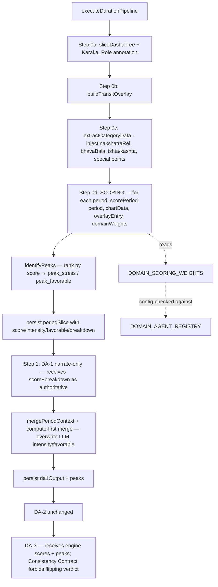
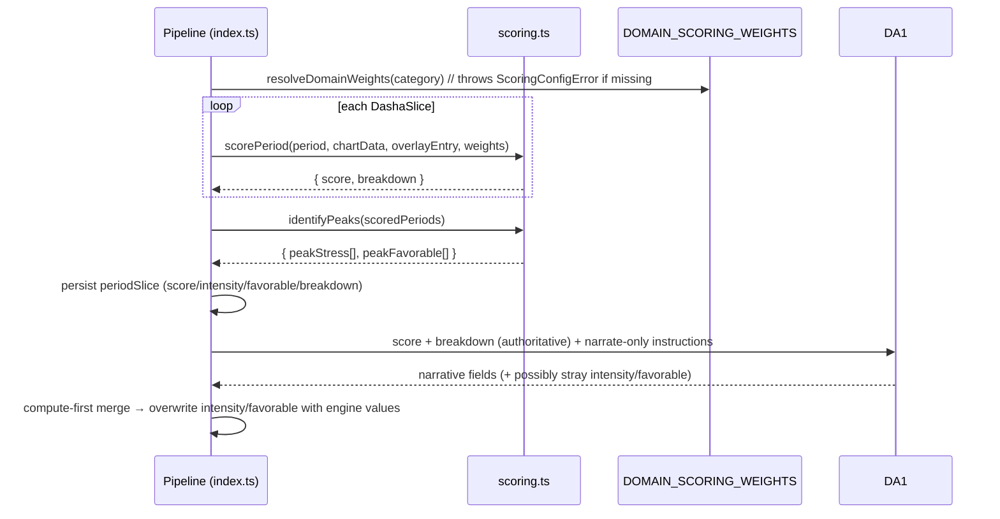

# Design Document: Duration Analysis Scoring

## Overview

This feature (Phase 1 of the Duration Analysis deepening roadmap — see `docs/ROADMAP.md`)
adds a deterministic, compute-first scoring layer to the existing Duration Analysis (DA)
pipeline. Today DA-1 (the Domain Analyser LLM) decides each period's `intensity` and
`favorable` verdict by judgment, and the DA extractor forwards only a subset of the
astrological data the compute engine (`engine/compute/`) already produces. This feature
moves the verdict to a pure-TypeScript **Scoring Engine** and wires the already-computed
hidden layers (Chara karakas, nakshatra relationships, Bhava Bala, Ishta/Kashta phala,
domain special points) into the DA context.

The contract established here is **compute-first, LLM-narrates**: a new module
`engine/durationAnalysis/scoring.ts` produces, for every sliced period, an integer
`score` in 0–100, an `intensity` band, a `favorable` flag, and an itemized, persisted
`ScoreBreakdown`. DA-1 receives those as authoritative and only writes narrative prose;
the pipeline overwrites any model-emitted verdict during the deterministic merge. Peaks
(most stressful / most favorable periods) are ranked by score, not chosen by the LLM.

The design is deliberately additive and non-breaking. It reuses the existing slicer →
transit-overlay → DA-1 → DA-2 → DA-3 flow (`engine/durationAnalysis/index.ts`), the
registry pattern (`engine/durationAnalysis/registry.ts`), and the `periodSlice` /
`transitOverlay` JSONB columns. No compute-path chart needs recomputation. Charts that
lack parts of the deterministic data set (paste-path or pre-migration) still get scored,
with a `Reduced_Confidence` flag and severity-weighted omission accounting.

### Scope (Phase 1)

Phase 1 delivers the **engine + persistence + API only**: the pure `scoring.ts` engine, the
`DOMAIN_SCORING_WEIGHTS` table, deterministic peak identification, the compute-first contract
for DA-1 and DA-3, persistence of scores/breakdowns/peaks, and their exposure through
`GET /api/duration-analysis/[id]`. **UI and report presentation** of scores, breakdowns,
peaks, and the `Reduced_Confidence` flag are explicitly **deferred to Phase 1.1** and are out
of scope here — no practitioner-facing rendering of these values is built in Phase 1. The
Phase 1 weights are **provisional and uncalibrated** (stamped `WEIGHTS_VERSION`
`0.x-provisional`); freezing them as calibrated depends on the Phase 2 Calibration_Gate,
which is an out-of-scope dependency recorded below and in the calibration section.

### Grounding in the current codebase

The design is anchored to the actual modules and stored data:

- **DA engine** — `slicer.ts` (`sliceDashaTree` + `PeriodLordAnnotation`), `transitOverlay.ts`
  (`buildTransitOverlay` + `TransitOverlay`), `extractor.ts` (`extractCategoryData` +
  `CategoryChartData`), `registry.ts` (`DOMAIN_AGENT_REGISTRY`), `index.ts`
  (`executeDurationPipeline`, `mergeDA1Outputs`, `mergePeriodContext`).
- **Deterministic astrology** — `shadbala.ts` (`ShadbalResult` → per-planet
  `components.total`, `strengthRatio`, `ishtaPhala`/`kashtaPhala`/`beneficRatio`,
  `ucchaBala`), `bhavaBala.ts` (`BhavaBalaResult` → per-house `total`/`rupas`),
  `karakas.ts` (`CharaKaraka[]` → `karakaAbbr` AK/AmK/BK/MK/PK/GK/DK),
  `nakshatraRelationships.ts` (`computeNakshatraRelationships` → depositor chains,
  sub-lords, parivartana, clusters), `arudhaPadas.ts` (`ArudhaPada[]`, AL=A1, UL=A12),
  `specialLagnas.ts` (`SpecialLagna[]` → HL/GL/SL).
- **Persisted chart columns** (`prisma/schema.prisma`, `UnifiedChart`): `planets`,
  `nakshatras`, `divisionalCharts`, `karakas`, `ashtakavarga`, `upagrahas`,
  `specialLagnas`, `arudhaPadas`, `relationships`, `shadbala`, `jaimini`, `bhavaBala`,
  `transits`, `dashaTree`. Note: `nakshatraRelationships` is **computed but not stored** —
  it is derived on-demand from the stored `nakshatras` column (see §Extractor Changes).

## Architecture



The Scoring Engine sits as a new **Step 0d**, after slice (0a) + transit overlay (0b) +
category extraction (0c) and **before** DA-1. It is pure: no LLM, no network, no DB, no
file I/O. The pipeline persists its output onto each period slice, then hands the same
data to DA-1 as read-only context.

### Data flow (compute-first)



## Components and Interfaces

### 1. Scoring Engine — `engine/durationAnalysis/scoring.ts` (NEW)

A pure module. Public surface:

```typescript
/**
 * Pure, deterministic period scorer. No LLM, network, DB, or file I/O.
 * Never throws on missing/malformed astrological data — omits the affected
 * factor, records the omission, and scores from the remaining factors.
 */
export function scorePeriod(
  period: DashaSlice,                       // includes lordAnnotations (+ karakaRole)
  chartData: ScoringChartData,              // deterministic columns needed for scoring
  transitOverlayEntry: TransitOverlay | null, // matching AD overlay (null if none)
  domainWeights: DomainScoringWeights,      // resolved per-category weight table entry
): PeriodScoreResult

export interface PeriodScoreResult {
  score: number            // integer 0–100
  breakdown: ScoreBreakdown
}

/**
 * Ranks already-scored periods and returns the extreme sets. Deterministic
 * tie-order: ascending pd.start, then md/ad/pd lord names.
 *
 * A period is only labeled a peak when its score deviates from neutral (50) — or,
 * equivalently, from the window median — by at least `minSignificance`
 * (Requirements 3.6 / 3.7). Periods within the threshold are NOT peaks: a flat window
 * (all scores near 50) therefore returns fewer peaks, or none, rather than reporting
 * near-neutral extremes as meaningful. `peakStress` requires score ≤ 50 − minSignificance;
 * `peakFavorable` requires score ≥ 50 + minSignificance.
 */
export function identifyPeaks(
  scored: Array<{ period: DashaSlice; result: PeriodScoreResult }>,
  topN?: number,               // default 3
  minSignificance?: number,    // default PEAK_SIGNIFICANCE_DELTA (12)
): { peakStress: PeakPeriod[]; peakFavorable: PeakPeriod[] }

/**
 * Resolves the weight-table entry for a category. Throws ScoringConfigError
 * when the category exists in DOMAIN_AGENT_REGISTRY but not in
 * DOMAIN_SCORING_WEIGHTS (Requirement 9.4). This is a configuration/programmer
 * error surfaced at pipeline start — NOT a data error inside scorePeriod.
 */
export function resolveDomainWeights(category: DurationCategory): DomainScoringWeights

export class ScoringConfigError extends Error {}

// Fixed constants (Requirements 2 / 3.6) — exported for test reuse.
export const FAVORABLE_THRESHOLD = 50          // score ≥ 50 ⇒ favorable
export const INTENSITY_HIGH_DELTA = 25         // |score-50| ≥ 25 ⇒ high
export const INTENSITY_MEDIUM_DELTA = 12       // 12 ≤ |score-50| < 25 ⇒ medium; else low
export const PEAK_SIGNIFICANCE_DELTA = 12      // |score-50| ≥ 12 required to qualify as a peak (Req 3.6/3.7)
```

`ScoringChartData` is a thin, scoring-focused view assembled from the extractor output so
the engine does not depend on the full `CategoryChartData` prompt payload:

```typescript
export interface ScoringChartData {
  category: DurationCategory
  shadbala?: ShadbalResult | null          // planets is ShadbalPlanet[] (an ARRAY, not a Record)
  bhavaBala?: BhavaBalaResult | null       // per-house total/rupas
  karakas?: CharaKaraka[] | null           // Chara Karaka assignments (karakaAbbr)
  ashtakavarga?: AshtakavargaResult | null // stored SAV bindus (sav: number[]) for natalHouseStrength
  planets?: PlanetPosition[] | null        // natal D1 positions — lord sign/house for dignity, mdAdRelationship
  // Domain special points (already resolved by the extractor; see §Extractor)
  specialPoints?: DomainSpecialPoints
}
```

> **Shadbala access is array-based.** `ShadbalResult.planets` is a `ShadbalPlanet[]`
> (see `engine/compute/types.ts`), **not** a `Record<string, …>`. Every per-lord lookup in
> the engine MUST be `shadbala.planets.find(p => p.planet === lord)` (returning
> `undefined` when the lord is absent → the factor is omitted). There is no
> `shadbala.planets[lord]` index access anywhere in the scorer.

#### Scoring formula (concrete)

Every applied factor produces a **normalized value** `n_f ∈ [0, 1]` (higher = more
supportive for the domain) and carries a **weight** `w_f` from the domain table. The
period score is the weight-normalized average over only the *available* factors, scaled
to 0–100:

```
score = round( 100 × clamp( Σ_{f ∈ applied} (w_f · n_f) / Σ_{f ∈ applied} w_f , 0, 1 ) )
```

Because omitted factors drop out of *both* the numerator and the denominator, the score
stays on the same 0–100 scale regardless of how many factors were available (graceful
degradation, Requirements 1.6 / 6.3 / 11.1). If **no** factor is available the engine
returns a neutral `score = 50` with a fully-omitted breakdown and `reducedConfidence = true`.

**Weights version stamping (Requirement 12.2/12.3).** Every `ScoreBreakdown` `scorePeriod`
returns carries `weightsVersion = WEIGHTS_VERSION` (the active `DOMAIN_SCORING_WEIGHTS`
version). The pipeline persists it unchanged on each scored slice, so a score is always
traceable to the exact weight configuration that produced it; breakdowns written under an
older version keep their original stamp when the table is later re-tuned. Because Phase 1
weights are `0.x-provisional`, downstream consumers can detect uncalibrated scores from the
stamp alone and MUST NOT present them to end clients as calibrated (Requirement 12.4/12.5).

Factor set and normalization (`n_f`), all derived from the running lords
(MD, AD, PD) unless noted:

| Factor key | Source | Normalization `n_f ∈ [0,1]` |
|---|---|---|
| `mdLordDignity` | dignity of MD lord (sign placement) | dignity ladder → [0,1] (see below) |
| `adLordDignity` | dignity of AD lord | dignity ladder → [0,1] |
| `pdLordDignity` | dignity of PD lord | dignity ladder → [0,1] |
| `shadbala` | `shadbala.planets.find(p => p.planet === lord)?.strengthRatio` (avg of running lords) | `clamp(ratio / 1.5, 0, 1)` (ratio 1.0 = required; 1.5+ = full) |
| `ishtaKashta` | `shadbala.planets.find(p => p.planet === lord)?.beneficRatio` (avg of running lords) | value already ∈ [0,1] |
| `houseOwnership` | lords' owned/occupied houses vs domain benefic/malefic houses; dusthana (6/8/12) penalty | centered map → [0,1] (0.5 neutral, +benefic, −malefic/dusthana) |
| `karakaRole` | running lords' `karakaRole` vs domain `relevantKarakaRoles` | MD match = 1.0, AD match = 0.8, none = 0.5 (neutral) |
| `naturalKaraka` | running lords vs domain `relevantNaturalKarakas` | MD match = 1.0, AD match = 0.75, PD match = 0.65, none = 0.5 (neutral) |
| `activatedYogas` | `lordAnnotations.*.activatedYogas` (Raja/Dhana/Neechabhanga/parivartana) | `0.5 + min(count, 3) × 0.15` → [0.5, 0.95] |
| `bhavaBala` | `bhavaBala.houses[h].rupas` for houses owned/occupied by lords (avg) | rank/relative normalization within the chart (see below) — NOT a saturating cap |
| `domainHouseActivation` | double transit: `overlay.saturn.houseFromLagna` / `overlay.jupiter.houseFromLagna` + graha-drishti onto the domain's `primaryHouses` | both activating = 1.0; one = 0.7; none = 0.5 (neutral) |
| `mdAdRelationship` | AD-lord sign-distance house from MD lord + permanent (naisargika) & temporary (tatkalika) maitri; shashtashtaka penalty | maitri base → [0,1]; `−0.3` when AD lord is in the 6th/8th from the MD lord; clamp [0,1] |
| `natalHouseStrength` | natal SAV bindus (`ashtakavarga.sav`) for the domain `primaryHouses` (avg) | `clamp(savBindus / (2 × SAV_MEAN), 0, 1)` with `SAV_MEAN ≈ 28` (mean = 0.5; higher = stronger) |
| `transitBav` | `overlay.saturnBavScore`, `overlay.jupiterBavScore` (avg, ignoring −1) | `bav / 8` (bindus 0–8; ≥4 = strong) |
| `saturnAfflictions` | `overlay.sadeSatiActive`/`sadeSatiPhase`, `ashtamaShani`, `kantakaShani` | penalty: start 1.0; peak Sade Sati −0.4, rising/setting −0.2, ashtamaShani −0.3, kantakaShani −0.2; clamp [0,1] |

**Dignity ladder → [0,1]** (reuses the sign-dignity concepts already encoded in
`shadbala.ts` — `MOOLATRIKONA_SIGNS`, exaltation/debilitation, `PERMANENT_FRIENDSHIP`):
exalted 1.0, moolatrikona 0.9, own 0.8, great friend 0.7, friend 0.6, neutral 0.5,
enemy 0.3, great enemy 0.2, debilitated 0.0. Each lord's sign is read from
`chartData.planets` (natal D1 `signNumber`). A period lord flagged `Neechabhanga active`
in `activatedYogas` raises a debilitated lord to 0.5.

**House-ownership normalization.** For each running lord, start at 0 points; `+1` per
domain-benefic house it owns or occupies, `−1` per domain-malefic house, an extra `−1`
dusthana penalty if it owns/occupies 6/8/12. Average the per-lord points, squash with
`n = clamp(0.5 + points × 0.15, 0, 1)` so neutral placement → 0.5. Ownership is derived
from each lord's dominion over the 12 signs via `SIGN_LORDS`; occupancy from the lord's
natal `house` in `chartData.planets`.

**`naturalKaraka` normalization (Requirement 1.9 — closes the previously dead config).**
For each running lord, test membership in `domainWeights.relevantNaturalKarakas` (e.g.
marriage → Venus/Jupiter, career → Sun/Saturn/Mercury). The MD lord matching is the
strongest signal (1.0), AD less (0.75), PD least (0.65); no running lord matching is
neutral (0.5). The karaka list is read *only* from the Domain_Weights — never hardcoded —
so a domain's significators are tunable without engine changes. This factor is distinct
from `karakaRole`, which uses the chart-specific Jaimini Chara Karaka assignment.

**`domainHouseActivation` normalization (Requirement 1.10 — the "double transit").** Read
transiting Saturn's and Jupiter's `houseFromLagna` from the Transit_Overlay_Entry, and add
graha-drishti: a planet in house `H` also aspects `H+7` (7th aspect), Saturn additionally
aspects `H+3` and `H+10`, Jupiter additionally `H+5` and `H+9`. A benefic (Jupiter) or the
karmic slow-mover (Saturn) *occupies or aspects* one of the domain's `primaryHouses` **or the
domain-house lord's natal house** (Req 1.10 — the lord's house is resolved via lagna →
primaryHouse sign → `SIGN_LORDS` → that lord's natal `house`) ⇒ that planet is "activating".
Both Saturn and Jupiter activating ⇒ 1.0 (classical double-transit
confirmation); exactly one ⇒ 0.7; neither ⇒ 0.5 (neutral). This is deliberately
domain-specific (keyed off `primaryHouses`) and is computed *independently* of the
transiting planet's generic BAV bindus in its own sign — unlike `transitBav`, which remains
the generic Saturn/Jupiter BAV signal.

**`mdAdRelationship` normalization (Requirement 1.11).** Applies only when both MD and AD
lords are available. Combine permanent friendship (naisargika maitri, from the
`PERMANENT_FRIENDSHIP` table in `shadbala.ts`: great-friend/friend/neutral/enemy/
great-enemy) with temporary friendship (tatkalika maitri, computed from the AD lord's sign
distance from the MD lord — planets in the 2/3/4/10/11/12 from each other are temporary
friends, in the 1/5/6/7/8/9 temporary enemies). Map the compound relationship to a `[0,1]`
base (great friend 1.0 … great enemy 0.0, neutral 0.5). Then subtract a **shashtashtaka
penalty** of `0.3` when the AD lord occupies the 6th or 8th house *from the MD lord* (6–8
friction); clamp to `[0,1]`. When only one of the two lords is available, the factor is
omitted.

**`natalHouseStrength` normalization (Requirement 1.12).** A static, transit-independent
signal. Read the natal SAV bindus for each of the domain's `primaryHouses` from
`chartData.ashtakavarga.sav` (a 12-element array **SIGN-indexed**, sav[0] = Aries …
sav[11] = Pisces — see `engine/compute/ashtakavarga.ts`; the engine converts each domain
house → sign via the lagna before indexing). Average them
and normalize against the classical SAV mean: `n = clamp(avgBindus / (2 × SAV_MEAN), 0, 1)`
with `SAV_MEAN ≈ 28` (total 337 bindus / 12 houses). A house at the mean maps to 0.5; a
strongly-tenanted house (e.g. 40+ bindus) maps well above 0.5; a weak house (e.g. 18)
below. Omitted when `ashtakavarga.sav` is unavailable.

**`bhavaBala` normalization (Requirement 1.13 — non-saturating).** The prior
`clamp(rupas / MAX_BHAVA_RUPAS, 0, 1)` with `MAX_BHAVA_RUPAS = 8` was wrong: house rupas =
`total / 60`, and `total` includes the house lord's **full Shadbala virupas** (routinely
300–500+ virupas ⇒ 5–9+ rupas) plus Dig Bala and Drishti Bala. A fixed cap of 8 flattens
most real houses to `1.0`, destroying all discrimination. The redesigned normalization
preserves discrimination two ways (the engine uses **relative** normalization by default):

- **Relative (default):** normalize each activated house's rupas against the *chart's own*
  min/max house rupas: `n = (rupas − minRupas) / (maxRupas − minRupas)` over the 12 houses
  of that chart (guard `maxRupas === minRupas` → 0.5). This ranks the activated houses
  within the chart and is inherently robust to the absolute rupas scale.
- **Absolute (fallback):** `clamp(rupas / BHAVA_RUPAS_CALIBRATION, 0, 1)` where
  `BHAVA_RUPAS_CALIBRATION` is a **provisional** constant calibrated from the observed rupas
  distribution in the Sanity_Backtest fixtures (expected on the order of ~10–12, well above
  8), documented in code as provisional and pinned by the backtest.

`BHAVA_RUPAS_CALIBRATION` is exported and marked provisional; its value is asserted against
the observed fixture distribution in the Sanity_Backtest so it never silently regresses to a
saturating cap.

Each factor's `contribution = w_f · n_f` (pre-normalization points) is recorded verbatim
in the breakdown, alongside the raw value and weight, satisfying the itemization
requirement (1.8 / 10.3).

#### Intensity band and favorable flag (Requirement 2)

Derived from the final integer score with fixed constants (deterministic; equal scores ⇒
equal band + flag):

```
favorable = score ≥ FAVORABLE_THRESHOLD (50)

delta = |score − 50|
intensity = delta ≥ 25  → 'high'      // strongly favorable OR strongly challenging
          | delta ≥ 12  → 'medium'
          | otherwise   → 'low'
```

Intensity encodes *magnitude of signal* and `favorable` encodes *direction* — matching
the existing DA-1 semantics where `intensity: 'high'` + `favorable: false` = intense
stress. Both are pure functions of the score.

#### Peaks (Requirement 3)

`identifyPeaks` sorts scored periods by `score` and returns up to `topN` lowest as
`peakStress` and `topN` highest as `peakFavorable`. Ties at an extreme score are all
included, ordered deterministically by `pd.start` then lord triple. Each `PeakPeriod`
carries a human label, its score, and the top-3 contributing factors pulled from its
`ScoreBreakdown.factors` (ranked by `contribution`).

**Significance floor (Requirements 3.6 / 3.7).** A candidate only qualifies as a peak when
its score clears the significance threshold: `peakStress` requires
`score ≤ 50 − PEAK_SIGNIFICANCE_DELTA` (≤ 38) and `peakFavorable` requires
`score ≥ 50 + PEAK_SIGNIFICANCE_DELTA` (≥ 62). Periods that stay within `±12` of neutral are
never labeled peaks. Consequently a **flat window** — every period hovering near 50 —
returns fewer peaks, or an empty set, rather than surfacing near-neutral extremes as if they
were meaningful. The threshold is measured from neutral (50); the window-median variant is
equivalent for the near-symmetric score distributions the engine produces and is available
as an alternative reference point.

### 2. Domain Scoring Weights — `engine/durationAnalysis/scoringWeights.ts` (NEW)

`DOMAIN_SCORING_WEIGHTS` is the single source of truth for every per-domain parameter
(Requirement 9). It is keyed by `DurationCategory` and mirrors the one-entry-per-domain
shape of `DOMAIN_AGENT_REGISTRY`. The engine reads *all* per-domain parameters from here;
nothing per-domain is hardcoded inside `scoring.ts`.

```typescript
export interface DomainScoringWeights {
  category: DurationCategory
  beneficHouses: number[]          // e.g. career: [1, 2, 6, 9, 10, 11]
  maleficHouses: number[]          // e.g. [8, 12] (6/8/12 also carry the dusthana penalty)
  primaryHouses: number[]          // the domain's defining house(s): marriage [7], career [10],
                                   // wealth [2,11], property [4], health [1,6,8], cashflow [2,11].
                                   // Used by domainHouseActivation and natalHouseStrength.
  relevantKarakaRoles: string[]    // Karaka_Role abbrs, e.g. marriage: ['DK'], career: ['AmK']
  relevantNaturalKarakas: string[] // e.g. marriage: ['Venus', 'Jupiter']; career: ['Sun', 'Saturn', 'Mercury']
  weights: Record<ScoringFactorKey, number>   // per-factor weights (need not sum to any total)
  specialPoints: DomainSpecialPointSpec[]      // declared points to inject/score (Req 7)
  primaryFactors: ScoringFactorKey[]           // omissions here materially dent confidence (Req 11 / §Confidence)
}

export type ScoringFactorKey =
  | 'mdLordDignity' | 'adLordDignity' | 'pdLordDignity'
  | 'shadbala' | 'ishtaKashta' | 'houseOwnership'
  | 'karakaRole' | 'naturalKaraka' | 'activatedYogas' | 'bhavaBala'
  | 'domainHouseActivation' | 'mdAdRelationship' | 'natalHouseStrength'
  | 'transitBav' | 'saturnAfflictions'

/** Declares a special point a domain needs (Requirement 7). */
export interface DomainSpecialPointSpec {
  key: string                      // e.g. 'upapadaLagna', 'darakaraka', 'arudhaLagna', 'horaLagna'
  source: 'arudhaPadas' | 'specialLagnas' | 'karakas' | 'upagrahas'
  selector: string                 // e.g. 'UL' (arudha abbr), 'HL'/'GL'/'SL', 'DK', upagraha abbr
  confidence: 'primary' | 'secondary'  // primary omission dents confidence; secondary is a footnote
}

/**
 * Weights_Version (Requirement 12). A content-addressable version stamped onto every
 * persisted Score_Breakdown so a score is always traceable to the exact weight table that
 * produced it. Bump on any change to DOMAIN_SCORING_WEIGHTS. Semver is used here; a content
 * hash of the serialized table is an equally valid choice.
 *
 * PROVISIONAL / UNCALIBRATED (Requirement 12.4). The `0.x` major signals Phase 1 status:
 * these weights are hand-seeded, NOT validated against life-event outcomes. Scores produced
 * from them MUST NOT be presented to end clients as calibrated until the Phase 2
 * Calibration_Gate (Requirement 13) is passed.
 */
export const WEIGHTS_VERSION = '0.1.0-provisional'

export const DOMAIN_SCORING_WEIGHTS: Record<DurationCategory, DomainScoringWeights> = { /* all six below */ }
```

All six categories are declared **completely** — no "same shape as another category"
placeholders (Requirements 9.5 / 9.6). Maraka/badhaka sensitivity is represented via each
domain's `maleficHouses` in Phase 1 (Requirement 9.7); a dedicated maraka factor is deferred.
All weights are **PROVISIONAL / UNCALIBRATED** (Requirement 12.4) and carry `WEIGHTS_VERSION`.

```typescript
health: {
  category: 'health',
  beneficHouses: [1, 5, 9, 11],
  maleficHouses: [6, 8, 12],              // maraka/badhaka sensitivity via malefics (Req 9.7)
  primaryHouses: [1, 6, 8],               // body/ascendant, disease, chronic/longevity
  relevantKarakaRoles: ['AK'],            // Atmakaraka — vitality
  relevantNaturalKarakas: ['Sun', 'Moon', 'Saturn'],
  weights: {
    mdLordDignity: 12, adLordDignity: 10, pdLordDignity: 5,
    shadbala: 10, ishtaKashta: 8, houseOwnership: 14,
    karakaRole: 6, naturalKaraka: 6, activatedYogas: 4, bhavaBala: 8,
    domainHouseActivation: 8, mdAdRelationship: 6, natalHouseStrength: 8,
    transitBav: 8, saturnAfflictions: 12,   // Saturn afflictions weigh heavily on health
  },
  specialPoints: [
    { key: 'ghatiLagna', source: 'specialLagnas', selector: 'GL', confidence: 'primary' },   // vitality (Req 7.5)
    { key: 'gulika',     source: 'upagrahas',     selector: 'Gk', confidence: 'secondary' },  // affliction marker
  ],
  primaryFactors: ['houseOwnership', 'saturnAfflictions', 'natalHouseStrength'],
},
career: {
  category: 'career',
  beneficHouses: [1, 2, 6, 9, 10, 11],
  maleficHouses: [8, 12],
  primaryHouses: [10],                    // karma bhava
  relevantKarakaRoles: ['AmK'],           // Amatyakaraka
  relevantNaturalKarakas: ['Sun', 'Saturn', 'Mercury'],
  weights: {
    mdLordDignity: 13, adLordDignity: 11, pdLordDignity: 5,
    shadbala: 12, ishtaKashta: 7, houseOwnership: 14,
    karakaRole: 9, naturalKaraka: 7, activatedYogas: 7, bhavaBala: 8,
    domainHouseActivation: 10, mdAdRelationship: 6, natalHouseStrength: 8,
    transitBav: 8, saturnAfflictions: 7,
  },
  specialPoints: [
    { key: 'arudhaLagna', source: 'arudhaPadas',  selector: 'AL', confidence: 'primary' },   // public image
    { key: 'ghatiLagna',  source: 'specialLagnas', selector: 'GL', confidence: 'secondary' }, // power/authority (Req 7.5)
  ],
  primaryFactors: ['shadbala', 'karakaRole', 'domainHouseActivation'],  // D10/Amatyakaraka substrate
},
wealth: {
  category: 'wealth',
  beneficHouses: [1, 2, 5, 9, 11],
  maleficHouses: [6, 8, 12],
  primaryHouses: [2, 11],                 // accumulation + gains
  relevantKarakaRoles: [],
  relevantNaturalKarakas: ['Jupiter', 'Venus'],
  weights: {
    mdLordDignity: 12, adLordDignity: 10, pdLordDignity: 5,
    shadbala: 10, ishtaKashta: 8, houseOwnership: 15,
    karakaRole: 4, naturalKaraka: 8, activatedYogas: 8, bhavaBala: 8,
    domainHouseActivation: 9, mdAdRelationship: 6, natalHouseStrength: 9,
    transitBav: 8, saturnAfflictions: 6,
  },
  specialPoints: [
    { key: 'sreeLagna',  source: 'specialLagnas', selector: 'SL', confidence: 'primary'   }, // prosperity
    { key: 'horaLagna',  source: 'specialLagnas', selector: 'HL', confidence: 'primary'   }, // wealth-flow
    { key: 'ghatiLagna', source: 'specialLagnas', selector: 'GL', confidence: 'secondary' }, // (Req 7.5)
  ],
  primaryFactors: ['houseOwnership', 'naturalKaraka', 'natalHouseStrength'],
},
marriage: {
  category: 'marriage',
  beneficHouses: [1, 5, 7, 11],
  maleficHouses: [6, 8, 12],
  primaryHouses: [7],                     // spouse/partnership
  relevantKarakaRoles: ['DK'],            // Darakaraka
  relevantNaturalKarakas: ['Venus', 'Jupiter'],
  weights: {
    mdLordDignity: 12, adLordDignity: 11, pdLordDignity: 5,
    shadbala: 9, ishtaKashta: 7, houseOwnership: 14,
    karakaRole: 11, naturalKaraka: 9, activatedYogas: 6, bhavaBala: 7,
    domainHouseActivation: 9, mdAdRelationship: 7, natalHouseStrength: 8,
    transitBav: 8, saturnAfflictions: 7,
  },
  specialPoints: [
    { key: 'upapadaLagna', source: 'arudhaPadas',  selector: 'UL', confidence: 'primary'   }, // marriage arudha
    { key: 'darakaraka',   source: 'karakas',       selector: 'DK', confidence: 'primary'   },
    { key: 'ghatiLagna',   source: 'specialLagnas', selector: 'GL', confidence: 'secondary' }, // (Req 7.5)
  ],
  primaryFactors: ['karakaRole', 'houseOwnership', 'naturalKaraka'],
},
property: {
  category: 'property',
  beneficHouses: [1, 4, 9, 11],
  maleficHouses: [6, 8, 12],
  primaryHouses: [4],                     // land/vehicles/fixed assets
  relevantKarakaRoles: [],
  relevantNaturalKarakas: ['Mars', 'Venus', 'Saturn'],
  weights: {
    mdLordDignity: 12, adLordDignity: 10, pdLordDignity: 5,
    shadbala: 9, ishtaKashta: 7, houseOwnership: 16,
    karakaRole: 4, naturalKaraka: 8, activatedYogas: 7, bhavaBala: 9,
    domainHouseActivation: 10, mdAdRelationship: 6, natalHouseStrength: 9,
    transitBav: 8, saturnAfflictions: 6,
  },
  specialPoints: [
    { key: 'ghatiLagna', source: 'specialLagnas', selector: 'GL', confidence: 'secondary' }, // (Req 7.5)
  ],
  primaryFactors: ['houseOwnership', 'domainHouseActivation', 'natalHouseStrength'],
},
cashflow: {
  category: 'cashflow',
  beneficHouses: [1, 2, 6, 10, 11],       // liquidity: income vs expenses vs debt
  maleficHouses: [8, 12],                 // 6th is favorable for cashflow (loans/competition won)
  primaryHouses: [2, 11],                 // liquid funds + recurring gains
  relevantKarakaRoles: [],
  relevantNaturalKarakas: ['Mercury', 'Venus'],
  weights: {
    mdLordDignity: 11, adLordDignity: 11, pdLordDignity: 7,   // PD matters more for short-term liquidity
    shadbala: 10, ishtaKashta: 8, houseOwnership: 14,
    karakaRole: 4, naturalKaraka: 7, activatedYogas: 7, bhavaBala: 8,
    domainHouseActivation: 8, mdAdRelationship: 6, natalHouseStrength: 8,
    transitBav: 9, saturnAfflictions: 7,
  },
  specialPoints: [
    { key: 'horaLagna',  source: 'specialLagnas', selector: 'HL', confidence: 'primary'   }, // wealth-flow / hora
    { key: 'ghatiLagna', source: 'specialLagnas', selector: 'GL', confidence: 'secondary' }, // (Req 7.5)
  ],
  primaryFactors: ['houseOwnership', 'transitBav'],
},
```

Every entry above is a complete `DomainScoringWeights` value (Requirements 9.5 / 9.6): each
declares `beneficHouses`, `maleficHouses`, `primaryHouses`, `relevantKarakaRoles`,
`relevantNaturalKarakas`, a full per-factor `weights` map covering all `ScoringFactorKey`
values, `specialPoints` (each domain declares Ghati Lagna `GL` per Requirement 7.5), and
`primaryFactors`. `resolveDomainWeights` therefore returns a fully-populated entry for every
one of the six categories.

**Config validation (Requirement 9.4).** `resolveDomainWeights(category)` looks the
category up in `DOMAIN_SCORING_WEIGHTS`; if it exists in `DOMAIN_AGENT_REGISTRY` but not
here, it throws `ScoringConfigError("No scoring weights registered for category: X")`.
The pipeline calls `resolveDomainWeights` once, before the scoring loop, so a
mis-configuration fails fast and loud — distinct from the never-throw contract of
`scorePeriod` on bad *data*.

### 3. Slicer changes — `engine/durationAnalysis/slicer.ts`

Add `karakaRole` to `PeriodLordAnnotation` (Requirement 4):

- Extend the `sliceDashaTree` `chart` param with `karakas: unknown` (the stored
  `CharaKaraka[]`).
- New helper `lookupKarakaRole(karakas, planet): string | null` — finds the planet in the
  `karakas` array and returns its `karakaAbbr` (`AK`/`AmK`/`BK`/`MK`/`PK`/`GK`/`DK`).
- `buildAnnotation` sets `karakaRole`.
- **Nodes:** Rahu/Ketu are not in the 7-karaka scheme (`computeCharaKarakas` excludes
  them) → `lookupKarakaRole` returns `null` for any planet absent from the array,
  satisfying 4.2 naturally.
- **Jaimini unavailable (4.4):** if `karakas` is null/empty, every lookup returns `null`;
  the scorer then omits the `karakaRole` factor and records the omission.

```typescript
export interface PeriodLordAnnotation {
  // …existing fields…
  karakaRole: string | null   // Chara Karaka abbr, or null (nodes / no jaimini data)
}
```

### 4. Extractor changes — `engine/durationAnalysis/extractor.ts`

`extractCategoryData` gains the deterministic layers the scorer and DA-1 need, for **all**
categories, plus per-domain special points. The extractor stays pure (no LLM/DB/IO).

New injected keys and their unavailable-data behavior (per the approved requirements):

| Injected key | Source | Unavailable-data rule |
|---|---|---|
| `nakshatraRelationships` | **derived on-demand** via `computeNakshatraRelationships(nakshatras, lagnaSubLord)` (not a stored column) | If `nakshatras` is absent/empty → **omit the key entirely** (Req 5.3) |
| `bhavaBala` | stored `bhavaBala` column | If unavailable → include the key with `null`/empty to signal it was attempted (Req 6.3) |
| `ishtaKashta` | derived from stored `shadbala` (per-planet `ishtaPhala`/`kashtaPhala`/`beneficRatio`) | If `shadbala` absent → omit; scorer omits `ishtaKashta`/`shadbala` factors |
| `ashtakavarga` | stored `ashtakavarga` column (`sav: number[]`, 12 house-from-lagna bindus) — feeds `natalHouseStrength` | If unavailable → include the key with `null`; scorer omits `natalHouseStrength` |
| `planets` | stored `planets` column (natal D1 `signNumber`/`house`) — feeds lord dignity, `houseOwnership`, `mdAdRelationship` | If unavailable → dignity/ownership/mdAdRelationship factors that need it are omitted |
| special points (per domain) | `arudhaPadas`, `specialLagnas`, `karakas`, `upagrahas` per `DomainSpecialPointSpec` | If a declared point is absent → include it **explicitly marked omitted** (`{ key, omitted: true }`), never silently dropped (Req 7.4) |

`CategoryChartData` and `ScoringChartData` are extended accordingly. Special-point
resolution reads the `specialPoints` declared in `DOMAIN_SCORING_WEIGHTS[category]` so the
registry and the extractor never disagree (Req 7.1/7.3). Resolved shape:

```typescript
export interface ResolvedSpecialPoint {
  key: string                    // e.g. 'upapadaLagna'
  omitted: boolean               // true when the underlying data was unavailable (Req 7.4)
  confidence: 'primary' | 'secondary'
  value?: {                      // present only when omitted === false
    sign?: string; signNumber?: number; house?: number; planet?: string
  }
}
export type DomainSpecialPoints = Record<string, ResolvedSpecialPoint>
```

The `nakshatraRelationships` derivation is the one subtle point: because the compute
engine produces `computedNakshatra` but the mapper does **not** persist it as a
`UnifiedChart` column, the extractor recomputes it deterministically from the stored
`nakshatras` array via `computeNakshatraRelationships(nakshatras, lagnaSubLord)`. This is
pure and cheap (arithmetic over 9 entries) and keeps the determinism guarantee intact.
DA-1's prompt instructs the model to use the injected data rather than re-deriving nakshatra
lords/sub-lords/chains (Req 5.2).

**`lagnaSubLord` source (explicit).** `computeNakshatraRelationships` takes an optional
`lagnaSubLord` to add the Lagna sub-lord layer. The extractor derives it from the stored
`nakshatras` array: if that array carries a Lagna/ascendant entry (`planet === 'Lagna'` or
`'Ascendant'`), its `subLord` is passed through; otherwise the extractor calls
`computeNakshatraRelationships(nakshatras)` **without** a `lagnaSubLord`, and the Lagna
sub-lord layer degrades gracefully (the rest of the depositor chains, sub-lords,
parivartana, and clusters are still produced from the nine planetary entries). The Lagna
longitude is not stored on the `nakshatras` column, so no attempt is made to recompute it
from raw positions here — the layer is simply omitted when the entry is absent.

### 5. Pipeline integration — `engine/durationAnalysis/index.ts`

Insert scoring as **Step 0d**, after `extractCategoryData` and before DA-1 batching:

```typescript
// after periodSlice (0a), transitOverlay (0b), categoryData (0c):

// 0d. Deterministic scoring (pure — never throws on data issues)
const domainWeights = resolveDomainWeights(category)        // throws ScoringConfigError if misconfigured
const scoringChartData = toScoringChartData(categoryData, chart)  // shadbala/bhavaBala/karakas/ashtakavarga/planets/specialPoints
const overlayByAd = new Map(transitOverlay.map(o => [o.adStart, o]))

const scored = periodSlice.map((period) => {
  const overlayEntry = overlayByAd.get(period.ad.start) ?? null
  const result = scorePeriod(period, scoringChartData, overlayEntry, domainWeights)
  return { period, result }
})

const { peakStress, peakFavorable } = identifyPeaks(scored)

// Attach score/intensity/favorable/breakdown onto each period slice (persisted below).
const scoredSlices: ScoredDashaSlice[] = scored.map(({ period, result }) => ({
  ...period,
  score: result.score,
  intensity: result.breakdown.intensity,
  favorable: result.breakdown.favorable,
  scoreBreakdown: result.breakdown,
}))

await prisma.durationAnalysis.update({
  where: { id: analysisId },
  data: {
    periodSlice: scoredSlices as any,        // now carries scores
    transitOverlay: transitOverlay as any,
  },
})
```

- **DA-1 input.** Each batch's slice entries already carry `score`, `intensity`,
  `favorable`, and a compact `scoreBreakdown` (top factors + verdict), fed to DA-1 as
  authoritative context (see §6).
- **Compute-first merge (Requirement 8.3/8.4).** `mergePeriodContext` is extended: after
  joining `lordAnnotations`/`transitContext`, it also **overwrites** each
  `period_analysis[i].intensity` and `.favorable` with the engine values from the matching
  scored slice, and attaches `score` + `scoreBreakdown`. Any model-emitted intensity/
  favorable is discarded. If a period cannot be matched, the engine verdict for that slice
  still wins (the LLM's value is never trusted).
- **Peaks (Requirement 3.3).** `da1Output.peak_stress_periods` and
  `peak_favorable_periods` are **replaced** by the engine's `peakStress`/`peakFavorable`
  (mapped to the existing `{ period, reason }` shape, `reason` built from top factors), so
  DA-1 cannot select or reorder peaks. The batched `mergeDA1Outputs` no longer concatenates
  LLM peaks; the deterministic peaks are authoritative and computed once over the whole
  window (not per batch).
- **Determinism.** Scoring runs once over the full `periodSlice` before batching, so peak
  ranking is global and independent of `DA1_BATCH_SIZE`.

### 6. DA-1 prompt changes — `prompts/agents/duration_da1_domain_analyser.md`

Add a "Compute-First Contract" block instructing the model that the engine verdict is
authoritative:

- The period table now includes, per period: `score` (0–100), `intensity`, `favorable`,
  and a `score_breakdown` (top contributing factors with their contributions, plus any
  omissions and the confidence level).
- DA-1 **must not** change `intensity` or `favorable`. It narrates *why* the engine reached
  its verdict, using the breakdown factors, `lordAnnotations`, `nakshatraRelationships`,
  `bhavaBala`, and the injected special points.
- DA-1 must not select or reorder peak periods — those are provided.
- When a period's breakdown carries `reducedConfidence`/omissions, DA-1 must explicitly
  note the reduced confidence in prose (see §Confidence) rather than overstating certainty.
- Narrative-only output fields remain: `analysis`, `key_factors`, `transit_factors`,
  `activated_yogas`, `bahiranga`, `antaranga`. (The model may still *emit* `intensity`/
  `favorable` for schema stability, but the pipeline overwrites them.)

### 7. DA-3 forecast consistency — `buildDA3Prompt` + `prompts/agents/duration_da3_future_analyser.md`

DA-3 is **no longer "unchanged."** Under the compute-first contract it must forecast *around*
the engine's deterministic verdict, never against it (Requirement 14).

**Pipeline injection (`buildDA3Prompt`).** Before invoking DA-3, the pipeline builds a
compact **scored-period summary** from the persisted `ScoredDashaSlice[]` and injects it,
together with the deterministic `peakStress`/`peakFavorable` sets, as authoritative context.
The summary is one row per AD (matching DA-3's per-AD forecast granularity):

```
ENGINE VERDICT (authoritative — do not contradict)
  Jupiter MD / Saturn AD (2027-03 → 2029-01): score 34, intensity high, favorable=false
    top factors: saturnAfflictions (peak Sade Sati), houseOwnership (−), domainHouseActivation (none)
  Jupiter MD / Mercury AD (2029-01 → 2031-05): score 71, intensity high, favorable=true
    top factors: naturalKaraka (MD match), natalHouseStrength (H10 40 bindus), transitBav (7/8)
  …
PEAK STRESS:     Jupiter MD / Saturn AD (score 34)
PEAK FAVORABLE:  Jupiter MD / Mercury AD (score 71)
```

This replaces DA-3's reliance on its own reading of BAV scores for the favorable/challenging
call: the engine `score`, `intensity`, and `favorable` are provided per AD and are
authoritative. DA-3 still authors `bahiranga`/`antaranga`/`why`/`transit_why`/
`recommendations`.

**Prompt Consistency Contract.** `duration_da3_future_analyser.md` gains a **Consistency
Contract** block instructing the model that:

- Each period arrives with an engine `score`, `intensity`, and `favorable` verdict that is
  authoritative and MUST NOT be reversed. A period the engine marks `favorable=true` MUST
  NOT be forecast as net-challenging, and vice-versa (Requirement 14.3).
- DA-3 MAY add nuance, texture, caveats, and *explain the reasons* behind the verdict, but
  MAY NOT flip its direction or contradict its intensity band.
- DA-3 MUST NOT select, reorder, or invent peak periods — the peak-stress and peak-favorable
  periods are provided by the engine.
- When DA-2 was overridden (symptom mismatch), DA-3 still honors the engine verdict and notes
  the astrological caveat, as today.

Because "never flips the verdict" is a constraint on LLM output rather than a pure function,
it is verified by the **prompt-contract wording** plus an **integration test** that runs DA-3
against seeded engine verdicts and asserts the returned per-period direction never contradicts
the injected `favorable`/`intensity` — not by a property-based test (see Testing Strategy and
Property 29).

### 8. Duration Analysis API — `GET /api/duration-analysis/[id]`

The route already returns `periodSlice` verbatim. Because scores and breakdowns are stored
inside the `periodSlice` JSONB entries, they are exposed automatically (Requirement 10.2).
The design adds, for clarity and stable typing:

- A top-level `peaks: { peakStress: PeakPeriod[]; peakFavorable: PeakPeriod[] }` field,
  read from the persisted `da1Output` (or a dedicated column — see §Persistence).
- No change to auth/shape beyond additive fields; existing consumers are unaffected.

## Data Models

### New/extended TypeScript types — `lib/durationTypes.ts`

```typescript
// ─── Score breakdown (persisted, audited) ───────────────────────────
export interface ScoreFactorContribution {
  factor: ScoringFactorKey
  value: number | string        // raw factor value used (e.g. dignity label, ratio, bav)
  weight: number                // per-domain weight applied
  normalized: number            // n_f ∈ [0,1]
  contribution: number          // weight × normalized (pre-normalization points)
}

export interface ScoreOmission {
  factor: ScoringFactorKey | string   // includes special-point keys
  reason: string                      // e.g. 'shadbala unavailable', 'Upapada omitted'
  severity: 'primary' | 'secondary'   // per domain primaryFactors / special-point confidence
}

export interface ScoreBreakdown {
  score: number                       // integer 0–100 (mirrors PeriodScoreResult.score)
  intensity: 'high' | 'medium' | 'low'
  favorable: boolean
  factors: ScoreFactorContribution[]  // one per applied factor
  omissions: ScoreOmission[]          // recorded, never silently dropped
  weightSumApplied: number            // Σ w_f over applied factors (denominator)
  reducedConfidence: boolean          // true when ≥1 factor/special point omitted (Req 11.2)
  confidence: 'full' | 'reduced' | 'low'   // 'low' when a PRIMARY factor/point is omitted
  weightsVersion: string              // WEIGHTS_VERSION that produced this breakdown (Req 12.2/12.3)
}

// ─── Scored period slice (persisted in periodSlice JSONB) ────────────
export interface ScoredDashaSlice extends DashaSlice {
  score: number
  intensity: 'high' | 'medium' | 'low'
  favorable: boolean
  scoreBreakdown: ScoreBreakdown
}

// ─── Peak periods (deterministic, authoritative) ─────────────────────
export interface PeakPeriod {
  label: string                       // e.g. "Jupiter MD / Saturn AD 2027-03"
  periodKey: string                   // md/ad/pd lords + pd.start for stable identity
  score: number
  topFactors: ScoreFactorContribution[]  // top-3 by contribution
}
```

`PeriodLordAnnotation` gains `karakaRole: string | null`. `PeriodAnalysis` (the DA-1 entry)
gains optional `score?: number` and `scoreBreakdown?: ScoreBreakdown`, merged in
deterministically post-DA-1.

### Persistence

- **Score + breakdown per period** live inside the existing `DurationAnalysis.periodSlice`
  JSONB column, as the `ScoredDashaSlice` shape above. No schema migration is required for
  scores — the column is already `Json?`. Because it is schemaless JSONB, incomplete
  breakdowns persist fine (Requirement 10.4): the reader treats every per-factor field and
  `factors[]` as optional and renders what is present.
- **Peaks** are persisted in `da1Output` (the deterministic peaks overwrite the LLM's peak
  arrays during the merge). Optionally a dedicated `peaks Json?` column may be added to
  `DurationAnalysis` for cleaner querying; the design treats this as an optional additive
  migration, not a hard requirement.
- **Reading (Requirement 10.2/10.3):** `GET /api/duration-analysis/[id]` returns
  `periodSlice` (with scores + breakdowns) and `peaks` as-is. Missing/corrupt per-factor
  data is tolerated: the API serializes whatever is stored without validation gating.

### Backward compatibility (Requirement 11)

- Scoring reads each factor's source defensively. Missing `shadbala` ⇒ omit `shadbala` +
  `ishtaKashta`; missing `bhavaBala` ⇒ omit `bhavaBala`; missing `karakas` ⇒
  `karakaRole = null` in annotations ⇒ omit `karakaRole`; missing overlay entry ⇒ omit
  `transitBav` + `saturnAfflictions`.
- Any omission sets `reducedConfidence = true` (11.2). A chart with the full deterministic
  set applies all factors and leaves `reducedConfidence = false`, `confidence = 'full'`
  (11.4).
- No recomputation of existing charts is triggered (11.3): the scorer works off whatever
  columns already exist; paste-path charts simply score from fewer factors.
- **Legacy score-absent contract (Requirements 11.5 / 11.6).** A `DurationAnalysis` row
  created before this feature has `periodSlice` entries with **no** `score`/`intensity`/
  `favorable`/`scoreBreakdown`. `GET /api/duration-analysis/[id]` returns those entries
  **verbatim** — it does not synthesize a score, a neutral 50, or an empty breakdown for
  them. Consumers MUST treat a period whose `score` or `scoreBreakdown` is absent as
  **unscored legacy data** (render it as "not scored", not as a real score), and the
  pipeline MUST NOT trigger recomputation or rescoring of that existing analysis on read.
  Scores appear only on analyses run after the feature ships; there is no backfill.

## Correctness Properties

*A property is a characteristic or behavior that should hold true across all valid
executions of a system — essentially, a formal statement about what the system should do.
Properties serve as the bridge between human-readable specifications and machine-verifiable
correctness guarantees.*

The Scoring Engine is pure and its behavior varies richly with input, so the following
universally-quantified properties are the primary verification vehicle. They are written
against `scorePeriod`, `identifyPeaks`, `resolveDomainWeights`, the slicer's Karaka_Role
tagging, the extractor's injection, and the pipeline's compute-first merge. (Prompt wording,
architectural purity, and DB/API wiring are verified by smoke, review, and integration
tests — see Testing Strategy — not by these properties.)

### Property 1: Score is a bounded integer

*For any* period, chart data, transit-overlay entry (or none), and domain weights, the
`score` returned by `scorePeriod` is an integer with `0 ≤ score ≤ 100` — including
degenerate inputs where every factor is omitted (which yields a neutral 50).

**Validates: Requirements 1.1, 1.5**

### Property 2: Determinism

*For any* fixed inputs, calling `scorePeriod` twice returns an identical `score` and a
deeply-equivalent `breakdown`; likewise `identifyPeaks` returns identical results across
repeated calls on the same scored set.

**Validates: Requirements 1.3**

### Property 3: Full data applies the complete factor set

*For any* input in which every factor source is present, `breakdown.factors` covers exactly
the domain's weighted factor set (MD/AD/PD lord dignity, total Shadbala, Ishta/Kashta ratio,
house ownership, Karaka_Role relevance, Natural_Karaka relevance, activated yogas, Bhava
Bala, Domain_House_Activation from the Saturn/Jupiter double transit, the MD_AD_Relationship,
Natal_House_Strength from the domain-house SAV, transit BAV of Saturn/Jupiter, and Saturn
affliction state) with no omissions.

**Validates: Requirements 1.4**

### Property 4: Graceful degradation on missing inputs

*For any* input with an arbitrary subset of factor sources removed (including any
combination of missing `shadbala`, `bhavaBala`, or `karakas`/jaimini), each affected factor
is absent from `breakdown.factors`, present in `breakdown.omissions`, and the returned
`score` is still a valid integer in `[0, 100]`.

**Validates: Requirements 1.6, 4.4, 6.3, 11.1**

### Property 5: Never throws on malformed input

*For any* arbitrary or malformed `chartData` / `transitOverlayEntry`, `scorePeriod`
completes without raising an exception and returns a well-formed result.

**Validates: Requirements 1.7, 10.4**

### Property 6: Factor itemization

*For any* input, every entry in `breakdown.factors` carries a factor name, the raw value
used, the weight applied, the normalized value, and a `contribution` equal to
`weight × normalized`.

**Validates: Requirements 1.8, 10.3**

### Property 7: Intensity band and favorable flag are pure functions of the score

*For any* integer score in `[0, 100]`, `favorable` equals `score ≥ FAVORABLE_THRESHOLD` and
`intensity` equals the fixed delta-threshold mapping (`high` when `|score−50| ≥ 25`,
`medium` when `≥ 12`, else `low`); consequently equal scores always yield the same band and
flag.

**Validates: Requirements 2.1, 2.2, 2.3**

### Property 8: Peaks are the score extremes

*For any* scored set of periods, every period in `peakStress` has a score `≤` every period
not in `peakStress`, and every period in `peakFavorable` has a score `≥` every period not in
`peakFavorable`.

**Validates: Requirements 3.1, 3.2**

### Property 9: Peak entries carry label, score, and top factors

*For any* scored set, each returned `PeakPeriod` has a non-empty label, a `score` equal to
its source period's score, and `topFactors` drawn from that period's
`breakdown.factors`.

**Validates: Requirements 3.4**

### Property 10: Tied extremes are complete and deterministically ordered

*For any* scored set containing multiple periods at an extreme score, all tied periods are
included in the corresponding peak set, in a deterministic tie-order (ascending `pd.start`,
then lord triple) that is stable across repeated calls.

**Validates: Requirements 3.5**

### Property 11: Karaka_Role tagging

*For any* chart and period, each lord annotation's `karakaRole` equals the Chara Karaka
abbreviation of that lord when present in the `karakas` data, and `null` otherwise —
including nodes (Rahu/Ketu), which are never in the scheme, and the case of absent
`karakas` data (all `null`).

**Validates: Requirements 4.1, 4.2**

### Property 12: Karaka_Role relevance is monotonic

*For any* period, setting a running lord's `karakaRole` to a role the domain marks relevant
yields a `karakaRole` factor normalized value no lower than the same period with a
non-matching role.

**Validates: Requirements 4.3**

### Property 13: Nakshatra-relationship injection

*For any* chart whose `nakshatras` data is present and non-empty, the extractor output
includes a `nakshatraRelationships` object exposing depositor chains, sub-lords, nakshatra
parivartana, and clusters; when `nakshatras` is absent the key is omitted entirely.

**Validates: Requirements 5.1, 5.3**

### Property 14: Bhava Bala contribution is monotonic

*For any* period, increasing the Bhava Bala (rupas) of the houses owned or occupied by the
running lords yields a `bhavaBala` factor normalized value no lower than the lower-rupas
case.

**Validates: Requirements 6.2**

### Property 15: Declared special points are always represented

*For any* category, every special point declared in `DOMAIN_SCORING_WEIGHTS` appears in the
extractor's resolved special-point output — with a value when its source data is present,
and explicitly marked `omitted: true` (never silently dropped, never a placeholder value)
when it is absent.

**Validates: Requirements 7.3, 7.4**

### Property 16: Scoring is driven entirely by the supplied weights

*For any* period, scaling a factor's weight to zero removes exactly that factor's
contribution from the weighted average, and two categories configured with identical
weights/houses produce identical scores for identical periods (no hidden per-domain
constants).

**Validates: Requirements 9.2, 9.3**

### Property 17: Compute-first merge always yields engine verdicts

*For any* DA-1 `period_analysis` output and the corresponding engine-scored slices, after
the deterministic merge every period's `intensity` and `favorable` equal the matching
scored slice's engine values, regardless of the values the model emitted.

**Validates: Requirements 8.3, 8.4**

### Property 18: Score breakdown survives serialization round-trip

*For any* `ScoreBreakdown`, deserializing its JSON serialization preserves the per-factor
itemization (`factor`, `value`, `weight`, `normalized`, `contribution`) and all recorded
omissions — including incomplete breakdowns with missing per-factor fields.

**Validates: Requirements 10.3, 10.4**

### Property 19: Omissions determine confidence, weighted by severity

*For any* input, `reducedConfidence` is `true` exactly when at least one factor or declared
special point is omitted; `confidence` is `low` when any omission is of a domain PRIMARY
factor/point, `reduced` when only SECONDARY omissions exist, and `full` when there are no
omissions.

**Validates: Requirements 11.2, 11.4**

### Property 20: Configuration error on missing weights

*For any* category that exists in `DOMAIN_AGENT_REGISTRY` but not in
`DOMAIN_SCORING_WEIGHTS`, `resolveDomainWeights` throws a `ScoringConfigError` whose message
names the missing category.

**Validates: Requirements 9.4**

### Property 21: Natural_Karaka relevance is monotonic

*For any* period, when a running lord is a member of the domain's `relevantNaturalKarakas`,
the `naturalKaraka` factor's normalized value is no lower than the same period with no
running lord in that list (neutral 0.5); and an MD-lord match yields a normalized value no
lower than an AD- or PD-lord match. The karaka membership is read only from the supplied
Domain_Weights.

**Validates: Requirements 1.9**

### Property 22: Domain_House_Activation credits the double transit

*For any* period and domain, when both transiting Saturn and Jupiter occupy or aspect one of
the domain's `primaryHouses`, the `domainHouseActivation` normalized value is no lower than
when exactly one does, which in turn is no lower than when neither does (neutral 0.5); and
the value is computed from transit house-from-lagna plus graha-drishti, independently of the
transiting planet's own-sign BAV.

**Validates: Requirements 1.10**

### Property 23: MD_AD_Relationship applies a shashtashtaka penalty

*For any* period in which both MD and AD lords are available, holding their permanent and
temporary maitri fixed, placing the AD lord in the 6th or 8th house from the MD lord yields
an `mdAdRelationship` normalized value strictly lower than (or, at the clamp floor, no higher
than) the same configuration without the 6/8 placement; and when only one of the two lords is
available the factor is omitted.

**Validates: Requirements 1.11**

### Property 24: Natal_House_Strength is monotonic in SAV bindus

*For any* period, increasing the natal SAV bindus of the domain's `primaryHouses` yields a
`natalHouseStrength` normalized value no lower than the lower-bindus case; the factor is
transit-independent (does not change with the transit-overlay entry) and is omitted when
`ashtakavarga.sav` is unavailable.

**Validates: Requirements 1.12**

### Property 25: Bhava Bala normalization does not saturate

*For any* set of houses whose rupas span the realistic observed range (routinely exceeding 8
rupas), the `bhavaBala` normalization maps distinct rupas values to distinguishable
normalized values across that range rather than collapsing them to a saturated maximum — so
two chart houses with materially different rupas receive different `bhavaBala` normalized
values (no flattening to 1.0).

**Validates: Requirements 1.13**

### Property 26: Peaks respect the significance floor

*For any* scored set, every period returned in `peakStress` has a score at or below
`50 − PEAK_SIGNIFICANCE_DELTA` and every period in `peakFavorable` has a score at or above
`50 + PEAK_SIGNIFICANCE_DELTA`; consequently a window whose scores all fall within the
threshold of neutral returns no peaks on the corresponding side.

**Validates: Requirements 3.6, 3.7**

### Property 27: Every breakdown is stamped with the weights version

*For any* input, the `ScoreBreakdown` returned by `scorePeriod` carries a non-empty
`weightsVersion` equal to the active `WEIGHTS_VERSION`, and that stamp survives the
persistence serialization round-trip so a persisted score is always traceable to the weight
configuration that produced it.

**Validates: Requirements 12.2, 12.3**

### Property 28: All six domains are fully configured

*For any* of the six categories (health, career, wealth, marriage, property, cashflow),
`resolveDomainWeights` returns a complete `DomainScoringWeights` entry — non-empty
`beneficHouses`, `maleficHouses`, and `primaryHouses`; a `weights` map defining every
`ScoringFactorKey`; declared `relevantKarakaRoles`, `relevantNaturalKarakas`,
`specialPoints`, and `primaryFactors` — with no placeholder or "same shape as another
category" entry.

**Validates: Requirements 9.5, 9.6**

### Property 29: DA-3 forecast never flips the engine verdict

For every period, the DA-3 forecast direction stays consistent with the engine verdict — a
period the engine marks `favorable` is never forecast as net-challenging, and vice-versa, and
DA-3 neither selects nor reorders peaks. Because this constrains LLM output rather than a pure
function, it is **not** a property-based test: it is enforced by the DA-3 prompt Consistency
Contract and verified by the DA-3 integration test (see Testing Strategy), which asserts the
returned per-period direction matches the injected `favorable`/`intensity`.

**Validates: Requirements 14.2, 14.3, 14.4**

## Error Handling

- **Never-throw scoring (Req 1.7).** `scorePeriod` wraps each factor computation so a
  missing or malformed input degrades to an omission, never an exception. Defensive reads
  mirror the existing `transitOverlay.ts` / `slicer.ts` style (`asArray`, `asObj`, typed
  guards, `?? null`). A totally empty factor set yields a neutral `score = 50` with
  `reducedConfidence = true`.
- **Config errors are loud and early (Req 9.4).** `resolveDomainWeights` throws
  `ScoringConfigError` at pipeline start when a registry category lacks a weights entry.
  This is caught by the existing `executeDurationPipeline` try/catch, which persists
  `status = 'failed'` with the error message and emits `agent_error` — the same path used
  for other fatal pre-DA errors. This is intentional: a missing weights entry is a
  deploy-time bug, not a runtime data condition.
- **Persistence resilience (Req 10.4).** Writing `periodSlice` with incomplete breakdowns
  cannot fail the analysis: the JSONB column accepts partial objects, and the reader/UI
  treat every per-factor field as optional.
- **Merge safety.** The compute-first merge overwrites verdicts even when a DA-1 period
  cannot be matched to a slice — the engine value is authoritative, so an unmatched or
  malformed LLM entry never leaks an LLM verdict into the persisted result.
- **Scoring approximations (documented).** The Shadbala inputs carry documented classical
  approximations (Tribhaga/Abda/Cheshta/DigBala — see `shadbala.ts` headers). These shift
  *absolute* scores slightly but largely wash out for *relative* ranking within a single
  chart, because every period in a run is scored against the same natal Shadbala. Peak
  identification and intra-chart comparisons therefore remain robust; cross-chart absolute
  score comparisons should be treated with the same caution as the underlying Shadbala.

## Calibration (Phase 1 Sanity_Backtest + Phase 2 gate)

### Phase 1 — Sanity_Backtest (in scope, Requirement 13.1/13.2)

A lightweight, deterministic backtest ships with Phase 1 to catch gross ranking regressions
while the weights are still provisional. It is **not** the accuracy gate — it only asserts
the engine ranks a small curated fixture set *sensibly*.

- **Fixtures.** A handful (≈4–8) of curated charts stored as JSON fixtures under
  `engine/durationAnalysis/__fixtures__/`, each paired with an **expected relative ranking**
  for a chosen domain + window (e.g. "chart A's marriage window should rank above chart B's;
  chart C's Saturn-Sade-Sati AD should be its own most-stressful peak"). Rankings are
  *relative*, not absolute scores, so they survive weight tuning.
- **Assertion (Vitest).** For each fixture, run `scorePeriod` over the window and assert the
  produced ordering is consistent with the expected relative ranking (e.g.
  `score(A) > score(B)`, and the expected peak matches `identifyPeaks`). A failure means a
  weight or normalization change broke basic sanity.
- **Calibration pins.** The same suite asserts the two provisional normalization constants
  do not silently regress: it samples the observed Bhava Bala rupas across the fixtures and
  asserts `BHAVA_RUPAS_CALIBRATION` sits above the observed cap-8 saturation point (i.e. real
  houses are discriminated, not flattened to 1.0), and that `SAV_MEAN` reflects the fixtures'
  SAV distribution.

The Sanity_Backtest is a Vitest suite run in CI alongside the property tests; it is distinct
from the Phase 2 gate below.

### Phase 2 — Calibration_Gate (out of scope, recorded dependency, Requirement 13.3/13.4)

The full **Calibration_Gate** — a curated N-chart set with **known life-event outcomes**, an
accuracy/ranking metric, and an explicit **human sign-off** — is a **Phase 2 prerequisite**
and is **out of scope for Phase 1**. It is recorded here as a hard dependency: the
`Provisional_Weights` MUST NOT be frozen, and Period_Scores MUST NOT be presented to end
clients as calibrated, until this gate is passed (Requirements 12.5 / 12.6 / 13.4). Phase 1
neither builds nor blocks on it; it only ensures every score is stamped with
`WEIGHTS_VERSION` so the eventual calibrated version is cleanly distinguishable from today's
provisional scores.

## Testing Strategy

The Scoring Engine is a set of pure functions over structured astrological inputs with a
large, varied input space (dignities, ratios, house sets, transit states, missing data) —
an ideal fit for property-based testing. UI, prompt-file wording, and API wiring are not.

**Property-based tests** (library: `fast-check`, ≥100 iterations each; the project uses
Vitest — see `package.json`). Each test is tagged
`Feature: duration-analysis-scoring, Property N: <text>` and targets the pure engine with
generated `DashaSlice` / `ScoringChartData` / `TransitOverlay` / `DomainScoringWeights`
inputs (including generators that randomly omit columns and special points to exercise
graceful degradation and confidence weighting).

**Example / unit tests** (Vitest, concrete cases):
- Fixed-threshold band/flag boundaries (scores 49/50, 25/26, 62/63/75) map to the exact
  `favorable`/`intensity` values.
- `resolveDomainWeights` throws `ScoringConfigError` for a registry category missing from
  `DOMAIN_SCORING_WEIGHTS`, and returns the entry when present.
- Slicer `karakaRole`: node lords → `null`; a chart with `karakas` tags AK/AmK/DK
  correctly; empty `karakas` → all `null`.
- Extractor: `nakshatraRelationships` omitted when `nakshatras` absent; `bhavaBala` key
  present-but-null when the column is null; a declared special point present-but-`omitted`
  when its source data is missing.
- A representative marriage chart with full data scores without `reducedConfidence`; the
  same chart stripped of `karakas` + Upapada flips to `confidence: 'low'` (primary
  omissions).

**Integration tests** (1–2 examples each):
- Run `executeDurationPipeline` (DA-1 mocked via the existing `callAgentJson` seam) on a
  stored compute-path chart and assert the persisted `periodSlice` entries carry
  `score`/`intensity`/`favorable`/`scoreBreakdown` (with a `weightsVersion` stamp), that
  DA-1's emitted intensity/favorable are overwritten by the engine values, and that
  `GET /api/duration-analysis/[id]` surfaces scores + breakdowns + peaks. Also assert a
  legacy row (period slices without scores) is returned verbatim with no synthesized score
  and triggers no rescoring (Requirements 11.5/11.6).
- **DA-3 consistency** (Requirement 14, verifies Property 29): invoke DA-3 (mocked LLM seam)
  with seeded engine per-period verdicts + peaks, and assert the returned per-period forecast
  direction never contradicts the injected `favorable`/`intensity` (no favorable→challenging
  or challenging→favorable flip). This pairs with the prompt Consistency Contract wording; it
  is an integration assertion, not a pure property.

**Sanity_Backtest** (Vitest, Requirement 13.1/13.2): the fixture-ranking suite described in
the Calibration section — asserts relative rankings across curated fixtures and pins the
provisional `BHAVA_RUPAS_CALIBRATION` / `SAV_MEAN` constants against the observed distribution
so normalization never regresses to a saturating cap.

## Open Decisions (Out of Build Scope)

- **OD-1 — Surya Siddhanta computational basis.** Carried forward from the requirements
  and explicitly **not implemented** here. The engine assumes the current Swiss Ephemeris
  + Lahiri ayanamsa + True Node + Whole Sign substrate. Adopting a Surya-Siddhanta basis
  would change the Moon's longitude, shift every Vimshottari dasha boundary, and thereby
  change every Period_Score — a foundational chart-accuracy decision that propagates
  through the whole pipeline. It is tracked as a separate foundational decision; no part of
  this design depends on resolving it.
