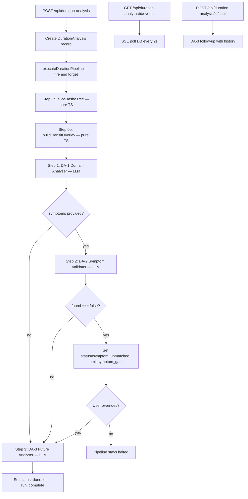
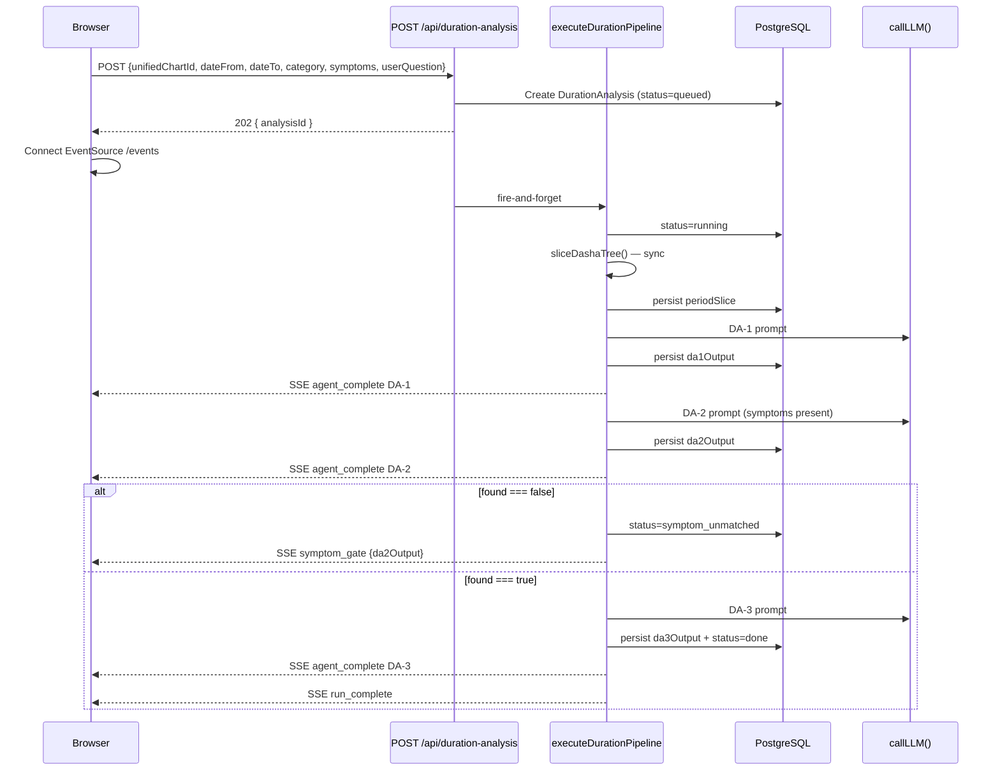
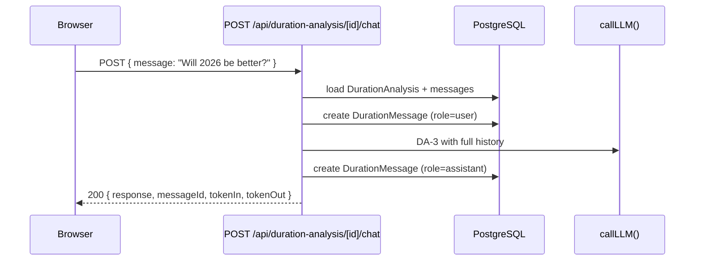

# Design Document: Duration Analysis

## Overview

Duration Analysis is a focused 3-agent sequential pipeline that lets a practitioner pick
a chart, a date range, a life domain (health/career/wealth/marriage/property), optional
current symptoms, and a free-text question. The system slices the stored Vimshottari dasha
tree, runs up to three LLM agents in sequence, streams progress via SSE, and exposes a
follow-up chat interface backed by DA-3. It is a sibling feature to the existing 18-agent
wave pipeline and shares infrastructure (Prisma, `callLLM`, SSE pattern) but has its own
DB tables, engine directory, API routes, and UI pages.

The pipeline is intentionally lightweight: no wave fan-out, no Wave 4 quality layer.
Period Slicer (Step 0) is pure TypeScript; DA-1/DA-2/DA-3 are sequential LLM calls with
structured JSON contracts. DA-2 is conditional — it only runs when `symptoms` is provided
— and acts as a gate that can short-circuit the run.

## Architecture




## Data Models

### Prisma Schema Addition

Add to `prisma/schema.prisma`:

```prisma
model DurationAnalysis {
  id              String   @id @default(uuid())
  unifiedChartId  String
  unifiedChart    UnifiedChart @relation(fields: [unifiedChartId], references: [id])
  dateFrom        DateTime @db.Timestamptz
  dateTo          DateTime @db.Timestamptz
  category        String   // "health" | "career" | "wealth" | "marriage" | "property"
  userQuestion    String?
  symptoms        String?
  status          String   @default("queued") // queued | running | symptom_unmatched | done | failed
  periodSlice     Json?    // DashaSlice[] — Step 0 output
  transitOverlay  Json?    // TransitOverlay[] — Step 0b output, one entry per AD boundary
  contextSummary  String?  // ~500-token summary generated after DA-3 for efficient follow-ups
  overrideApplied Boolean  @default(false)  // true if user overrode symptom_unmatched gate
  da1Output       Json?    // DA1Output
  da2Output       Json?    // DA2Output | null (null when no symptoms)
  da3Output       Json?    // DA3Output
  totalTokenIn    Int      @default(0)
  totalTokenOut   Int      @default(0)
  totalCostUsd    Decimal  @default(0) @db.Decimal(10, 6)
  createdAt       DateTime @default(now()) @db.Timestamptz
  updatedAt       DateTime @updatedAt @db.Timestamptz

  messages DurationMessage[]

  @@index([unifiedChartId])
  @@index([status])
  @@map("duration_analysis")
}

model DurationMessage {
  id         String           @id @default(uuid())
  analysisId String
  analysis   DurationAnalysis @relation(fields: [analysisId], references: [id])
  role       String           // "user" | "assistant"
  content    String
  agentId    String?          // "DA-3" for follow-ups, "chat" for manual
  focusPeriod String?          // e.g. "Jupiter MD / Saturn AD 2024-03" — period this message concerns
  tokenIn     Int      @default(0)
  tokenOut    Int      @default(0)
  createdAt  DateTime         @default(now()) @db.Timestamptz

  @@index([analysisId])
  @@map("duration_message")
}
```

Also add `durationAnalyses DurationAnalysis[]` relation to `UnifiedChart` in the schema.


## TypeScript Types

Add to `lib/types.ts` or a new `lib/durationTypes.ts`:

```typescript
// ─── Duration Analysis Domain Types ────────────────────────────────

export type DurationCategory = 'health' | 'career' | 'wealth' | 'marriage' | 'property'

export type DurationStatus =
  | 'queued'
  | 'running'
  | 'symptom_unmatched'
  | 'done'
  | 'failed'

export type DurationAgentId = 'DA-1' | 'DA-2' | 'DA-3'

/** A single dasha period entry returned by sliceDashaTree(). */
export interface DashaSlice {
  md: { lord: string; start: string; end: string }   // ISO strings
  ad: { lord: string; start: string; end: string }
  pd: { lord: string; start: string; end: string }
  // Natal chart annotations for this period's lords (injected by extractor)
  lordAnnotations: {
    mdLord: PeriodLordAnnotation
    adLord: PeriodLordAnnotation
    pdLord: PeriodLordAnnotation
  }
}

/** Natal chart metadata for a dasha lord — injected deterministically, no LLM. */
export interface PeriodLordAnnotation {
  planet: string
  sign: string
  house: number
  nakshatra: string
  nakshatraLord: string   // lord of the nakshatra the planet occupies natally
  subLord: string         // KP sub-lord
  retrograde: boolean
  combust: boolean        // from relationships.combustion
  cazimi: boolean
  activatedYogas: string[]  // yogas formed with this lord's natal position e.g. ["Raja Yoga (1st-5th lord exchange)", "Neechabhanga"]
  ownsHouses: number[]      // houses this planet rules (from relationships.houseLords) e.g. [6, 11] for Mercury in Taurus lagna
  occupiesHouse: number     // same as `house` — included for explicitness in prompts
}

/** Transit state of key planets at a specific date — computed via computeTransits(). */
export interface TransitOverlay {
  adStart: string          // ISO date — the AD boundary this overlay was computed for
  adLord: string
  saturn: { sign: string; signNumber: number; houseFromLagna: number; houseFromMoon: number; retrograde: boolean }
  jupiter: { sign: string; signNumber: number; houseFromLagna: number; houseFromMoon: number; retrograde: boolean }
  rahu: { sign: string; signNumber: number; houseFromLagna: number }
  ketu: { sign: string; signNumber: number; houseFromLagna: number }
  sadeSatiActive: boolean
  sadeSatiPhase: 'rising' | 'peak' | 'setting' | null
  ashtamaShani: boolean
  kantakaShani: boolean
  // Ashtakavarga transit strength (from stored UnifiedChart.ashtakavarga.bav)
  saturnBavScore: number    // Saturn's bindhu count in its current transit sign (0–8); ≥4 = strong
  jupiterBavScore: number   // Jupiter's bindhu count in its current transit sign (0–8); ≥4 = strong
}

/** Input to the Duration Analysis pipeline. */
export interface DurationPipelineInput {
  analysisId: string
  unifiedChartId: string
  dateFrom: Date
  dateTo: Date
  category: DurationCategory
  userQuestion?: string
  symptoms?: string
  emitEvent: (event: DurationSSEEvent) => void
}

export interface PeriodAnalysis {
  md: { lord: string; start: string; end: string }
  ad: { lord: string; start: string; end: string }
  pd: { lord: string; start: string; end: string }
  lordAnnotations: {
    mdLord: PeriodLordAnnotation
    adLord: PeriodLordAnnotation
    pdLord: PeriodLordAnnotation
  }
  transitContext: TransitOverlay   // transit state at the start of this AD
  analysis: string
  key_factors: string[]
  transit_factors: string[]        // NEW: transit-specific factors e.g. "Saturn transiting 8th from lagna"
  activated_yogas: string[]  // yogas that activate in this MD/AD combination, derived from lordAnnotations
  intensity: 'high' | 'medium' | 'low'
  favorable: boolean
  bahiranga: string                // NEW: external manifestation prediction
  antaranga: string                // NEW: internal/psychological experience
}

export interface DA1Output {
  agent_id: 'DA-1'
  category: DurationCategory
  date_range: { from: string; to: string }
  period_analysis: PeriodAnalysis[]
  overall_trend: string
  peak_stress_periods: Array<{ period: string; reason: string }>
  peak_favorable_periods: Array<{ period: string; reason: string }>
}

export interface SymptomDiagnosis {
  found: boolean
  confidence: 'high' | 'medium' | 'low'
  supporting_factors: string[]
  contradicting_factors: string[]
  analysis: string
  affected_periods: string[]
}

export interface DA2Output {
  agent_id: 'DA-2'
  symptom_diagnosis: SymptomDiagnosis
}

export interface PeriodForecast {
  period_label: string
  forecast: string
  bahiranga: string          // External events/manifestations
  antaranga: string          // Internal experience/psychological state
  why: string
  transit_why: string        // NEW: why the transit overlay reinforces or modifies the forecast
  recommendations: string[]
}

export interface DA3Output {
  agent_id: 'DA-3'
  answer: string
  period_forecasts: PeriodForecast[]
  summary: string
}

// ─── SSE Event Types ────────────────────────────────────────────────

export type DurationSSEEventType =
  | 'connected'
  | 'agent_start'
  | 'agent_complete'
  | 'agent_error'
  | 'symptom_gate'
  | 'run_complete'

export interface DurationSSEEvent {
  type: DurationSSEEventType
  agent_id?: DurationAgentId
  data?: Record<string, unknown>
  timestamp: string
}
```


## Engine Files

### `engine/durationAnalysis/slicer.ts`

```typescript
/**
 * sliceDashaTree — pure function, no LLM.
 *
 * Reads a DashaTree (as stored in UnifiedChart.dashaTree JSONB) and returns
 * all MD/AD/PD periods that overlap the requested date range, sorted by
 * the PD start date ascending.
 *
 * Overlap condition: period.start < dateTo AND period.end > dateFrom
 *
 * The JSONB stored in DB has dates as ISO strings (not Date objects), so
 * this function accepts the raw JSONB value and handles string→Date coercion.
 */
export function sliceDashaTree(
  dashaTree: unknown,       // raw JSONB from DB — dates are ISO strings
  dateFrom: Date,
  dateTo: Date
): DashaSlice[]
```

Implementation notes:
- Iterate `dashaTree.mahadashas[]` → `.antardashas[]` → `.pratyantardashas[]`
- For each PD: check `new Date(pd.start) < dateTo && new Date(pd.end) > dateFrom`
- Return `{ md: {lord, start, end}, ad: {lord, start, end}, pd: {lord, start, end} }` with ISO string dates
- Sort result by `pd.start` ascending
- If no PDs overlap (date range falls between computed dashas), return empty array
- Never throw for empty result — that is a valid state the caller must handle
- Yoga activation: for each period entry, check the MD lord and AD lord combination against the chart's `relationships.mutualReception` (parivartana yogas), `relationships.conjunctions`, and natal planet positions to detect yogas that activate when both lords are simultaneously running. Populate `lordAnnotations.{mdLord|adLord|pdLord}.activatedYogas[]` with human-readable yoga names (e.g. "Raja Yoga — 1st and 5th lord exchange", "Dhana Yoga — 2nd and 11th lord conjunction", "Neechabhanga — debilitated lord in own house AD"). 
- Yoga activation rules for the MD/AD combination:
  - **Parivartana (mutual reception)**: If MD lord and AD lord are in mutual reception (exchange of signs), flag as "Mutual Reception Yoga activated"
  - **Conjunction yoga**: If MD lord and AD lord are conjunct in the natal chart (same sign), flag as "Conjunction — {sign} H{house}"
  - **Raja Yoga substrate**: If MD lord owns a kendra (1,4,7,10) and AD lord owns a trikona (1,5,9) or vice versa, flag as "Raja Yoga combination — {lord1} kendra + {lord2} trikona"
  - **Dhana Yoga substrate**: If MD or AD lord owns 2nd or 11th house and the other owns 1st, 5th, or 9th, flag as "Dhana Yoga combination"
  - **Neechabhanga**: If the period lord is debilitated AND its neechabhanga condition is met (debilitation lord or exaltation lord is in kendra from lagna or Moon), flag as "Neechabhanga active"
- Use `houseLords` from `relationships` to determine house ownership for kendra/trikona checks
- Populate `ownsHouses` by looking up `relationships.houseLords[1]` (D1 house lordships) — find all house numbers where the lord planet matches the annotation planet
- `occupiesHouse` is the same as `house` from `planets[]` lookup — redundant but explicit for prompt clarity

### `engine/durationAnalysis/transitOverlay.ts`

```typescript
/**
 * buildTransitOverlay — pure function, uses Swiss Ephemeris via existing computeTransits().
 *
 * For each unique AD start date within the sliced period table, calls
 * computeTransits(natalMoonSignNumber, natalLagnaSignNumber, birthYear, adStartDate)
 * and extracts a compact transit snapshot for Saturn, Jupiter, and Rahu/Ketu.
 *
 * Also reads sadeSati.allPeriods from the stored UnifiedChart.transits JSONB
 * to determine Sade Sati phase without recomputing the full Sade Sati scan.
 *
 * Called synchronously after sliceDashaTree() — no LLM, no DB writes at this stage.
 */
export function buildTransitOverlay(
  periodSlice: DashaSlice[],
  natalMoonSignNumber: number,
  natalLagnaSignNumber: number,
  birthYear: number,
  storedTransits: unknown,       // UnifiedChart.transits JSONB — used for Sade Sati allPeriods
  storedAshtakavarga: unknown    // UnifiedChart.ashtakavarga JSONB — used for BAV scores
): TransitOverlay[]
```

Implementation notes:
- Deduplicate AD start dates before computing: if multiple PDs share the same AD, compute transit only once per AD
- Call `computeTransits(natalMoonSignNumber, natalLagnaSignNumber, birthYear, new Date(adStart))` from `engine/compute/transits.ts`
- Extract from result: `transits` array filtered to Saturn, Jupiter, Rahu, Ketu
- Read `sadeSati.allPeriods` from `storedTransits` JSONB (already a full timeline with start/end dates) — check if `new Date(adStart)` falls within any period — no re-scan of ephemeris needed
- Set `ashtamaShani` and `kantakaShani` from the returned `TransitAnalysis` fields
- Look up `saturnBavScore` from `UnifiedChart.ashtakavarga.bav['Saturn'][saturn.signNumber - 1]` — the BAV array is already stored, no computation needed
- Look up `jupiterBavScore` from `UnifiedChart.ashtakavarga.bav['Jupiter'][jupiter.signNumber - 1]`
- `buildTransitOverlay` must accept `storedAshtakavarga: unknown` as an additional parameter for the BAV lookup
- Return one `TransitOverlay` entry per unique AD start, sorted by `adStart` ascending
- Maximum ~10–15 transit computations for a typical 4-year window — negligible compute cost

### `engine/durationAnalysis/extractor.ts`

```typescript
/**
 * extractCategoryData — pure function, no LLM.
 *
 * Given a full UnifiedChart DB record and a category, returns only the
 * JSONB columns relevant to that category. Used to minimise LLM input tokens.
 *
 * Column map (all categories always include: planets, nakshatras, relationships, ashtakavarga):
 *   health   → planets, nakshatras, relationships (full), shadbala, ashtakavarga,
 *               divisionalCharts (D30 only), dashaTree
 *   career   → planets, nakshatras, relationships (full), shadbala, ashtakavarga,
 *               divisionalCharts (D10 only), jaimini, dashaTree
 *   wealth   → planets, nakshatras, relationships (full), ashtakavarga,
 *               divisionalCharts (D2 only), jaimini, dashaTree
 *   marriage → planets, nakshatras, relationships (full), ashtakavarga,
 *               divisionalCharts (D9 only), dashaTree
 *   property → planets, nakshatras, relationships (full), ashtakavarga,
 *               divisionalCharts (D4 only), dashaTree
 *
 * IMPORTANT: nakshatras, relationships, and ashtakavarga are included for ALL categories:
 *   - nakshatras: nakshatra lords and sub-lords for each dasha lord
 *   - relationships: combustion state, conjunctions, parivartana — needed for yoga activation
 *   - ashtakavarga.bav: BAV scores for Saturn and Jupiter transit strength
 *
 * For divisional charts: filter the divisionalCharts JSON array to only
 * include the relevant division by matching the "division" field
 * (e.g. "D30", "D10", "D2", "D9", "D4").
 */
export function extractCategoryData(
  chart: Pick<UnifiedChart, 'planets' | 'nakshatras' | 'relationships' |
    'shadbala' | 'divisionalCharts' | 'jaimini' | 'ashtakavarga' | 'dashaTree'>,
  category: DurationCategory
): CategoryChartData

export interface CategoryChartData {
  category: DurationCategory
  planets: unknown
  nakshatras: unknown            // ALL categories
  relationships: unknown         // ALL categories
  ashtakavarga: unknown          // ALL categories — BAV scores for transit strength + yoga context
  shadbala?: unknown             // health, career
  divisionalChart?: unknown      // filtered single chart
  jaimini?: unknown              // career, wealth
  dashaTree: unknown
}
```


### `engine/durationAnalysis/index.ts`

```typescript
/**
 * executeDurationPipeline — main orchestrator for the 3-step DA pipeline.
 *
 * Runs synchronously (sequential steps), emits SSE events at each transition,
 * persists step outputs to DB, accumulates token/cost totals.
 *
 * Called fire-and-forget from the API route (no await at call site).
 * Errors are caught internally and stored as status="failed".
 */
export async function executeDurationPipeline(
  input: DurationPipelineInput
): Promise<void>
```

**Execution flow:**

```typescript
// Pseudocode for executeDurationPipeline

async function executeDurationPipeline(input) {
  // 1. Set status = "running"
  await prisma.durationAnalysis.update({ status: 'running' })

  // 2. Load chart and model configs
  const chart = await prisma.unifiedChart.findUniqueOrThrow(...)
  const [da1Config, da2Config, da3Config] = await loadModelConfigs(['DA-1','DA-2','DA-3'])

  // 3. Step 0a: Period Slicer (sync)
  //    Also annotates each slice with lordAnnotations (nakshatra lord, sub-lord,
  //    combustion, retrograde) from chart data — pure lookup, no LLM
  const periodSlice = sliceDashaTree(chart.dashaTree, dateFrom, dateTo, chart)
  
  // 3b. Step 0b: Transit Overlay (sync, calls computeTransits per AD boundary)
  const natalMoonSign = Math.floor(Number(chart.moonLongitude) / 30) + 1
  const natalLagnaSign = Math.floor(Number(chart.lagnaLongitude) / 30) + 1
  const birthYear = new Date(chart.birthDatetime).getUTCFullYear()
  const transitOverlay = buildTransitOverlay(
    periodSlice, natalMoonSign, natalLagnaSign, birthYear, chart.transits, chart.ashtakavarga
  )
  await prisma.durationAnalysis.update({ periodSlice, transitOverlay })

  // 4. Step 1: DA-1 Domain Analyser
  emitEvent({ type: 'agent_start', agent_id: 'DA-1' })
  const categoryData = extractCategoryData(chart, category)
  const da1Prompt = buildDA1Prompt(categoryData, periodSlice, transitOverlay, userQuestion)
  const da1Response = await callLLM({ ...da1Config, prompt: da1Prompt })
  const da1Output = JSON.parse(da1Response.content) as DA1Output
  await prisma.durationAnalysis.update({ da1Output, accumulateTokens(da1Response) })
  emitEvent({ type: 'agent_complete', agent_id: 'DA-1', ...tokens })

  // 5. Step 2: DA-2 (conditional)
  let da2Output: DA2Output | null = null
  if (input.symptoms) {
    emitEvent({ type: 'agent_start', agent_id: 'DA-2' })
    const da2Prompt = buildDA2Prompt(categoryData, da1Output, symptoms)
    const da2Response = await callLLM({ ...da2Config, prompt: da2Prompt })
    da2Output = JSON.parse(da2Response.content) as DA2Output
    await prisma.durationAnalysis.update({ da2Output, accumulateTokens(da2Response) })
    emitEvent({ type: 'agent_complete', agent_id: 'DA-2', ...tokens })

    // Gate check — symptom mismatch (overridable)
    if (da2Output.symptom_diagnosis.found === false) {
      await prisma.durationAnalysis.update({ status: 'symptom_unmatched' })
      emitEvent({ type: 'symptom_gate', data: { da2Output, actions: ['override_continue', 'cancel'] } })
      return  // pipeline halts; user can override via POST /api/duration-analysis/[id]/override
    }
  }

  // 6. Step 3: DA-3 Future Analyser
  emitEvent({ type: 'agent_start', agent_id: 'DA-3' })
  const messages = await prisma.durationMessage.findMany(...)  // existing history
  const da3Prompt = buildDA3Prompt(categoryData, da1Output, da2Output, userQuestion, messages)
  const da3Response = await callLLM({ ...da3Config, prompt: da3Prompt })
  const da3Output = JSON.parse(da3Response.content) as DA3Output
  await prisma.durationAnalysis.update({ da3Output, status: 'done', accumulateTokens(da3Response) })
  emitEvent({ type: 'agent_complete', agent_id: 'DA-3', ...tokens })

  // 7. Persist DA-3 answer as assistant message
  await prisma.durationMessage.create({ role: 'assistant', content: da3Output.answer, agentId: 'DA-3' })

  // 7b. Generate context summary for efficient follow-up prompting
  const contextSummary = buildContextSummary(da1Output, da3Output, periodSlice)
  await prisma.durationAnalysis.update({ contextSummary })

  emitEvent({ type: 'run_complete', data: { totalTokenIn, totalTokenOut, totalCostUsd } })
}
```

**Error handling:** Any throw inside the try-block sets `status = 'failed'` and emits
`{ type: 'agent_error', data: { error: message } }`. The outer caller does `.catch(err => console.error(...))`.

**Prompt builders** (internal helpers in `index.ts` or separate `prompts.ts`):

```typescript
function buildDA1Prompt(
  categoryData: CategoryChartData,
  periodSlice: DashaSlice[],       // includes lordAnnotations with activatedYogas[]
  transitOverlay: TransitOverlay[], // includes BAV scores for Saturn and Jupiter
  userQuestion?: string
): string

function buildDA2Prompt(
  categoryData: CategoryChartData,
  da1Output: DA1Output,
  symptoms: string
): string

function buildDA3Prompt(
  categoryData: CategoryChartData,
  da1Output: DA1Output,
  da2Output: DA2Output | null,
  userQuestion?: string,
  conversationHistory: Array<{ role: string; content: string }>,
  contextSummary?: string          // used instead of full da1Output after 2+ turns
): string

/** Generates a ~500-token summary of key findings for efficient follow-up prompting. */
function buildContextSummary(
  da1Output: DA1Output,
  da3Output: DA3Output,
  periodSlice: DashaSlice[]
): string
```

Each builder reads the corresponding markdown prompt file via `readPromptFile()` from
`engine/llm.ts` and prepends the structured data as a JSON block. Pattern identical to
`assemblePrompt()` in `engine/orchestrator.ts`.


## API Routes

### `POST /api/duration-analysis`

**File:** `app/api/duration-analysis/route.ts`

**Request body (Zod schema):**
```typescript
const CreateDurationAnalysisSchema = z.object({
  unifiedChartId: z.string().uuid(),
  dateFrom: z.string().regex(/^\d{4}-\d{2}-\d{2}$/),  // YYYY-MM-DD
  dateTo: z.string().regex(/^\d{4}-\d{2}-\d{2}$/),
  category: z.enum(['health', 'career', 'wealth', 'marriage', 'property']),
  symptoms: z.string().max(2000).optional(),
  userQuestion: z.string().max(2000).optional(),
})
// Additional validation: dateTo - dateFrom must not exceed 3653 days (10 years)
```

**Validation:**
- `dateFrom < dateTo` — return 400 if not
- Date span must not exceed 10 years (3653 days) — return 400 if `dateTo - dateFrom > 10 years`
- If the period slice exceeds 200 PD entries, truncate to the first 200 and add a `truncated: true` flag to the DA-1 context
- `unifiedChartId` must exist and have `dashaTree` populated — return 404/422 if not
- `category` must be one of the five allowed values

**Behavior:**
1. Validate body
2. Load `UnifiedChart` — verify `dashaTree` is not null
3. Create `DurationAnalysis` record with `status = 'queued'`
4. If `userQuestion` provided, create a `DurationMessage` with `role = 'user'`
5. Fire `executeDurationPipeline(...)` without `await`
6. Return `202 { analysisId: string }`

**Response (202):**
```json
{ "analysisId": "uuid" }
```

---

### `GET /api/duration-analysis/[id]/events`

**File:** `app/api/duration-analysis/[id]/events/route.ts`

SSE stream. Identical implementation pattern to `/api/runs/[id]/events`:
- Poll `DurationAnalysis` status every 2 seconds
- Emit `connected` on open
- Emit `agent_start`, `agent_complete`, `agent_error`, `symptom_gate`, `run_complete` based on DB state changes
- Close stream on terminal states: `done | failed | symptom_unmatched`

Because the DA pipeline writes events directly via the `emitEvent` callback, the SSE
route must also poll the DB. Use a `reportedEvents Set<string>` to avoid duplicate events.

The `symptom_gate` event payload must include `da2Output` from the DB record so the UI
can display the analysis text.

**Response headers:**
```
Content-Type: text/event-stream
Cache-Control: no-cache
Connection: keep-alive
```

---

### `GET /api/duration-analysis/[id]`

**File:** `app/api/duration-analysis/[id]/route.ts`

Returns the full `DurationAnalysis` record including all agent outputs.

**Response (200):**
```typescript
{
  id: string
  unifiedChartId: string
  chartName: string          // joined from UnifiedChart.name
  dateFrom: string           // ISO
  dateTo: string
  category: DurationCategory
  userQuestion?: string
  symptoms?: string
  status: DurationStatus
  periodSlice: DashaSlice[] | null
  transitOverlay: TransitOverlay[] | null
  contextSummary: string | null
  da1Output: DA1Output | null
  da2Output: DA2Output | null
  da3Output: DA3Output | null
  totalTokenIn: number
  totalTokenOut: number
  totalCostUsd: number
  messages: Array<{ id: string; role: string; content: string; agentId?: string; createdAt: string }>
  createdAt: string
  updatedAt: string
}
```

---

### `POST /api/duration-analysis/[id]/chat`

**File:** `app/api/duration-analysis/[id]/chat/route.ts`

**Request body:**
```typescript
z.object({
  message: z.string().min(1).max(2000),
  focusPeriod: z.string().max(200).optional(),  // e.g. "Jupiter MD / Saturn AD 2024-03"
})
```

**Behavior:**
1. Validate `status === 'done'` — return 400 otherwise
2. Load `DurationAnalysis` with `da1Output`, `da2Output`, `da3Output`, and `messages`
3. Create user `DurationMessage`
4. Build DA-3 prompt:
   - If message history depth ≤ 2: include full `da1Output` as context
   - If message history depth > 2: use `contextSummary` instead of full `da1Output`
     (reduces token cost for long conversations)
   - Always include full conversation history (all `DurationMessage` records)
   - If `focusPeriod` provided in request body, prepend it as "Focus period: X" for
     the model to anchor its response
5. Call `callLLM` using `DA-3` model config (synchronous — no SSE for chat)
6. Create assistant `DurationMessage`
7. Return `200 { response: string, messageId: string, tokenIn: number, tokenOut: number }`

Follow-up calls to DA-3 include all prior `DurationMessage` records in the prompt so
the model has full conversation context. Prepend in `user: / assistant:` pairs as in the
existing `/api/runs/[id]/chat` pattern.

---

### `POST /api/duration-analysis/[id]/override`

**File:** `app/api/duration-analysis/[id]/override/route.ts`

**Request body:** (empty or `{}`)

**Behavior:**
1. Validate `status === 'symptom_unmatched'` — return 400 otherwise
2. Set `DurationAnalysis.overrideApplied = true`, `status = 'running'`
3. Resume pipeline from DA-3:
   - Load `da1Output`, `da2Output`, `categoryData` from the existing record
   - Build DA-3 prompt with a preamble noting: "Note: Symptom validation returned
     found=false with the following analysis: {da2Output.analysis}. The practitioner
     has chosen to proceed despite the mismatch. Incorporate this awareness into your
     forecast — note limitations but provide the requested analysis."
   - Call `callLLM` with DA-3 config, persist `da3Output`, update status to `done`
   - Emit `agent_complete` for DA-3, then `run_complete`
4. Return `202 { status: 'resumed' }`


## Prompt Files

### `prompts/agents/duration_da1_domain_analyser.md`

```markdown
# DA-1: Domain Analyser

You are a senior Vedic astrology analyst. You have been given:
1. Category-scoped chart data for the selected life domain
2. A table of Vimshottari dasha periods that overlap the requested date range
3. A practitioner's question (optional)

Your task: For EACH period in the period table, provide a detailed domain-specific
astrological analysis explaining what the dasha lords indicate for the selected category.

RULES:
- Analyse every MD/AD/PD combination in the period table. Do not skip any.
- Use only the chart data provided. Do not invent positions or yogas not in the data.
- Classify intensity as "high", "medium", or "low" based on lord strength and dignity.
- Set favorable=true when the combination supports the domain, false when it challenges it.
- key_factors must list specific astrological reasons (e.g. "Saturn 6th lord", "Moon debilitated").
- overall_trend: a 2–3 sentence synthesis across all periods.
- peak_stress_periods and peak_favorable_periods: list the top 2–3 each with a period label
  and a brief reason.
- transit_factors must list specific transit observations (e.g. "Saturn transiting 8th from
  lagna throughout this period", "Rahu-Ketu axis activating 1st-7th house axis").
- lordAnnotations for each period lord are pre-computed and provided — use them directly.
  Do NOT re-derive nakshatra lords or combustion state.
- bahiranga: describe the external, observable events or circumstances likely during this period.
- antaranga: describe the internal psychological, emotional, or health experience during this period.
  For career/wealth this is the mental/motivational state; for health this is the bodily experience.
- activated_yogas: list any yogas that activate in this MD/AD combination based on the
  pre-computed `lordAnnotations.activatedYogas` data. Include the yoga name and the
  specific planets/houses involved. If no yogas activate, use an empty array.
- For each period lord, reference which houses it owns (`ownsHouses` in lordAnnotations)
  and occupies. This is the primary interpretive axis: "Jupiter AD lord owns H5 and H8,
  occupies H3" tells you what life areas activate. Always state this in `key_factors`.
- Always anchor the period analysis to the lagna lord's state: reference its sign, house,
  nakshatra lord, and strength as the baseline vitality indicator for the native. The lagna
  lord's condition shapes HOW the dasha lord's significations manifest.
- Always note the Moon sign lord's state: it governs emotional processing and receptivity.
  For health: Moon sign lord's affliction = psychological stress component. For marriage:
  Moon sign lord's placement shapes relational emotional quality.
- For transit scoring: `saturnBavScore` and `jupiterBavScore` in `transitContext` indicate
  transit strength. Score ≥ 4 = transit supports the period; ≤ 3 = transit adds friction.
  Always include this assessment in `transit_factors`.

Return ONLY valid JSON matching this exact structure (no markdown fences):
{
  "agent_id": "DA-1",
  "category": "<category>",
  "date_range": { "from": "<YYYY-MM-DD>", "to": "<YYYY-MM-DD>" },
  "period_analysis": [
    {
      "md": { "lord": "", "start": "", "end": "" },
      "ad": { "lord": "", "start": "", "end": "" },
      "pd": { "lord": "", "start": "", "end": "" },
      "analysis": "",
      "key_factors": [],
      "transit_factors": [],
      "activated_yogas": [],
      "bahiranga": "",
      "antaranga": "",
      "intensity": "high|medium|low",
      "favorable": true
    }
  ],
  "overall_trend": "",
  "peak_stress_periods": [{ "period": "", "reason": "" }],
  "peak_favorable_periods": [{ "period": "", "reason": "" }]
}
```

### `prompts/agents/duration_da2_symptom_validator.md`

```markdown
# DA-2: Symptom Validator

You are a senior Vedic astrology analyst. You validate whether described symptoms have
astrological support in the chart. You do NOT make medical diagnoses.

You have been given:
1. Category-scoped chart data
2. DA-1 domain analysis output
3. Symptom description from the practitioner

Your task: Determine whether the described symptoms are astrologically correlated with
the chart patterns identified in DA-1.

RULES:
- Set found=true only if there is clear astrological support for the symptoms in the chart.
- List every supporting factor (planet, house, dasha combination) specifically.
- List contradicting factors honestly — do not suppress contradictions.
- affected_periods: list date ranges (e.g. "2024-03 to 2024-09") where the symptoms
  would be most active astrologically.
- If found=false, your analysis must clearly explain what the chart suggests instead.
- This is ASTROLOGICAL correlation only. Never suggest medical treatment.
- Always conclude your analysis with: "This is astrological correlation only and does not
  constitute medical diagnosis or advice."

Return ONLY valid JSON (no markdown fences):
{
  "agent_id": "DA-2",
  "symptom_diagnosis": {
    "found": true,
    "confidence": "high|medium|low",
    "supporting_factors": [],
    "contradicting_factors": [],
    "analysis": "",
    "affected_periods": []
  }
}
```

### `prompts/agents/duration_da3_future_analyser.md`

```markdown
# DA-3: Future Analyser

You are a senior Vedic astrology consultant. You have been given:
1. Category-scoped chart data
2. DA-1 domain analysis for the requested period
3. DA-2 symptom validation (if applicable — may be absent)
4. Conversation history (for follow-up questions)
5. The practitioner's question

Your task: Provide a practical, period-by-period forecast for the requested life domain,
directly answering the practitioner's question. For each period, explain not just WHAT
will happen but WHY — grounded in specific dasha lord significations and chart positions.

RULES:
- Answer the user's question directly in the "answer" field first.
- period_forecasts: cover all significant periods from DA-1, consolidated by AD
  (one forecast entry per AD period is sufficient; do not repeat every PD).
- Each forecast must have a "why" field citing specific astrological reasons.
- recommendations: practical, domain-appropriate guidance (e.g. "Favour water-related
  therapies during Moon AD" for health; "Prioritise property search during 4th lord
  transit" for property).
- Keep the answer grounded. Do not speculate beyond what the chart supports.
- If this is a follow-up question, address the specific new question using the history.
- For each period_forecast, provide separate bahiranga (external events) and antaranga
  (internal experience) fields.
- transit_why: explain how the transit overlay (Saturn, Jupiter, Rahu/Ketu positions)
  reinforces or modifies what the dasha period indicates.
- When conversation history depth > 2 turns: a contextSummary of prior findings will be
  provided instead of the full DA-1 output. Use it as the authoritative prior analysis.

Return ONLY valid JSON (no markdown fences):
{
  "agent_id": "DA-3",
  "answer": "",
  "period_forecasts": [
    {
      "period_label": "Jupiter MD / Saturn AD (2024-03 to 2025-09)",
      "forecast": "",
      "bahiranga": "",
      "antaranga": "",
      "why": "",
      "transit_why": "",
      "recommendations": []
    }
  ],
  "summary": ""
}
```


## Model Config Seed Data

Add to the database seed script (or a migration-time insert):

```typescript
// prisma/seed.ts additions
await prisma.modelConfig.createMany({
  skipDuplicates: true,
  data: [
    {
      waveId: 'DA-1',
      modelId: 'claude-sonnet-4-5',
      provider: 'anthropic',
      temperature: new Decimal('0.3'),
      maxTokens: 8192,
      promptVersion: 'v1.0',
    },
    {
      waveId: 'DA-2',
      modelId: 'claude-sonnet-4-5',
      provider: 'anthropic',
      temperature: new Decimal('0.0'),
      maxTokens: 4096,
      promptVersion: 'v1.0',
    },
    {
      waveId: 'DA-3',
      modelId: 'claude-sonnet-4-5',
      provider: 'anthropic',
      temperature: new Decimal('0.3'),
      maxTokens: 8192,
      promptVersion: 'v1.0',
    },
  ],
})
```

Note: `callLLM` in `engine/llm.ts` already ignores `temperature` for `claude-sonnet-4-5`
(passes `temperature: 1` regardless). The stored value is kept for documentation/UI
display only.

## UI Pages

### `/duration-analysis` — Form Page

**File:** `app/duration-analysis/page.tsx` (Client Component)

**Layout:**
- Heading: "Duration Analysis"
- Chart picker: `<select>` populated by `GET /api/unified-charts` — show name + lagna
- Date range: two `<input type="date">` fields (From / To), with basic validation that
  From < To. Year granularity is fine (UI may default day to 01-01 / 12-31).
- Category selector: radio buttons or tab-style toggle for
  `health | career | wealth | marriage | property`
- Symptoms textarea: optional, labelled "Current symptoms or observations (optional)"
- Question textarea: optional, labelled "Your question (optional)"
- Submit button: calls `POST /api/duration-analysis`, on 202 redirects to
  `/duration-analysis/[id]`

**Validation (client-side):**
- `unifiedChartId` required
- `dateFrom` required and `< dateTo`
- `category` required

### `/duration-analysis/[id]` — Results Page

**File:** `app/duration-analysis/[id]/page.tsx` (Client Component)

**Sections (rendered progressively as SSE events arrive):**

1. **Header**: chart name, category badge, date range, status badge
1b. **Medical disclaimer** (shown when `category === 'health'`):
    Persistent grey info bar: "This analysis provides astrological perspectives only.
    It is not medical advice. Always consult qualified healthcare professionals for
    health concerns." Visible at all times, not dismissible.
2. **Progress panel**: agent status for DA-1 / DA-2 / DA-3 (same pattern as
   `/runs/[id]` — pulsing dot = running, green dot = done, red = failed)
3. **Symptom gate banner** (only when `status === 'symptom_unmatched'`):
   amber banner with DA-2 analysis text explaining the mismatch, plus two action buttons: "Override & Continue" (calls POST /override, resumes pipeline) and "Accept & Stop" (leaves status as symptom_unmatched). Same UX pattern as the Wave 4 halt gate in /runs/[id].
4. **Period table** (shown after DA-1 completes):
   table of all periods with columns: MD lord | AD lord | PD lord | Start | End |
   Intensity badge | Favorable badge | Analysis text (expandable)
5. **DA-3 Forecast** (shown after DA-3 completes):
   accordion/card per period forecast. First shows `answer` field prominently.
   Each card: period label, forecast text, "Why" expandable, recommendations list.
6. **Follow-up chat box** (shown when `status === 'done'`):
   text input + send button, calling `POST /api/duration-analysis/[id]/chat`.
   Renders message history inline (user messages right-aligned, assistant left).

**SSE connection:** `EventSource` on `/api/duration-analysis/[id]/events`.
Close on terminal states. Reload full record from `GET /api/duration-analysis/[id]`
on `run_complete` to hydrate all output fields.


## Sequence Diagrams

### Happy Path (with symptoms)



### Follow-up Chat



## Error Handling

| Scenario | Handling |
|---|---|
| `dashaTree` is null on UnifiedChart | Return 422 from POST route with message "Chart has no dasha tree. Run compute first." |
| `sliceDashaTree` returns empty array | Continue pipeline; DA-1 receives empty period table and should indicate "no periods found in range" |
| LLM returns invalid JSON | Store `{ raw_content: "..." }` as agent output, set status=failed, emit agent_error |
| DA-2 `found === false` | Set `status = 'symptom_unmatched'`, emit `symptom_gate` with override actions. User can call POST /override to resume to DA-3, or leave halted. If overridden, DA-3 prompt includes mismatch context. |
| LLM call throws | Catch in pipeline, set `status = 'failed'`, emit `agent_error` with message |
| Chat called on non-done analysis | Return 400 "Analysis not complete" |
| `dateFrom >= dateTo` | Return 400 from API validation |
| `transitOverlay` computation fails (ephemeris error) | Log warning, set `transitOverlay = []`, continue pipeline — transit context is enhancement not blocker |
| BAV score lookup fails (ashtakavarga null for paste-path chart) | Default `saturnBavScore` and `jupiterBavScore` to -1 (unknown); DA-1 prompt treats -1 as "BAV data unavailable" |
| Date range exceeds 10 years | Return 400 from POST route with error "Date range must not exceed 10 years" |
| Period slice exceeds 200 entries | Truncate to first 200 PDs (sorted by start); add `truncated: true` to DA-1 context so model knows analysis is partial |

## Correctness Properties

*A property is a characteristic or behavior that should hold true across all valid executions of a system — a formal statement about what the system should do.*

### Property 1: Period Slicer overlap correctness

*For any* valid dasha tree and any date range [from, to), every PD period whose interval
overlaps the range (i.e. `pd.start < dateTo && pd.end > dateFrom`) must appear in the
slice output, and no PD period that does not satisfy the overlap condition may appear.
When no periods overlap, the result must be an empty array (no throw).

**Validates: Requirements 2.1, 2.2**

### Property 2: Period Slicer sort order

*For any* non-empty slice result, the entries must be ordered by PD start date ascending
— i.e. for all adjacent pairs `(a, b)` in the result, `a.pd.start <= b.pd.start`.

**Validates: Requirements 2.1**

### Property 3: Category extractor column isolation

*For any* category value in `{health, career, wealth, marriage, property}` and any
`UnifiedChart` with all domain columns populated, the extracted `CategoryChartData`
must contain exactly the columns listed in the extraction map for that category and
must contain no columns outside that map.

**Validates: Requirements 2.3, 2.4, 2.5, 2.6, 2.7**

### Property 4: Input validation rejects invalid requests

*For any* request to `POST /api/duration-analysis` where any required field is absent
or where `dateFrom >= dateTo` or where `category` is not one of the five allowed values,
the API must return a 4xx error and must not create a `DurationAnalysis` record.

**Validates: Requirements 1.2, 1.3, 1.7**

### Property 5: Symptom gate state invariant

*For any* pipeline run where `symptoms` is provided and DA-2 returns
`symptom_diagnosis.found === false`, the final `DurationAnalysis.status` must equal
`'symptom_unmatched'` and `da3Output` must be null.
Conversely, *for any* pipeline run where `symptoms` is absent, `da2Output` must be null
and `da3Output` must be non-null after a successful run.

Exception: if `POST /override` is called after `symptom_unmatched`, the status SHALL transition to `'done'` and `da3Output` SHALL be non-null, with `overrideApplied = true`.

**Validates: Requirements 3.2, 3.3, 3.4**

### Property 6: Token accumulation invariant

*For any* completed or `symptom_unmatched` `DurationAnalysis` run, `totalTokenIn` must
equal the sum of `tokenIn` values returned by every `callLLM()` invocation during that
run. The same identity must hold for `totalTokenOut`. `totalCostUsd` must equal the
sum of `costUsd` estimates from all calls.

**Validates: Requirements 3.9, 5.1**

### Property 7: Chat message history completeness

*For any* sequence of N chat submissions on a single analysis, the `messages` array
returned by `GET /api/duration-analysis/[id]` after the Nth submission must contain
all N user messages and all N assistant responses in the order they were submitted,
with no gaps, reorderings, or deletions.

**Validates: Requirements 4.2, 4.4**

### Property 8: Chat rejected on non-done status

*For any* `DurationAnalysis` whose `status` is not `'done'` (i.e. `queued`, `running`,
`symptom_unmatched`, or `failed`), a `POST /api/duration-analysis/[id]/chat` request
must return HTTP 400 and must not create any `DurationMessage` records.

**Validates: Requirements 4.3**

