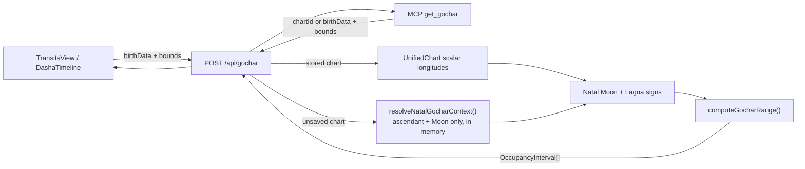

# Design Document: Gochar Range & PD Integration

## Overview

This feature adds deterministic, date-ranged Gochar to the existing Transits
tab and Vimshottari PD rows. It reuses the compute engine's Swiss Ephemeris,
Lahiri ayanamsa, whole-sign Moon/Lagna reckoning, and bisection-refined sign
boundaries.

The default response contains eight grahas (Sun, Mars, Mercury, Jupiter, Venus,
Saturn, Rahu, and Ketu). The Moon is included only when `includeMoon: true`.
Every response and UI display uses UTC. The output is positional timing only;
it contains no interpretive or scoring layer.

There is no database schema change. A saved chart supplies natal signs from its
existing scalar longitudes; an unsaved chart supplies `birthData` and is computed
in memory only.

## Resolved Design Decisions

| Decision | Choice | Rationale |
|---|---|---|
| Ephemeris/model | Swiss Ephemeris, Lahiri sidereal, existing node handling | Prevents divergence from `computeTransits()` and JHora/PVR-aligned chart calculations. |
| Houses | Whole-sign from natal Moon and natal Lagna | Identical to the existing `computeTransits()` house arithmetic. |
| Times | UTC ISO-8601 at engine, API, MCP, and UI | Deterministic across browser/server locations; the UI explicitly labels UTC. |
| Moon | Opt-in, default `false` | The Moon alone adds roughly 162 sign intervals/year; the eight-graha default remains readable for multi-year review. |
| Span cap | 1 year with Moon; 3 years without | Bounds ephemeris work and payload size while allowing slow-graha reviews. Every valid PD is shorter than the 1-year cap. |
| Retrograde | Preserve every contiguous sign stay, including sub-day stays | Merging or filtering would hide real house changes and violate range coverage. |
| PD boundaries | Exact ISO instants from the dasha tree | Prevents calendar-date rounding from leaking an interval outside the PD. |
| Boundary search | Cusp-proximity **adaptive** stepping, not a fixed coarse step | A fixed step cannot see a cross-and-return that completes inside one step, which would silently drop a real ingress pair. See "Cusp-proximity refinement". |
| Natal context | Ascendant + planet positions only; never `computeFullChart()` | Only two sign numbers are needed. `computeFullChart()` also runs shadbala, 13 vargas, yogas, and the Sade Sati scans — orders of magnitude more work per request. |

## Architecture



`mcp/` remains an HTTP-only adapter. It does not import the compute engine and
does not call an AI-analysis endpoint.

## Compute Engine

### New module and public contracts

Add `engine/compute/gochar.ts` for the Swiss-Ephemeris computation. Put the
serializable response contracts (`GocharGraha`, `GocharOccupancyInterval`,
`GocharRangeResult`, and `GocharApiResponse`) in the client-safe
`lib/gocharRange.ts` leaf beside the range/span constants. UI code imports them
directly from that file, never from `@/engine/compute`; this prevents a future
non-type engine import from pulling the native Swiss Ephemeris chain into a
client bundle. `gochar.ts` may type-import and re-export those contracts for
server compatibility, but retains the engine-only input/context types.

```ts
export interface GocharRangeInput {
  natalMoonSignNumber: number
  natalLagnaSignNumber: number
  start: Date                 // inclusive UTC instant
  end: Date                   // exclusive UTC instant
  includeMoon: boolean
}

export function computeGocharRange(input: GocharRangeInput): GocharRangeResult
```

`lib/gocharRange.ts` owns the client-safe response shape:

```ts
export type GocharGraha = /* nine-graha union */
export interface GocharOccupancyInterval { /* UTC interval fields */ }
export interface GocharRangeResult { /* range + included grahas + intervals */ }
export interface GocharApiResponse extends GocharRangeResult {
  dateFrom: string // normalized UTC inclusive start
  dateTo: string   // normalized UTC exclusive end
  ayanamsa: 'Lahiri'
}
```

### Graha selection

The module owns stable, ordered constants:

```ts
export const DEFAULT_GOCHAR_GRAHAS = [
  'Sun', 'Mars', 'Mercury', 'Jupiter', 'Venus', 'Saturn', 'Rahu', 'Ketu',
] as const

export const ALL_GOCHAR_GRAHAS = [
  'Sun', 'Moon', 'Mars', 'Mercury', 'Jupiter', 'Venus', 'Saturn', 'Rahu', 'Ketu',
] as const
```

The output's `includedGrahas` is the authoritative declaration of which grahas
were calculated. `moonIncluded` duplicates the decision for simple consumers;
both fields are always present.

Use the same body IDs and Lahiri sidereal flags as `transits.ts`. Rahu is read
from the existing node body; Ketu is always derived by adding 180° and uses the
same sign-boundary instants as Rahu.

#### Type boundary with `transits.ts`

The engine elsewhere types planet names as plain `string` (`PlanetPosition.planet`,
`TransitPlanet.planet`). `GocharGraha` is deliberately stricter, so the widening
happens once, at the module's own ephemeris boundary, and never via a bare cast at
call sites:

```ts
/** The single place where a loose engine planet name becomes a GocharGraha. */
const GOCHAR_BODY_IDS: ReadonlyArray<{ graha: GocharGraha; id: number }> = [
  /* mirrors PLANET_IDS in transits.ts; Ketu is derived, not listed */
]
```

`computeGocharRange()` iterates `GOCHAR_BODY_IDS` (a typed constant it owns)
rather than reading `PLANET_IDS` and casting. If a future change adds a body to
`transits.ts`, Gochar does not silently inherit it — a deliberate choice, since
`GocharGraha` is part of the API and MCP contract. A unit test SHALL assert that
every `GocharGraha` except `'Ketu'` has a corresponding entry in
`GOCHAR_BODY_IDS`, and that each id matches the id `transits.ts` uses for the same
graha, so the two cannot drift apart unnoticed.

### Range scan algorithm

`computeGocharRange()` validates finite natal sign numbers in `1..12`, finite
dates, and `start < end`; invalid engine input throws a typed validation error.
The API performs normal request validation before calling it.

For every selected physical body:

1. Resolve the sidereal sign at `start`.
2. Set the first interval start to `start`, so an interval already in progress is
   clipped rather than backtracked.
3. Advance with a bounded, body-specific coarse step until the sign changes or
   `end` is reached.
4. When a change is bracketed, refine it with the existing 42-iteration bisection
   convention and close the current interval at that exact boundary.
5. Start the next interval at that same boundary and repeat until `end`.
6. Emit the final interval ending exactly at `end`.

The scanner must use an end-bounded variant of the existing state-change helper:
it returns `end` when no state change is found within the requested range, rather
than scanning beyond it. The existing `nextStateChange()` in `transits.ts` scans
forward unbounded (guarded at 5000 iterations), so it cannot be reused as-is.

Base coarse steps are constants internal to the module:

| Bodies | Base coarse step | Reason |
|---|---:|---|
| Moon | 0.25 day | Matches the existing lunar transit scan and cannot skip a lunar sign boundary. |
| Sun, Mars, Mercury, Venus | 1 day | Their maximum daily movement cannot traverse a full sign and return within the step. |
| Jupiter, Saturn, Rahu/Ketu | 5 days | Efficient for slow movers while still safely below a sign traversal. |

No retrograde merge threshold and no minimum duration apply. A planet that
returns to a prior sign produces another interval in chronological order, even
if the stay is shorter than one day.

### Cusp-proximity refinement (required for correctness)

A fixed coarse step is **not sufficient**. `nextStateChange()`-style scanning
advances while `stateAt(hi) === startSign`, so if a graha crosses a sign boundary
and returns *within a single step*, both samples read the same sign, no bracket is
ever formed, bisection never runs, and **both crossings are lost**. The result is
not a loud failure but a silently missing ingress pair, which breaks the coverage
guarantee in Requirement 2.9 and the sub-day guarantee in Requirement 2.8.

This is a real event class, not a theoretical one: a graha stationing a fraction
of a degree from a cusp crosses, turns, and re-crosses in well under one step.

| Bodies | Base step | Max excursion in one step near station | Vulnerable window |
|---|---:|---:|---|
| Jupiter, Saturn, Rahu/Ketu | 5 d | ~0.25–0.65° | within ~0.3° of a cusp |
| Sun, Mars, Mercury, Venus | 1 d | a few arcminutes | within a few arcmin of a cusp |
| Moon | 0.25 d | ~3.75° | never stations; not vulnerable |

Note the existing `computeDegreeSadeSati` avoids this problem with a 138-day
merge heuristic. Gochar is explicitly forbidden from merging (Requirement 2.7),
so it must instead *detect* the dip.

**Rule.** Before concluding "no state change in this step", the scanner SHALL
subdivide when the sample is close enough to a cusp that a round trip is possible
within the step:

```ts
// Distance in degrees from `lon` to the nearest 30° sign cusp, 0..15.
function degreesToNearestCusp(lon: number): number {
  const within = ((lon % 30) + 30) % 30
  return Math.min(within, 30 - within)
}

const MIN_STEP_DAYS = 1 / 24        // 1 hour floor
const CUSP_SAFETY_FACTOR = 2        // margin over the theoretical excursion

// Subdivide when a cross-and-return could complete inside `stepDays`.
function stepIsSafe(lon: number, speedDegPerDay: number, stepDays: number): boolean {
  const reach = Math.abs(speedDegPerDay) * stepDays * CUSP_SAFETY_FACTOR
  return degreesToNearestCusp(lon) > reach
}
```

When `stepIsSafe()` is false, halve the step and re-test, down to
`MIN_STEP_DAYS`. Because the trigger is cusp proximity, this costs nothing over
the vast majority of a range and engages only in the neighbourhood of a boundary.

The speed used SHALL be the body's instantaneous `longitudeSpeed` from the same
`swe_calc_ut` call that produced the longitude — never a hardcoded mean motion —
so a station is detected from the ephemeris itself rather than assumed. Rahu/Ketu
retain the existing node treatment, and because Ketu is exactly Rahu + 180° (a
multiple of 30°), Ketu shares Rahu's boundary instants and SHALL NOT be searched
separately.

Once a change is bracketed, refinement uses the established 42-iteration
bisection unchanged.

For each interval, derive houses exactly as the current transit code does:

```ts
houseFromMoon = ((signNumber - natalMoonSignNumber + 12) % 12) + 1
houseFromLagna = ((signNumber - natalLagnaSignNumber + 12) % 12) + 1
```

Sort intervals by the stable graha order and then start instant. The UI groups
the flat list; the API deliberately does not expose a second grouped shape.

### Date-bound parsing and span policy

Date parsing belongs in a small server-safe helper (for example
`lib/gocharRange.ts`), shared by the route and unit tests:

```ts
export interface ParsedGocharBounds {
  dateFrom: string            // normalized echo
  dateTo: string              // normalized echo
  start: Date                 // inclusive
  end: Date                   // exclusive
}

export function parseGocharBounds(dateFrom: string, dateTo: string): ParsedGocharBounds
export function validateGocharSpan(bounds: ParsedGocharBounds, includeMoon: boolean): void
```

- A bare `YYYY-MM-DD` `dateFrom` resolves to that UTC midnight.
- A bare `YYYY-MM-DD` `dateTo` resolves to the following UTC midnight.
- A full ISO instant must carry `Z` and is used verbatim: `dateFrom` is inclusive
  and `dateTo` is exclusive.
- Mixed bare-date and full-instant input is supported under those independent
  rules.
- `start >= end` is invalid.
- The resolved duration may not exceed 366 days when the Moon is included, or
  1,096 days when it is not. The limits are duration limits, not calendar-year
  label comparisons, and are applied after parsing.

The helper never converts through browser, server, birth, or chart timezones.

## API Design

### `POST /api/gochar`

Create `app/api/gochar/route.ts`. Follow the existing auth convention:
`resolveRequestUser(request)` is mandatory for every request. The endpoint is
synchronous, deterministic, and read-only; it does not use `waitUntil()` or SSE.

Request schema:

```ts
interface GocharApiRequest {
  dateFrom: string
  dateTo: string
  includeMoon?: boolean       // defaults false
  unifiedChartId?: string
  birthData?: BirthInput
}
```

Zod validates the primitive fields and an object-level refinement requires
exactly one of `unifiedChartId` and `birthData`.

Context resolution follows this order:

1. For `unifiedChartId`, load only the owner's `moonLongitude` and
   `lagnaLongitude`; return `404` if the chart does not exist or is not owned by
   the caller. Derive signs by `Math.floor(longitude / 30) + 1`.
2. For `birthData`, derive the two natal sign numbers with the **minimal**
   ephemeris path — never `computeFullChart()`. Nothing is persisted.
3. Pass the natal signs, parsed bounds, and `includeMoon` into
   `computeGocharRange()`.

#### Minimal natal context (do not call `computeFullChart()`)

Only `natalMoonSignNumber` and `natalLagnaSignNumber` are required.
`computeFullChart()` additionally computes 13 divisional charts, shadbala,
ashtakavarga, yogas, jaimini, bhava bala, arudhas, upagrahas, special lagnas and
— most expensively — `computeTransits()`, which runs the Sade Sati boundary
scans. For calibration, `tests/…/transits.degreeSadeSati.test.ts` takes ~12 s in
the existing suite. Paying that per Gochar request to obtain two integers would
make the endpoint's "synchronous and deterministic" contract dishonest.

Add a narrow helper (co-located with the Gochar module or in `planets.ts`) built
only from primitives that already exist:

```ts
export interface NatalGocharContext {
  natalMoonSignNumber: number   // 1..12
  natalLagnaSignNumber: number  // 1..12
}

export function resolveNatalGocharContext(input: BirthInput): NatalGocharContext {
  const jd = birthInputToJulianDay(input)
  const asc = computeAscendant(jd, input.latitude, input.longitude)
  const moon = computePlanetPositions(jd, asc.signNumber).find((p) => p.planet === 'Moon')
  if (!moon) throw new Error('Moon position could not be computed')
  return {
    natalMoonSignNumber: moon.signNumber,
    natalLagnaSignNumber: asc.signNumber,
  }
}
```

This reuses the identical ayanamsa and sidereal flags as the full path, so the
derived signs are bit-for-bit the same as `computeFullChart()` would produce —
verified by a unit test asserting equality against `computeFullChart()` for a
fixed birth input.

Successful response shape:

```ts
interface GocharApiResponse extends GocharRangeResult {
  dateFrom: string
  dateTo: string
  ayanamsa: 'Lahiri'
}
```

Return `400` for JSON, source-selection, date, span, and birth-data validation
errors; `401` for missing identity; `404` for missing/non-owned charts; and `500`
only for unexpected compute failures. Do not include chart metadata in errors.

## MCP Design

Add `get_gochar` in `mcp/src/tools.ts` beside `get_transits` and
`get_dasha_tree`. Its input follows the established chart-reference convention:

```ts
{
  chartId?: string,
  birthData?: BirthData,
  dateFrom: string,
  dateTo: string,
  includeMoon?: boolean,
}
```

The handler rejects absent or dual chart references before forwarding. It maps
`chartId` to `unifiedChartId`, preserves `birthData` unchanged, and POSTs only to
the literal route `/api/gochar`. Its description states all of the following:

- range instants are UTC;
- Moon data is absent unless `includeMoon` is true; and
- `includedGrahas` is authoritative for what was computed.

Add `/api/gochar` to `ALLOWED_POST_ROUTES` in `tests/mcp-cost-guard.test.ts`.
This is an explicit static-source-scan allow-list update; no paid route becomes
reachable.

## UI Design

### Shared types and rendering

Add a typed `GocharRangeTable` component in `app/components/` that receives
`GocharRangeResult` from `@/lib/gocharRange` and an optional label. It groups
`intervals` by `planet` in the returned stable order and renders:

| Graha | From (UTC) | To (UTC) | Sign | H/Moon | H/Lagna |
|---|---|---|---|---|

All timestamps are formatted from the returned ISO values with a fixed UTC
formatter and visibly labelled `UTC`. Do not use browser-local
`toLocaleDateString()` without `timeZone: 'UTC'`.

**Sub-day intervals must remain legible.** Requirement 2.8 requires returning
retrograde slivers shorter than one day. Rendered date-only, such a row shows an
identical `From` and `To` and reads as a duplicate-row bug rather than a real
short transit. The formatter SHALL therefore include time-of-day (`HH:mm` UTC),
either always or at minimum whenever an interval is under 24 hours, so that every
returned interval is visibly distinct:

```ts
// Always renders an unambiguous instant; never collapses a sub-day interval.
const fmtUtc = (iso: string) =>
  new Intl.DateTimeFormat('en-GB', {
    timeZone: 'UTC',
    year: 'numeric', month: 'short', day: '2-digit',
    hour: '2-digit', minute: '2-digit', hour12: false,
  }).format(new Date(iso))
```

A short interval MAY additionally carry a visual marker, but the marker SHALL NOT
be the only means of distinguishing it (colour/icon alone is insufficient — the
distinct timestamps carry the information).

The component reports `includedGrahas` above the table. This makes an omitted
Moon explicit, especially for MCP-initiated or PD views. It uses the established
overflow-x table pattern and semantic table headers.

Add a small client hook, `useGocharRange`, shared by both consumers. Its source
is a **discriminated union**, not `birthData`-only, so a saved chart takes the
cheap two-column read path instead of forcing a server-side natal recompute on
every request:

```ts
type GocharRequestSource =
  | { kind: 'saved'; unifiedChartId: string }
  | { kind: 'unsaved'; birthData: BirthInput }

interface UseGocharRangeResult {
  result: GocharApiResponse | null
  error: string | null
  loading: boolean
  request(input: { dateFrom: string; dateTo: string; includeMoon: boolean }): Promise<void>
  clear(): void
}

export function useGocharRange(source: GocharRequestSource): UseGocharRangeResult
```

Callers SHALL prefer `{ kind: 'saved' }` whenever a `unifiedChartId` is
available; `birthData` is for charts computed but not yet saved. The hook maps
the union onto the API's mutually-exclusive `unifiedChartId` / `birthData` fields,
so the "exactly one source" refinement is satisfied by construction.

The hook sends `POST /api/gochar`, preserves caller-controlled dates and
`includeMoon` on failure, and discards stale responses when a newer request
finishes first (compare against a monotonically increasing request id, not
response arrival order).

Its visible result, error, and loading state are scoped to the current natal
source key. If an application changes the chart/birth-data snapshot, a completed
or in-flight response for the prior source is hidden immediately and may not
update the new source's view; the component-lifetime cache remains source-keyed
for safe reuse.

**Failure message.** For a non-success API JSON body shaped as
`{ error?: string, details?: Record<string, string[]> }`, expose the first
available message in `details` (the first field in object insertion order, then
its first message). If no such message exists, expose `error`; otherwise use a
generic request-failed message. Do not concatenate every field/message: a
range-cap error is intentionally represented against both date fields by the
route and would otherwise be displayed twice.

**Response cache.** The hook keys results on
`source + dateFrom + dateTo + includeMoon` in a component-lifetime `Map`. Gochar
is a pure function of those inputs, so a repeat is always safe to serve from
cache. This matters most for PD rows, where opening, closing, and re-opening the
same PD would otherwise re-issue an identical request each time. Cache hits SHALL
skip the network entirely and SHALL NOT flip `loading` to `true`.

### Transits tab

`TransitsView` remains the owner of its existing inner section state
(`gochar | sadesati | moon | asc`). Its `gochar` section displays the existing
current-position table, then four compact North-Indian charts from the same
`TransitAnalysis.asOf` snapshot: natal D1; a JHora-style Transit Moment Chart
whose H1 is the moving Ascendant at the birthplace and exact snapshot instant;
Gochar from birth Lagna; and Gochar from natal Moon. The
range form remains below those current-snapshot charts:

- `dateFrom` and `dateTo` are native date inputs for practitioner-entered
  calendar ranges; full ISO instants remain available to API/MCP callers and PD
  integration.
- The form continues to display its controlled, user-entered calendar dates.
  It does not present the API's normalized `dateTo` echo as the selected end
  date: a bare end date is inclusive to the practitioner but resolves to the
  following UTC midnight as the engine's exclusive end bound.
- `includeMoon` is an unchecked checkbox, labelled with the one-year limit and
  increased-row-count warning.
- The submit button is disabled while the request is loading.
- Success renders `GocharRangeTable`; failure renders a `role="status"` message
  without clearing the date or checkbox state.

Update `app/page.tsx` to capture a `BirthInput` snapshot with every successful
chart computation, and pass that snapshot into `TransitsView`. The live form may
then be edited without making a Gochar request disagree with the chart still on
screen. The current static `result.chart.transits` remains unchanged and
continues to power the current-position, Gochar-chart, and Sade Sati displays.

### Vimshottari PD rows

Update `DashaTimeline` to accept the same computed birth-data snapshot. Replace each
plain PD row wrapper with a focusable button/control containing its existing
MD–AD–PD label and a `View Gochar` action.

`DashaTimeline` maintains one selected PD state and one `useGocharRange` state:

1. Selecting `View Gochar` passes the PD's exact `start` and `end` ISO strings
   with `includeMoon: false`.
2. The selected PD expands directly beneath its row with the MD–AD–PD label,
   exact UTC range, a Moon opt-in checkbox, and `GocharRangeTable` on success.
3. Selecting a different PD clears the previous response and opens only the new
   PD. Selecting the same action closes it.
4. An error is displayed within that PD's expansion with a retry action.

This mirrors the existing one-MD/one-AD expansion model and avoids navigating
away from the dasha hierarchy.

## Error Handling

| Layer | Condition | Behaviour |
|---|---|---|
| Parser | Invalid date or non-UTC full instant | Typed validation error; API returns 400. |
| Parser | Start not before end or span too large | Typed validation error; API returns 400. |
| API | Neither/both chart sources | 400 with field-level source-selection error. |
| API | Stored chart not owned by caller | 404, matching other unified-chart routes. |
| Engine | Invalid natal sign or ephemeris failure | Throw typed compute/validation error; route returns 500 only for unexpected ephemeris failures. |
| Engine | Subdivision reaches `MIN_STEP_DAYS` still unsafe | Accept the 1-hour floor and continue; do not throw. A sub-hour round trip is below the feature's stated resolution and must not fail an otherwise valid range. |
| Engine | `birthData` supplied but Moon position unresolvable | Throw from `resolveNatalGocharContext()`; route returns 400 (bad birth data), not 500. |
| UI | Fetch failure | Preserve inputs, show readable retryable error, retain current Gochar data. |
| MCP | API failure | Existing `guard()` converts it to an MCP error result. |

## Testing Strategy

### Engine and bounds tests

- Fixed-date regression tests for all default grahas: stable order, requested
  range clipping, first/last boundary equality, and complete per-graha coverage.
- Moon tests proving exactly eight grahas by default and all nine only when opted
  in.
- Whole-sign house arithmetic tests against known Moon/Lagna sign combinations.
- Date parser tests for bare dates, UTC ISO instants, mixed bounds, reversed
  bounds, and no timezone offset application.
- Span tests for each `includeMoon` tier at the exact permitted boundary and one
  millisecond beyond it.
- Natal-context equivalence: `resolveNatalGocharContext()` returns the same two
  sign numbers as `computeFullChart()` for a fixed birth input — the guard that
  makes skipping the full chart safe.
- Body-table drift: every `GocharGraha` except `'Ketu'` maps to a
  `GOCHAR_BODY_IDS` entry whose id equals the id `transits.ts` uses.

#### Cusp-proximity tests (the correctness-critical case)

A generic retrograde fixture is **not** sufficient — an ordinary retrograde
re-entry spans weeks and any step size finds it. The scan defect only appears when
a station sits within the vulnerable window of a cusp, so the tests must target
that specifically:

- **Derive the fixture, do not guess a date.** Add a dev-only search that walks a
  wide horizon for each slow graha, locating an instant where the body is within
  ~0.5° of a 30° cusp and `|longitudeSpeed|` is near zero. Pin the discovered
  instants as fixture constants with a comment recording how they were found, so
  the suite stays fast and deterministic while the dates remain reproducible.
- **Differential assertion.** For each pinned window, assert that the adaptive
  scanner returns strictly more intervals than a deliberately naive fixed-step
  scan over the same window. This proves the refinement is doing work; a test that
  only checks "coverage is contiguous" passes even when a crossing pair is lost,
  because a dropped pair leaves the coverage seamless.
- **Round-trip integrity.** Where a dip is found, assert the sign sequence is
  `A → B → A` with the middle interval's duration under one day and both
  boundaries bisection-refined.
- **Cost guard.** Assert `stepIsSafe()` short-circuits away from cusps, i.e. a
  range containing no near-cusp station performs no more ephemeris samples than
  the fixed-step baseline — so the refinement cannot silently become a
  whole-range fine scan.

### Integration and UI tests

- Route tests for auth, ownership, source exclusivity, invalid request bodies,
  cap enforcement, response metadata, and no persistence side effect.
- MCP tool tests for schema/default forwarding and `includedGrahas` disclosure;
  run the static MCP cost guard.
- Component tests for default Moon state, loading/failed-request preservation,
  UTC labelling, PD exact-ISO forwarding, and single-PD expansion behaviour.
- Manual practitioner acceptance: compare a fixed UTC range to Jagannatha Hora
  after converting its local ingress display to UTC. Record the fixture and
  conversion in the implementation PR/spec notes.

## Documentation Impact

The implementation change must update `docs/computation_transits_sadesati.md`
with range-scan and UTC semantics; API/MCP and chart-visualization skill guides;
`docs/HLD.md`, `docs/DFD.md`, `docs/ERD.md` (no schema change); `Agents.md`; and
`Claude.md`. The MCP README must list `get_gochar` as a deterministic range tool.
