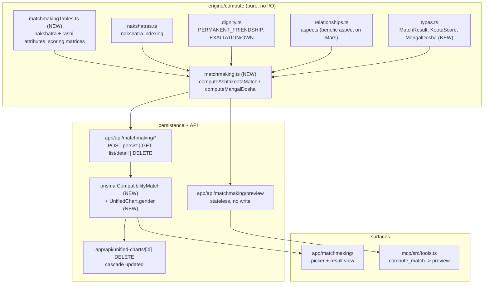

# Design Document: Marriage Matchmaking (Kundli Milan / Guna Milan)

## Overview

This feature adds **two-chart compatibility matching** — the first capability in
VedicMojoAI that operates on a pair of `UnifiedChart` rows rather than one. A new
pure module `engine/compute/matchmaking.ts` computes the classical **Ashtakoota
Guna Milan** (8 kootas, 36 points) plus **Mangal Dosha (Kuja Dosha)**
compatibility, backed by a new static-table module
`engine/compute/matchmakingTables.ts`. Results are persisted as a
`CompatibilityMatch` row, served over `/api/matchmaking`, rendered at
`/matchmaking`, and exposed read-only (non-persisting) over MCP.

The engine follows the contract the scorer and `yogas.ts` established: **pure and
never-throwing** — no ephemeris, LLM, network, DB, or file I/O, and a missing
input degrades that factor to `unavailable` rather than throwing.

Two properties drive most of this design and are worth stating up front:

1. **The koota input space is finite and tiny.** All 8 kootas are a function of
   `(nakshatra, pada, role)` per native — 27×4×27×4 = **11,664** combinations.
   That makes exhaustive oracle verification possible (§Testing) and means the
   engine needs no birth data to test.
2. **`UnifiedChart.moonLongitude` is required on both ingestion paths.** Guna
   Milan therefore works for `source="paste"` charts too; only Mangal Dosha,
   which needs house positions from `planets`, is compute-path-only.

## Guiding Principle

Per `requirements.md`'s Guiding Principle — **pin to JHora/PyJHora output, and do
not misattribute the 36-point system to PVR.** Concrete consequences codified here:

- Koota tables and point gradations are validated against oracle output, never
  against prose. (PyJHora's own README states varna as "0-3 points" where its
  code sets `varna_max_score = 1`; only `1` makes the eight maxima sum to 36.)
- Code comments, UI copy, and docs describe the 36-point system as North Indian
  almanac convention — not "classical Parashari" and not "per PVR" (NFR-8).
- Divergences from JHora are recorded in a **KNOWN DIVERGENCE** table in
  `docs/computation_matchmaking.md`, per `docs/computation_chara_dasha.md` §4.

## Resolved Decisions

Recording the decisions taken since `requirements.md` was written, and the
engineering calls made in this design pass.

| # | Decision | Resolution |
|---|---|---|
| OD-3 | Graha Maitri friendship source | **`dignity.ts`'s `PERMANENT_FRIENDSHIP` (naisargika only)**. `relationships.ts` has no friendship table; `getVargaDignityLabel` blends in *tatkalika* and is the wrong relation. |
| OD-6 | Bride/groom role storage | **Both** — role on the match record *and* a new `UnifiedChart.gender` column. See §Data Models. |
| OD-8 | PyJHora compatibility module | **Exists**: `src/jhora/horoscope/match/compatibility.py`, class `Ashtakoota`, plus `all_nak_pad_boy_girl.csv` (11,664 rows). |
| OD-13 | AGPL posture | **Oracle-only, never vendor.** Run locally to generate expected values; transcribe tables from classical sources; nothing enters this repo or the deploy. AGPL restricts conveying, not private use. |
| OD-4 | Entity naming | **`CompatibilityMatch`** (`@@map("compatibility_match")`), route `/api/matchmaking`, page `/matchmaking`, module `engine/compute/matchmaking.ts`. |
| OD-5 | Persisted vs. live result | **Persisted snapshot.** `result` JSON is written once and read back, mirroring `PipelineRun` / `DurationAnalysis`. Never silently recomputed on view. |
| OD-9 | Chart-delete semantics | **Cascade** — deleting a chart removes matches referencing it, matching how `PipelineRun`/`DurationAnalysis` are treated. |
| OD-10 | MCP persistence | **Stateless.** A separate `POST /api/matchmaking/preview` computes without saving; MCP calls only that. Preserves "MCP reads, the app writes." |
| OD-1 | Score bands | `<18 / 18–24 / 24–32 / 32–36`. The **18.0** lower bound matches PyJHora's own default; 24/32 are presentation-only and carry a provenance comment saying so. |
| OD-12 | Boundary threshold | **1.0°** of Moon longitude (≈2 h of lunar motion), as a named exported constant so it is tunable. |
| OD-2 / OD-7 / OD-11 | Cancellation variants / South Indian / second fixture | Oracle-driven; deferred; needed for Mangal Dosha only (§Testing). |

## Architecture / Affected Modules



## Data Models

### New types (`engine/compute/types.ts`, re-exported from `index.ts`)

```typescript
export type MatchRole = 'bride' | 'groom'

export type KootaKey =
  | 'varna' | 'vashya' | 'tara' | 'yoni'
  | 'grahaMaitri' | 'gana' | 'bhakoot' | 'nadi'

export interface KootaScore {
  key: KootaKey
  name: string                 // display label, e.g. "Graha Maitri"
  points: number               // fractional — 0.5 steps are legitimate
  maxPoints: number
  status: 'scored' | 'unavailable'
  evidence: KootaEvidence      // rule fired + the satisfying values
  cancellation?: Cancellation  // set when a Bhanga rule nullified a dosha
}

export interface AshtakootaResult {
  gunaScore: number            // 0–36, in 0.5 steps — NEVER rounded on store
  maxScore: 36
  kootas: KootaScore[]         // always 8 entries, in fixed order
  verdict: MatchVerdict
  boundaryRisk: BoundaryRisk[] // one entry per native
  limitations: string[]        // Requirement 5.5 — rendered, not decorative
}

export interface MangalDoshaNative {
  status: 'manglik' | 'not_manglik' | 'unavailable'
  triggeredFrom: Array<'lagna' | 'moon' | 'venus'>   // provenance, not a bool
  marsHouseFrom: Record<'lagna' | 'moon' | 'venus', number | null>
  cancellations: Cancellation[]
}

export interface MatchResult {
  ashtakoota: AshtakootaResult
  mangalDosha: {
    bride: MangalDoshaNative
    groom: MangalDoshaNative
    compatibility: 'matched' | 'mismatched' | 'cancelled' | 'unavailable'
  }
  tablesVersion: string        // bump when a koota table changes (see §Versioning)
}
```

**`points` is deliberately `number`, not an integer type.** Vashya (0.5 steps),
Graha Maitri (0.5 steps), and Tara (1.5 per direction) all yield halves; a valid
`gunaScore` is e.g. `27.5`. Nothing in the stack rounds the stored value —
formatting is a display concern only.

### Prisma — `CompatibilityMatch` (new)

```prisma
model CompatibilityMatch {
  id            String       @id @default(uuid())
  userId        String
  user          User         @relation(fields: [userId], references: [id])

  brideChartId  String
  brideChart    UnifiedChart @relation("MatchBride", fields: [brideChartId], references: [id])
  groomChartId  String
  groomChart    UnifiedChart @relation("MatchGroom", fields: [groomChartId], references: [id])

  label         String?
  gunaScore     Decimal      @db.Decimal(4, 1)  // indexable; 0.5 steps fit exactly
  result        Json                             // full MatchResult snapshot
  tablesVersion String

  createdAt     DateTime     @default(now()) @db.Timestamptz

  @@index([userId])
  @@index([brideChartId])
  @@index([groomChartId])
  @@map("compatibility_match")
}
```

Roles are encoded **structurally** (`brideChartId` / `groomChartId`) rather than
as a role enum on a generic A/B pair. This makes the directional kootas
(Requirement 1.3) impossible to get wrong by argument order and makes the two
indexes needed for cascade cleanup fall out naturally.

`gunaScore` is denormalized out of `result` as `Decimal(4,1)` so list views can
sort/filter without parsing JSONB — the same reason `UnifiedChart` carries scalar
index fields alongside its JSONB domains.

### Prisma — `UnifiedChart.gender` (new, per OD-6)

```prisma
  gender  String?   // "male" | "female" | "other" — nullable; see backfill below
```

Adding this fixes a latent problem beyond matchmaking. Gender currently reaches
Wave 2-G only through optional `ChartInputV1.meta.gender`, and
`lib/validation.ts:383-386` **silently defaults an absent gender to `'male'`**
for 2G karaka selection (`engine/chartSummary.ts:39`). Compute-path charts have
no gender at all, so that default is applied broadly and invisibly.

- **Migration:** additive nullable column; no tightening step (gender is
  genuinely optional, unlike `userId`).
- **Backfill:** a checked-in idempotent script populates `gender` from
  `chartInputV1.meta.gender` where present, in the spirit of
  `prisma/backfill-owner.ts`. Rows without it stay `null`.
- **Wave 2-G wiring:** `{{gender}}` prefers the column, falls back to
  `chartInputV1.meta.gender`, and only then to the existing default — and when
  it does fall through, the existing `W2` warning still fires.
- **Relationship to role:** gender **pre-fills** the role picker; the role on
  `CompatibilityMatch` is authoritative. A chart with `gender = null` is fully
  usable — the practitioner just picks the role explicitly.

## Input Contracts

The module is split so that the cheap, universally-available path is not gated
behind the expensive one.

```typescript
// ── Ashtakoota: needs only nakshatra + pada + role ──────────────────
export interface MatchNativeInput {
  nakshatraNumber: number   // 1..27
  padaNumber: number        // 1..4
  role: MatchRole
}
export function computeAshtakootaMatch(
  a: MatchNativeInput,
  b: MatchNativeInput,
): AshtakootaResult

// ── Mangal Dosha: needs house geometry (compute path only) ──────────
export interface MangalNativeInput {
  planets: PlanetPosition[]
  lagnaSignNumber: number
  aspects: AspectEdge[]     // relationships.aspects — for benefic-aspect Bhanga
}
export function computeMangalDosha(input: MangalNativeInput): MangalDoshaNative

// ── Composition ─────────────────────────────────────────────────────
export function computeMatch(
  bride: { koota: MatchNativeInput; mangal?: MangalNativeInput },
  groom: { koota: MatchNativeInput; mangal?: MangalNativeInput },
): MatchResult
```

`(nakshatraNumber, padaNumber)` — not a longitude — is the koota interface
because it is exactly the oracle's own key
(`Ashtakoota(boy_nakshatra_number, boy_paadham_number, girl_nakshatra_number,
girl_paadham_number)`), making the comparison in §Testing direct.

**Longitude → (nakshatra, pada, rashi)** is a thin pure helper in
`matchmaking.ts`, applied at the call site from `UnifiedChart.moonLongitude`.
Pada matters because a nakshatra spans 13°20′ and can straddle two rashis
(Krittika pada 1 is Aries; padas 2–4 Taurus), and Varna/Vashya/Bhakoot/Graha
Maitri are all *rashi*-based.

## Koota Specifications

Each koota is a pure `scoreX(bride, groom): KootaScore`. `computeAshtakootaMatch`
runs them in fixed order and sums. Directionality is explicit in every signature —
the parameters are named `bride`/`groom`, never `a`/`b`.

| # | Koota | Max | Rule | Directional? |
|---|---|---|---|---|
| 1 | Varna | 1 | Moon-rashi Varna class (Brahmin=water, Kshatriya=fire, Vaishya=earth, Shudra=air). 1 point when groom's rank ≥ bride's, else 0 | **Yes** |
| 2 | Vashya | 2 | Moon-rashi Vashya group (Manav/Vanachar/Chatushpad/Jalachar/Keet) via compatibility matrix; **0.5 steps** | No |
| 3 | Tara | 3 | Count bride→groom nakshatra mod 9 and groom→bride mod 9; remainder 3/5/7 inauspicious. **1.5 points per favorable direction** | Symmetric in total; both counts in evidence |
| 4 | Yoni | 4 | Moon-nakshatra Yoni (animal + fixed gender), **five tiers**: same 4, friendly 3, neutral 2, enemy 1, **bitter enemy 0** | No |
| 5 | Graha Maitri | 5 | **Naisargika only**, from `dignity.ts`'s `PERMANENT_FRIENDSHIP`, between the two Moon-rashi lords; **0.5 steps** | No |
| 6 | Gana | 6 | Moon-nakshatra Gana (Deva/Manushya/Rakshasa) via compatibility matrix | **Verify against oracle** — some tables score bride-Rakshasa/groom-Deva differently from the reverse |
| 7 | Bhakoot | 7 | Rashi distance between Moon signs; 2-12, 5-9, 6-8 → 0, else 7 (all-or-nothing) | No |
| 8 | Nadi | 8 | Moon-nakshatra Nadi (Aadi/Madhya/Antya); same → 0, different → 8 | No |

**Explicitly NOT used:** `getVargaDignityLabel` for koota 5 — it blends
*tatkalika* friendship per its own file header, which is the wrong relation.

**Directionality is established from the oracle, not from this table.** Varna's
and Gana's directional handling is asserted here from the classical rule and is
verified before the tables are frozen; if the oracle disagrees, the oracle wins
and the divergence is recorded (Requirement 10.3a).

### Cancellation registry

Nadi, Bhakoot, and Mangal cancellations are each a named, individually testable
detector returning a `Cancellation` recorded in `evidence` — never applied
silently, mirroring how `yogas.ts` records `Neechabhanga`. Which variants ship in
v1 is oracle-driven (OD-2): a cancellation is included only if enabling it moves
our output *toward* the oracle across the 11,664-combination sweep.

## Mangal Dosha Design

The in-repo canonical statement is `prompts/domains/marriage.md`: Mars in
**1/2/4/7/8/12** from **lagna, Moon, or Venus**, cancelled by own/exalted sign,
benefic aspect, or matching dosha in partner. The engine implements exactly that,
so the deterministic and LLM paths cannot drift; any change applies to that file
in the same PR (the `named-yoga-engine` → `wave2_2a_yogas.md` precedent).

- **Per-native detection** records `marsHouseFrom` for all three reference points
  and `triggeredFrom` listing which fired — provenance, never a bare boolean.
- **Cancellation** reads Mars's own/exaltation dignity from `dignity.ts` and
  benefic aspects from `relationships.aspects` (never re-derived, per NFR-2).
- **"Matching dosha in partner" is pairwise, not per-native** — it surfaces as
  the `matched` verdict in `compatibility`, not as a per-native cancellation.
- **`compatibility` is `unavailable`, never `matched`,** when either native lacks
  `planets` (paste path). Reporting an unestablished result as an all-clear would
  be the worst available failure mode here.
- Mangal Dosha is reported **beside** `gunaScore`, never folded into the 36
  (Requirement 3.4).

## Integration Design

### API routes

| Route | Behavior |
|---|---|
| `POST /api/matchmaking` | Validates roles present (400 if absent — never guess), ownership-checks **both** charts, computes, persists, returns the record |
| `POST /api/matchmaking/preview` | Identical minus the write. The MCP path (OD-10) |
| `GET /api/matchmaking` | Lists caller's matches, `WHERE userId = <resolved>` |
| `GET /api/matchmaking/[id]` | One match's detail, ownership-checked |
| `DELETE /api/matchmaking/[id]` | Ownership-checked delete |

All routes resolve identity through `resolveRequestUser(request)` and return
**404, never 403**, on any ownership mismatch — including when only *one* of the
two charts belongs to the caller (`user-management` Decision 5).

### Chart deletion (Requirement 13)

`DELETE /api/unified-charts/[id]` does **not** rely on database cascade — it
hand-deletes dependents in FK order inside a `$transaction`
([route.ts:184-199](app/api/unified-charts/[id]/route.ts:184)), with a comment
noting "Cascade isn't automatic with Prisma." Adding two FKs without touching it
means any matched chart fails to delete with an FK violation surfacing as a 500.

The transaction gains, **before** the chart delete:

```typescript
prisma.compatibilityMatch.deleteMany({
  where: { OR: [{ brideChartId: params.id }, { groomChartId: params.id }] },
}),
```

The `OR` is the point — a match references two charts, and deleting *either* must
clean it up. Both FK columns are indexed for this.

### UI (`app/matchmaking/`)

- **Picker** — two chart selectors over the caller's own charts, each with an
  explicit bride/groom role, pre-filled from `UnifiedChart.gender` when set.
  Warns (does not block) on an identical pair.
- **Result view** — `gunaScore` out of 36 with its band; the 8-koota breakdown
  table with points/max and one-line evidence; per-native Mangal Dosha with
  `triggeredFrom` and any cancellation reason.
- **Required framing** — the output is labeled **Ashtakoota / North Indian**, not
  a generic "compatibility score" (Non-Goals); the band is shown as guidance, not
  a verdict of record (Requirement 5.2); `limitations` is rendered, not hidden
  behind a tooltip (Requirement 5.5); boundary and paste-ayanamsa cautions appear
  inline when set (Requirement 14).
- Reachable from primary navigation — this makes the app's fifth
  practitioner-facing feature.

### MCP

`compute_match` in `mcp/src/tools.ts` wraps **`/api/matchmaking/preview`** only,
taking two chart ids plus roles. This keeps MCP's read-only-by-convention posture
intact: every existing tool is a `get`, and all three currently-allowed POSTs
(`/api/compute`, `/api/compute/varshaphal`, `/api/timeline`) are stateless. Only
`/api/matchmaking/preview` is added to `ALLOWED_POST_ROUTES` — the persisting
route is deliberately **not** reachable from MCP. Called out explicitly in the PR
per the `user-management` 8.7 precedent. Unowned/unknown charts return the
standard `extractOrGuide` guidance, never an ownership-revealing error.

## Error Handling / Degradation

- Every koota guards its inputs; malformed → `status: 'unavailable'` with a
  reason in evidence, never a throw. The remaining kootas still score.
- `computeAshtakootaMatch` wraps the koota loop so one unexpected error is
  contained and the rest still run — the scorer's last-resort-guard pattern.
- A partial `gunaScore` is reported **with its `unavailable` entries visible**;
  it is never presented as a complete score with silently missing factors.
- Paste-path: all 8 kootas score; only Mangal Dosha degrades (Requirement 1.5).

## Versioning

`tablesVersion` is stored on every row and in `MatchResult`. Because results are
persisted snapshots (OD-5), a later table correction does not retroactively
change a saved match — the version records which tables produced it, and the UI
can flag a stale match rather than silently disagreeing with a fresh computation
of the same pair. This mirrors `WEIGHTS_VERSION` in the scorer.

## Testing Strategy

**Oracle harness (AGPL-safe, per OD-13).** PyJHora is run *locally, outside this
repository*, in a dev-only script to emit expected values. It is never imported,
vendored, committed, or deployed — AGPL restricts conveying, not private use.
The koota tables themselves are transcribed from classical/secondary sources,
with the oracle used to *verify* rather than to supply them.

- **Exhaustive koota sweep** (Requirement 10.3) — compare our output across the
  27×4×27×4 = **11,664** combination space, or a deterministic documented sample
  if runtime demands. No birth data needed: inputs are synthetic
  `(nakshatra, pada)` pairs. This is a stronger bar than the one-fixture
  standard used elsewhere in the repo, available only because the space is
  enumerable.
- **Per-koota unit tests** — full-points and zero/boundary case each, including
  Yoni's five tiers (the 0-point bitter-enemy tier specifically) and the 0.5-step
  cases in Vashya and Graha Maitri.
- **Role-awareness tests** (Requirement 1.3) — (a) swapping charts *and* roles is
  a no-op; (b) swapping charts *without* roles changes Varna when the two Varna
  ranks differ; (c) each symmetric koota individually asserted symmetric.
- **Half-point integrity** — assert a known pair yields a fractional total and
  that nothing in route/serialization/storage rounds it.
- **Mangal Dosha** — all three reference points, one cancellation per rule, and
  `compatibility === 'unavailable'` (never `'matched'`) when `planets` is absent.
  This is the only part needing a second chart fixture; the repo has one file in
  `engine/compute/__fixtures__/` and one inlined record (the "Mojo" chart in
  `yogas.mojo.test.ts`), so a second must be sourced — **synthetic or
  already-public, not client data**.
- **Ownership** — `POST` and `GET /[id]` return 404 (not 403, not 200 with leaked
  data) when *either* chart belongs to another user.
- **Delete cascade** — deleting a chart in a match succeeds (not 500) and leaves
  no orphaned rows; asserted for the bride side and the groom side separately.
- **Cost guard** — `tests/mcp-cost-guard.test.ts` passes with only
  `/api/matchmaking/preview` added; the persisting route stays absent from
  `mcp/src`.

## Documentation

Updated in the same change, per `Claude.md`'s maintenance table:
`docs/ERD.md` (`CompatibilityMatch`, `UnifiedChart.gender`), `docs/HLD.md` (new
routes, page, compute module), `docs/DFD.md` (two-chart matching process),
`.kiro/skills/nextjs-project-structure.md` + `database-prisma.md`,
`mcp/README.md` (`compute_match`), and `Claude.md` (four practitioner-facing
features becomes five).

**New:** `docs/computation_matchmaking.md`, in the style of the existing
`computation_*.md` files — each koota's rule and point table with its pinned
source; the directional kootas; the Mangal Dosha rule and its link to
`prompts/domains/marriage.md`; a **KNOWN DIVERGENCE** table vs. JHora; the
Porutham system's absence recorded as a known gap; and the explicit statement
that the 36-point system and its bands are almanac convention, not PVR.
