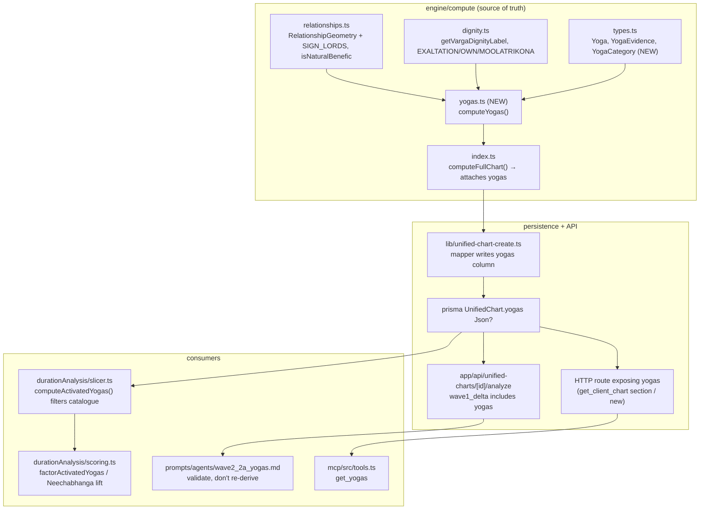

# Design Document: Deterministic Named-Yoga Engine (F1)

## Overview

This feature adds a pure, deterministic named-yoga detector to the compute engine.
A new module `engine/compute/yogas.ts` exposes `computeYogas(input): Yoga[]`, scans
the geometry already produced by `engine/compute/relationships.ts` and `dignity.ts`,
and emits a chart-wide, evidence-carrying `Yoga[]` catalogue. The catalogue is
attached to `ComputedChart`, persisted on a new `UnifiedChart.yogas` JSONB column,
injected into the compute-path `wave1_delta`, consumed by the Duration-Analysis
slicer/scorer, and exposed read-only over MCP.

It is the keystone for three deferred build-list items — F3 (Grahan promotion),
F4 (Viparita/Dhana analyzer), F5 (DKA / Raja labeler) — which become thin consumers
of the catalogue rather than independent detectors.

The engine follows the same contract the deterministic scorer established: **pure and
never-throwing** — no LLM/network/DB/file I/O, and a detector that hits missing or
malformed input emits nothing rather than throwing.

## Guiding Principle (Parashari / PVR)

Detection follows classical Parashari treatment (P.V.R. Narasimha Rao / Jagannatha
Hora), consistent with the `deterministic-1c-1d` and `scorer-dynamic-range` specs.
The concrete consequences codified here:

- A yoga's *formation* rests on the `RelationshipGeometry` tables and `dignity.ts`
  labels — a detector MUST NOT re-scan planet pairs for conjunctions/aspects/exchanges
  (the 1D→2A single-source-of-truth rule).
- Combustion is a graded affliction with no cazimi cancellation (already fixed in
  `relationships.ts` under `scorer-dynamic-range`); a combust yoga participant is
  recorded in `evidence`, never silently dropped.
- Node lords (Rahu/Ketu) carry no classical friendship dignity; detectors that hinge
  on dignity skip them, mirroring `getVargaDignityLabel` returning `undefined`.

## Architecture / Affected Modules



## Data Models

New types in `engine/compute/types.ts`, re-exported from `engine/compute/index.ts`.

```typescript
export type YogaCategory =
  | 'mahapurusha'
  | 'raja'
  | 'dhana'
  | 'viparita'
  | 'lunar'
  | 'neechabhanga'
  | 'parivartana'
  | 'kartari'
  | 'combination'   // Budha-Aditya, Gaja Kesari, etc.

export type YogaStrength = 'strong' | 'moderate' | 'weak'

/** How a yoga was recognized — the auditable seam F3/F4/F5 read. */
export interface YogaEvidence {
  /** Machine rule id that fired, e.g. "raja.kendra_trikona.conjunction". */
  rule: string
  /** Linkage type when the yoga is an association. */
  linkage?: 'conjunction' | 'graha_aspect' | 'rashi_aspect' | 'parivartana' | 'placement'
  /** Houses each involved planet owns (planet → houses), for lord-based yogas. */
  ownedHouses?: Record<string, number[]>
  /** Dignity label of each involved planet where dignity gated the rule. */
  dignity?: Record<string, string>
  /** Combustion / cancellation context — never dropped (F3 seam). */
  afflictions?: Array<{ planet: string; kind: 'combust' | 'debilitated' | 'nodal'; detail?: string }>
  /** Free-form notes (school variant, e.g. Gaja Kesari from Lagna). */
  notes?: string[]
}

export interface Yoga {
  /** Stable machine key, e.g. "mahapurusha.sasa", "raja.dka". */
  key: string
  /** Human name, e.g. "Sasa Yoga", "Dharma-Karmadhipati Raja Yoga". */
  name: string
  category: YogaCategory
  /** Participating grahas, sorted for deterministic output. */
  planets: string[]
  /** Houses (from lagna) the yoga implicates, sorted. */
  houses: number[]
  /** Net classical benefic/malefic disposition of the yoga. */
  benefic: boolean
  /** Coarse formation-quality grade (NOT a calibrated score). */
  strength: YogaStrength
  /** Planets whose dashas classically fire the yoga (slicer hint; no dates). */
  activatingPlanets: string[]
  evidence: YogaEvidence
}
```

`ComputedChart` gains `yogas: Yoga[]`. `UnifiedChart` gains `yogas Json? // Yoga[]`.

There is no per-`Yoga` timestamp (Requirement 1.2 determinism); a single
`computedAt` MAY live on the wrapper if the column stores an object, but the simplest
shape — a bare `Yoga[]` — is preferred and matches `PlanetPosition[]` / `CharaKaraka[]`.

### `computeYogas` input contract

```typescript
export interface YogaInput {
  planets: PlanetPosition[]           // house, signNumber, degreeInSign, retrograde
  lagnaSignNumber: number
  houseLordsD1: Record<number, string> // relationships.houseLords[1]
  aspects: AspectEdge[]                // relationships.aspects (graha drishti)
  conjunctions: Conjunction[]          // relationships.conjunctions
  mutualReception: Parivartana[]       // relationships.mutualReception
  combustion: CombustionResult[]       // relationships.combustion
}
export function computeYogas(input: YogaInput): Yoga[]
```

`computeFullChart` builds `YogaInput` from `planets`, `ascendant.signNumber`, and the
already-computed `relationships` object (Step 14), so `computeYogas` runs immediately
after `computeRelationshipGeometry`.

## Detector Specifications (v1)

Each detector is a pure helper `detectX(input): Yoga[]`. `computeYogas` runs the
Yoga_Registry (an ordered array of detectors), concatenates results, then sorts by
`(category, key, planets.join())` for determinism.

Shared helpers reused (no re-implementation):
- `SIGN_LORDS`, `getPlanetsInHouse`, `houseToSign` from `relationships.ts`.
- `getVargaDignityLabel`, `EXALTATION_SIGNS`, `OWN_SIGNS`, `MOOLATRIKONA_SIGNS`,
  `DEBILITATION_SIGNS`, `SIGN_LORDS` from `dignity.ts`.
- `isNaturalBenefic` from `relationships.ts` for Kartari benefic/malefic classing.
- A local `ownedHousesOf(planet, houseLordsD1)` (planet → houses it lords) — the same
  inversion `slicer.ts`'s `lookupOwnsHouses` performs, extracted as a shared helper.

| # | Detector | Rule (v1) | Category | Strength heuristic |
|---|---|---|---|---|
| 1 | Pancha Mahapurusha | Mars/Merc/Jup/Ven/Sat in own **or** exalted sign **and** in a kendra (1/4/7/10) from lagna → Ruchaka/Bhadra/Hamsa/Malavya/Sasa | `mahapurusha` | exalted → strong; own → moderate; combust participant downgrades one level |
| 2 | Gaja Kesari | Jupiter in kendra (1/4/7/10) from Moon | `combination` | Jupiter dignity ≥ friend → strong; debilitated/combust → weak |
| 3 | Raja (kendra-trikona) | a kendra-lord and a trikona-lord linked by conjunction / mutual graha aspect / parivartana; **DKA** = specifically 9th-lord + 10th-lord → `key: raja.dka` | `raja` | both dignified & non-combust → strong |
| 4 | Dhana | association among lords of {2,5,9,11}+lagna (conj / mutual aspect / parivartana) | `dhana` | count & dignity of participants |
| 5 | Viparita | lord of 6/8/12 placed in 6/8/12 → Harsha (6L) / Sarala (8L) / Vimala (12L) | `viparita` | placed in own dusthana → strong |
| 6 | Neechabhanga | debilitated planet, cancellation via debil-sign dispositor **or** exalter in a kendra from lagna or Moon (rule lifted verbatim from `slicer.ts` tables) | `neechabhanga` | moderate (v1 flat) |
| 7 | Lunar | non-Sun planets in 2nd (Sunapha) / 12th (Anapha) / both (Durudhara) from Moon; none & no co-tenant → Kemadruma | `lunar` | Durudhara strong; Kemadruma weak+malefic |
| 8 | Budha-Aditya | Sun & Mercury in same sign (from `conjunctions`); combustion of Mercury recorded in evidence | `combination` | non-combust → moderate; combust → weak |
| 9 | Parivartana | projection of `mutualReception` entries; map `exchange_type` (maha/dainya/kahala/simple) → `key: parivartana.<type>` | `parivartana` | maha → strong; dainya → weak+malefic |
| 10 | Kartari | lagna or a house hemmed by malefics (Papa) or benefics (Shubha) in its 2nd & 12th; classify via `isNaturalBenefic` | `kartari` | Shubha benefic; Papa malefic |

**`benefic` field:** true for mahapurusha/raja/dhana/viparita(*)/durudhara/shubha-kartari/
maha-parivartana; false for kemadruma/dainya-parivartana/papa-kartari. Viparita is
classically benefic-in-outcome despite dusthana inputs — flagged `benefic: true` with a
note.

**Deferred (registry-extensible, not built):** Nabhasa families, Amala, Chamara,
Parvata, Lakshmi, Saraswati, Kalanidhi, varga-internal yogas (needs F2).

## Integration Design

### Compute + storage
- `computeFullChart` (Step 14+): after `relationships` is built, call `computeYogas`
  and add `yogas` to the returned `ComputedChart`.
- Prisma: add `yogas Json?` to `UnifiedChart` (+ migration). Mapper in
  `lib/unified-chart-create.ts` writes `computed.yogas`.
- Paste path: column stays `null`; no computation attempted.

### wave1_delta + Wave 2A
- `app/api/unified-charts/[id]/analyze/route.ts` adds the catalogue to `wave1Delta`
  (e.g. under the `1D`/relationships agent key, or a dedicated `yogas` key — decided in
  tasks). `wave2_2a_yogas.md` gains a directive: when a deterministic `yogas` catalogue
  is present, treat it as the authoritative list — validate, classify strength, and
  interpret; do NOT re-derive formation. This mirrors the existing 1D→2A instruction.

### Slicer + scorer (Duration Analysis)
- `computeActivatedYogas(mdLord, adLord, ...)` is refactored: given the chart-wide
  catalogue (threaded in via the chart-data the slicer already receives), a period's
  activated yogas = catalogue entries where `planets` (or `activatingPlanets`) include
  the running MD/AD lord. The returned string list keeps a compatible shape so
  `factorActivatedYogas` and the `Neechabhanga active — <lord> debilitation cancelled`
  match in `factorLordDignity` continue to work; the Neechabhanga string is emitted
  from the catalogue's `neechabhanga` entries.
- **Paste-path fallback:** when no catalogue is available, `computeActivatedYogas`
  retains its current pair-scoped derivation (decided in Requirement 5.2 — keep
  fallback, do not regress paste charts).
- If the `activatedYogas` factor inputs shift materially, bump `WEIGHTS_VERSION` and
  re-baseline the Duration-Analysis backtest fixtures per the `scorer-dynamic-range`
  precedent.

### MCP
- Add `get_yogas` to `mcp/src/tools.ts` — a thin wrapper over the HTTP route that
  serves the stored catalogue (extend `get_client_chart`'s section allow-list or add a
  dedicated endpoint). Uses `extractOrGuide` for paste charts. Stays behind the
  cost-guard boundary (never calls `/analyze` or `/duration-analysis`).

## Error Handling

- Every detector guards its required table; absent/malformed → returns `[]`, never
  throws. `computeYogas` wraps the registry loop so one detector's unexpected error is
  swallowed (logged in dev) and the rest still run — the scorer's last-resort-guard
  pattern.
- Missing `houseLordsD1` disables the lord-based detectors (Raja/Dhana/Viparita) only;
  placement/dignity detectors (Mahapurusha/Gaja Kesari/Lunar/Budha-Aditya) still run.
- Node lords are skipped by dignity-gated rules (consistent with `getVargaDignityLabel`).

## Testing Strategy

- **Per-detector unit tests** (Requirement 7.1): one positive + one negative per family,
  using hand-built `YogaInput` fixtures (deterministic, no ephemeris).
- **Determinism test** (Requirement 1.2): identical input → deep-equal output, twice.
- **Degradation tests** (Requirement 1.3/7.3): drop each input table → affected detector
  emits nothing, no throw, others unaffected.
- **End-to-end fixture** (Requirement 7.2): run `computeFullChart` for the "Mojo"
  Taurus-lagna chart and assert expected yogas — notably a Harsha Viparita candidate
  (exalted Saturn as 6th-context lord) and Budha-Aditya / combustion evidence around the
  combust Venus. Reuse the chart already backing `mojo_wealth_range.json`.
- **Slicer non-regression:** existing Duration-Analysis fixtures re-verified; re-baseline
  + version bump only if `activatedYogas` outputs change.

## Documentation (Requirement 8)

Updated in the same change: `docs/ERD.md` (yogas column), `docs/HLD.md` (new compute
domain + wave1_delta), `.kiro/skills/backend/compute-engine.md` &
`engine-pipeline.md`, `Agents.md` (note deterministic yoga detection feeds 2A),
`Claude.md`.
```
