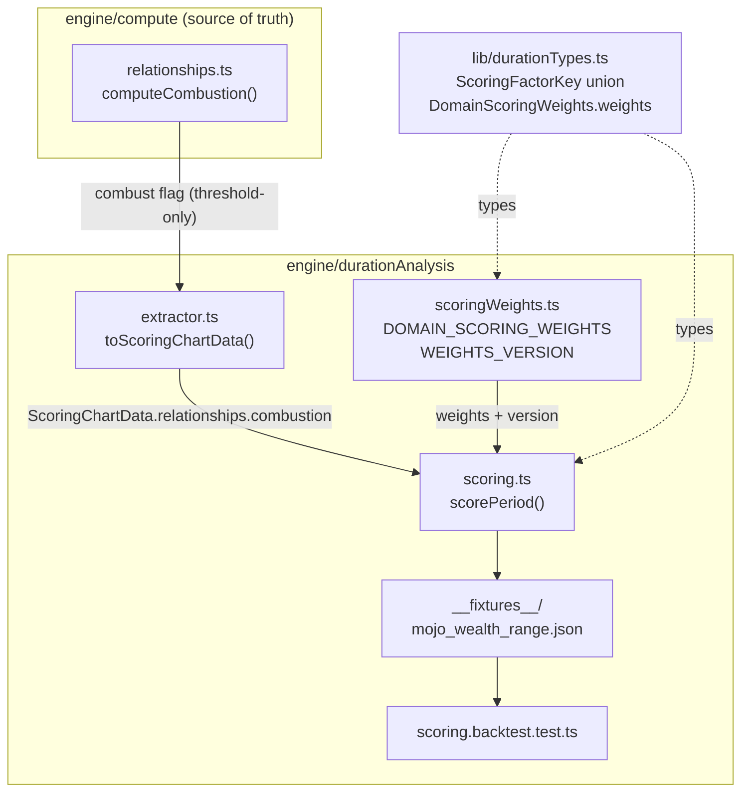

# Design Document: Scorer Dynamic Range

## Overview

This feature retunes the deterministic Duration-Analysis period scorer
(`engine/durationAnalysis/scoring.ts` + weight table
`engine/durationAnalysis/scoringWeights.ts`) so a wealth (and every other domain)
Period_Score can move across a genuinely wide range within a single Mahadasha, and so a
combust dasha lord visibly dampens the periods it governs. It also corrects the combustion
determination at the compute source so the `combust` flag the scorer consumes is
Vedically (Parashari) correct.

The work has six mechanical parts, all validated against one real chart ("Mojo",
`3c1ee085-8845-4440-8983-e3a7c41773cc`, Taurus lagna, Venus MD 2007–2027):

1. **Weight rebalance** — shift weight off the five Natal_Constant_Factors onto the
   Period_Varying and Transit_Level factors, per domain, bumping `WEIGHTS_VERSION` to
   `0.7.0-provisional`. (Requirement 1, 6, 7)
2. **De-pin `naturalKaraka` / `karakaRole`** — an MD-lord karaka match no longer returns a
   flat `1.0` for the whole MD; the value now varies with AD/PD reinforcement and is reduced
   when the matched karaka lord is combust. (Requirement 1.2/1.3, Requirement 3.4)
3. **New `lordAffliction` factor** — a standalone, additive, itemized Scoring_Factor that
   penalizes a period when a running MD/AD/PD lord is combust, graded by closeness to the Sun.
   (Requirement 3, Requirement 7)
4. **`domainHouseActivation` discrimination fix** — narrow the transit aspect net so the factor
   stops pinning at its `1.0` ceiling across a whole analysis window. (Requirement 2)
5. **Conditional Sade-Sati peak penalty** in `factorSaturnAfflictions` — the peak-phase penalty
   deepens only when transiting Saturn sits in a non-friendly rashi (its positional dignity is
   debilitated/enemy), and stays at the current mild level when Saturn is in a friendly/neutral
   rashi. A targeted transit-penalty refinement that widens the genuine downside without a
   weight change. (Requirement 7.2, Requirement 1.4)
6. **Combustion source fix** — remove the cazimi cancellation of the `combust` flag in
   `engine/compute/relationships.ts`. (Requirement 9)

The changes are validated by a new backtest fixture that scores the Mojo wealth timeline under
fresh `0.7.0` output and asserts the top-of-range inversion was removed and at least one end of
the distribution moved toward lived experience, recording the achieved range as an informational
metric rather than gating on it (Requirement 4, as softened), with the existing per-domain
fixtures re-verified or re-baselined (Requirement 8).

### Validation baseline (measured, fresh `0.6.0` compute)

The design's worked numbers are computed against the live `0.6.0-provisional` output for the
Mojo wealth window (2022-01-01 → 2026-07-31, 19 periods) obtained by re-scoring the chart, not
from cached breakdowns:

| Statistic | Value (0.6.0) |
|---|---|
| Score range across 19 periods | **58 – 70** (spread 12) |
| Highest-scoring period | **70 — Venus MD / Mercury AD / Saturn PD (2025-05 → 2025-11)** |
| That period vs lived experience | Lands inside the practitioner's WORST reported stretch (10–15/100) — the inversion |
| Lowest-scoring period | 58 — Venus MD / Ketu AD / Mars PD (2026-04) |

The compression and the inversion both trace to a block of factors that never move across the
Venus MD. Measured on every one of the 19 periods, the following are pinned at a fixed value:

| Pinned factor (0.6.0) | Value on every period | Contribution |
|---|---|---|
| `naturalKaraka` | `1.0` ("MD matches: Venus") | 9.0 |
| `domainHouseActivation` | `1.0` ("double transit") | 10.0 |
| `mdLordDignity` | `0.8` (Venus own) | 8.0 |
| `natalHouseStrength` | `0.527` (SAV 29.5) | 4.21 |
| `argalaOnDomainHouse` | `0.74` (net +2) | 5.18 |
| `divisionalChartStrength` | `0.48`–`0.51` | ~2.9 |

Pinned/near-pinned weight ≈ **50 of ~154 applied** carries a fixed value for the entire 20-year
MD. With that much of the score anchored, the AD/PD/transit factors cannot swing it far from
~64. The single highest period (70) is driven by Saturn exalted as PD lord (`pdLordDignity`
1.0) plus a Saturn-boosted `shadbala` (0.94), with nothing reading Venus's natal combustion
(`degreeFromSun 5.66`, `threshold 10`, `combust: true`).

## Guiding Principle (Parashari / PVR)

Where a classical-vs-Western modeling choice arises, the scorer follows classical Parashari
(PVR Narasimha Rao) treatment. The concrete consequence codified here: **combustion (astangata)
is a graded affliction, deepest at closest approach to the Sun, with NO cazimi strengthening
exception** (Requirement 3.5, Requirement 9). The existing combustion thresholds
(Venus 10°, etc.) are already classical/JHora-aligned and are unchanged.

## Architecture / Affected Modules



| Module | Change | Requirements |
|---|---|---|
| `engine/compute/relationships.ts` | Remove `&& !cazimi` in `computeCombustion` so `combust` is threshold-only | 9 |
| `lib/durationTypes.ts` | Add `'lordAffliction'` to `ScoringFactorKey` union | 3.9, 6.4 |
| `engine/durationAnalysis/scoringWeights.ts` | Rebalance all 7 category weight tables; add `lordAffliction` weight to each; bump `WEIGHTS_VERSION` to `0.7.0-provisional`; version-history entry | 1, 6, 8 |
| `engine/durationAnalysis/scoring.ts` | Redesign `factorNaturalKaraka` + `factorKarakaRole`; redesign `factorDomainHouseActivation`; add `factorLordAffliction`; make the peak Sade-Sati penalty in `factorSaturnAfflictions` conditional on Saturn's transit dignity (imports `getVargaDignityLabel` from `engine/compute/dignity.ts`); wire `lordAffliction` into `_scorePeriod` | 1, 2, 3, 7 |
| `engine/durationAnalysis/extractor.ts` | **No change required** — `relationships.combustion` already reaches `ScoringChartData` (verified below) | 3 (plumbing) |
| `engine/durationAnalysis/__fixtures__/mojo_wealth_range.json` (new) + `scoring.backtest.test.ts` | New Mojo backtest fixture + assertions; re-verify/re-baseline existing fixtures | 4, 8 |
| `periodInsights.ts` | **No change** — `dignityOf()` and `rashiDrishtiHousesFor()` shapes preserved | 3.10, 6.5 |

### Combustion plumbing (Requirement 3, item 3 confirmation)

`ScoringChartData.relationships` (`lib/durationTypes.ts`) is typed `RelationshipGeometry`,
whose `combustion: CombustionResult[]` carries `{ planet, degreeFromSun, combust, threshold, cazimi, nearCombust }`.
`toScoringChartData()` (`extractor.ts`) already assigns
`relationships: categoryData.relationships ?? null`, and `categoryData.relationships =
chart.relationships` from `extractCategoryData`'s base columns (populated for every
`source="compute"` chart, including Mojo). **Therefore the graded combustion data is already
available to `scorePeriod` at scoring time — no extractor change is needed.** `factorLordAffliction`
reads `chartData.relationships.combustion` and looks up each running lord by `planet` name (the
same names used by `period.md.lord` / `period.lordAnnotations.*`). On paste-path charts where
`relationships` is absent/malformed, the factor omits gracefully (Requirement 3.6/3.11).

> Note: `period.lordAnnotations.*.combust` also exists but carries only the boolean, not
> `degreeFromSun`/`threshold`. The graded factor therefore reads `relationships.combustion`,
> not the annotation.

---

## Component and Formula Design

### 1. Factor Rebalance (Requirement 1, Requirement 7)

**Classification.** The 21 existing factors + the new `lordAffliction` are grouped exactly as
the Glossary defines:

- **Natal_Constant** (fixed for the whole MD): `naturalKaraka`, `mdLordDignity`,
  `natalHouseStrength`, `argalaOnDomainHouse`, `divisionalChartStrength`.
- **Period_Varying** (change per AD/PD): `adLordDignity`, `pdLordDignity`, `shadbala`,
  `ishtaKashta`, `houseOwnership`, `bhavaBala`, `mdAdRelationship` (AD-granular),
  `activatedYogas` (AD-granular), `nakshatraDispositor`, `dashaLordBav`, `rashiDrishti`,
  `rashiDispositorChain`.
- **Transit_Level** (change per calendar date): `transitBav`, `saturnAfflictions`,
  `domainHouseActivation`.
- **New penalty channel**: `lordAffliction` (varies with which lord runs → effectively
  period-varying; classified SECONDARY for confidence per Requirement 3.8).

`karakaRole` is treated as Natal-Constant-behaving only when the MD lord is the domain's
karaka (its de-pin is handled in §2).

**Strategy.** Cut the five Natal_Constant weights, move that weight onto the discriminators
(AD/PD dignity, shadbala, `transitBav`, `saturnAfflictions`, `houseOwnership`), and add the new
`lordAffliction`. The two dominant *pinned ceiling* factors are also directly addressed: `naturalKaraka`
is de-pinned (§2) and `domainHouseActivation` is narrowed (§4), so shifting weight toward transit
no longer just piles weight onto another constant.

#### Proposed weight table — `wealth` (concrete)

| Factor | 0.6.0 | 0.7.0 | Δ | Class |
|---|---:|---:|---:|---|
| mdLordDignity | 10 | **6** | −4 | Natal-const |
| naturalKaraka | 9 | **5** | −4 | Natal-const |
| natalHouseStrength | 8 | **6** | −2 | Natal-const |
| argalaOnDomainHouse | 7 | **5** | −2 | Natal-const |
| divisionalChartStrength | 6 | **4** | −2 | Natal-const |
| adLordDignity | 8 | **10** | +2 | Period-varying |
| pdLordDignity | 4 | **5** | +1 | Period-varying |
| shadbala | 8 | **9** | +1 | Period-varying |
| houseOwnership | 12 | 12 | 0 | Period-varying |
| ishtaKashta | 6 | 6 | 0 | Period-varying |
| bhavaBala | 8 | 8 | 0 | Period-varying |
| mdAdRelationship | 10 | **8** | −2 | Period-varying (AD) |
| activatedYogas | 7 | **6** | −1 | Period-varying (AD) |
| nakshatraDispositor | 7 | **6** | −1 | Period-varying |
| dashaLordBav | 7 | 7 | 0 | Period-varying |
| rashiDrishti | 5 | 5 | 0 | Period-varying |
| rashiDispositorChain | 7 | **6** | −1 | Period-varying |
| transitBav | 10 | **13** | +3 | Transit |
| saturnAfflictions | 10 | **13** | +3 | Transit |
| domainHouseActivation | 10 | **8** | −2 | Transit |
| karakaRole | 7 | 7 | 0 | (omits for wealth) |
| **lordAffliction (NEW)** | — | **8** | +8 | Penalty (secondary) |
| **Total** | **166** | **163** | | |

`mdAdRelationship` and `domainHouseActivation` are trimmed because, in the measured Mojo data,
both *inverted* against lived experience (they scored the bad Mercury-AD span at `1.0` and the
good Saturn-AD span at `0.35`/`0.6`); they remain meaningful but should not dominate. These two
trims are kept **deliberately minimal** (−2 each, per resolved Decision 1) rather than deepened:
a larger cut, justified only by this single wealth chart, would risk overfitting to Mojo (a spec
Non-Goal). The cross-domain fixture suite (Requirement 8: `career_strong_weak`,
`health_saturn_affliction`, `marriage_dk_vs_dusthana`, `wealth_dhana_vs_dusthana`, re-run under
`0.7.0`) is the guard against that overfitting — it, not a heavier hand on these two factors, is
what keeps the rebalance honest across domains.

**Requirement 1.4 check (PV+T proportion must rise).** Using the Glossary's *named* PV and
Transit sets:

| Bucket | 0.6.0 weight | 0.7.0 weight |
|---|---:|---:|
| Period_Varying (adLord, pdLord, shadbala, houseOwnership, bhavaBala, mdAdRelationship, activatedYogas) | 57 | 58 |
| Transit (transitBav, saturnAfflictions, domainHouseActivation) | 30 | 34 |
| **PV + Transit** | **87** | **92** |
| Category total | 166 | 163 |
| **PV+T proportion** | **52.4 %** | **56.4 %** |

56.4 % > 52.4 % ⇒ **Requirement 1.4 satisfied for wealth.** (Counting the period-varying
`lordAffliction` too gives 61.3 %.) Natal_Constant share falls 24.1 % → 16.0 %.

#### Pattern for the other five domains

Apply the same transformation, preserving each domain's existing emphasis (its `primaryFactors`
and the 4-dimension balance documented for 0.6.0):

- **Natal-constant cuts:** `mdLordDignity` 10→6, `naturalKaraka` −4 (or −3 where it is a
  `primaryFactor`, e.g. wealth/marriage keep it usable), `natalHouseStrength` 8→6,
  `argalaOnDomainHouse` 7→5, `divisionalChartStrength` 6→4 (health, which already sets it to 4,
  goes 4→3).
- **Transit gains:** `transitBav` +2–3, `saturnAfflictions` +2 (health keeps its 12 → 14, since
  Saturn afflictions are its `primaryFactor`), `domainHouseActivation` −2 (career/property keep
  it comparatively higher since it is one of their `primaryFactors`, e.g. 12→10).
- **Period-varying gains:** `adLordDignity` +2, `pdLordDignity` +1, `shadbala` +1.
- **New:** `lordAffliction` = 8 for every domain (health 9 — combustion of the AK / vitality
  karaka is most consequential there).

Each domain's resulting PV+T proportion must be re-computed and asserted > its 0.6.0 value
before the version ships; the backtest fixtures (Requirement 8) guard the relative rankings.

#### Combined effect: the genuine downside channel (Requirement 7)

Worked on the Mojo **worst-window floor** period (Venus MD / Ketu AD / Mars PD, 2026-04,
Sade-Sati peak, 0 yogas). Measured 0.6.0 score = **58**. Under 0.7.0 (all §1–§6 changes, using
the measured normalized values, `saturnAfflictions` peak penalty per the conditional §5 rule —
the Ketu-AD overlay has transiting Saturn in **Pisces**, a friendly/neutral rashi for Saturn, so
the **mild** peak penalty applies (normalized 0.60), NOT the steep one — `naturalKaraka`
de-pinned per §2, `lordAffliction` per §3):

| Factor | norm | w | contrib |
|---|---:|---:|---:|
| mdLordDignity | 0.80 | 6 | 4.80 |
| adLordDignity (Ketu) | 0.50 | 10 | 5.00 |
| pdLordDignity (Mars enemy) | 0.30 | 5 | 1.50 |
| shadbala | 0.531 | 9 | 4.78 |
| ishtaKashta | 0.464 | 6 | 2.78 |
| houseOwnership | 0.30 | 12 | 3.60 |
| naturalKaraka (Venus, de-pinned+combust) | 0.34 | 5 | 1.70 |
| bhavaBala | 0.305 | 8 | 2.44 |
| transitBav | 0.6875 | 13 | 8.94 |
| saturnAfflictions (peak, Saturn in Pisces = friendly → mild 0.40) | 0.60 | 13 | 7.80 |
| domainHouseActivation (Saturn-only) | 0.60 | 8 | 4.80 |
| mdAdRelationship | 0.40 | 8 | 3.20 |
| natalHouseStrength | 0.527 | 6 | 3.16 |
| nakshatraDispositor | 0.5975 | 6 | 3.59 |
| dashaLordBav | 0.50 | 7 | 3.50 |
| argalaOnDomainHouse | 0.74 | 5 | 3.70 |
| divisionalChartStrength | 0.48 | 4 | 1.92 |
| rashiDispositorChain | 0.50 | 6 | 3.00 |
| **lordAffliction (Venus MD combust)** | **0.283** | **8** | **2.26** |
| *omitted*: karakaRole, activatedYogas (0 yogas), rashiDrishti | | | |

weightedSum ≈ 72.5, weightSumApplied = 145 → **score ≈ 50**. The floor drops **58 → ~50**,
i.e. materially below the pre-fix floor of ~58 (Requirement 7.1/7.2 mechanically demonstrated).
Under the conditional §5 rule the Sade-Sati peak here is only *mildly* penalized (Saturn in
Pisces is friendly/neutral, normalized 0.60), so — unlike the earlier unconditional-steepening
draft, which put the floor at ~48 — the downside is now carried almost entirely by the reduced
natal anchor, the `lordAffliction` penalty (2.26 vs a neutral ~4.0), and the de-pinned
`naturalKaraka` (1.70 vs the pinned 4.5 it would contribute at neutral). The Saturn factor
contributes little extra drop for *this* period because its Sade-Sati is in a benign rashi; it is
the karaka/combustion channel that opens the downside. The floor still lands ~8 points below the
pre-fix ~58, so the Requirement 7 downside gate holds with comfortable margin.

---

### 2. `naturalKaraka` / `karakaRole` De-pin + Combustion Credit Reduction (Req 1.2/1.3, Req 3.4)

**Problem (measured).** `factorNaturalKaraka` returns `1.0` whenever the MD lord is in
`relevantNaturalKarakas`, for *every* AD/PD combination — so Venus MD pins it at `1.0`
(contribution 9) across all 19 Mojo periods, and the combust wealth karaka is invisible.

**New `factorNaturalKaraka` logic.** Sum a per-level *presence* base across every running lord
that matches, each scaled by the lord's combustion survival fraction, then clamp to `[0,1]`:

```
levelBase   = { MD: 0.60, AD: 0.25, PD: 0.15 }
survival(lord) = combust ? clamp(degreeFromSun / threshold, 0, 1) : 1.0
normalized  = clamp( Σ_over_matching_levels levelBase[level] × survival(lord), 0, 1 )
```

- MD-only match, lord not combust → `0.60` (was `1.0`) — de-pinned.
- MD + PD match (e.g. Venus MD + Jupiter PD) → `0.60 + 0.15 = 0.75` — now **varies across
  AD/PD** within the same MD (Requirement 1.2 satisfied: the value differs between periods
  where a second karaka is running and periods where it is not).
- Reinforcement lets the factor rise; combustion of a matched lord lowers it.

`survival` implements Requirement 3.4: a combust karaka is scored as a *weaker karaka*, within
the existing `[0,1]` range, no new key, no value-shape change.

**Worked (combust Venus in wealth, `degreeFromSun 5.66`, `threshold 10`):**

```
survival(Venus) = 5.66 / 10 = 0.566
MD-only match   → 0.60 × 0.566 = 0.340   (contribution at w=5 → 1.70; was 9.0 pinned)
MD + Jupiter PD → 0.60×0.566 + 0.15×1.0 = 0.49
```

Deeper combustion (smaller `degreeFromSun`) → smaller survival → smaller credit, monotonically
(supports Requirement 3.3's ordering, applied here to the karaka credit).

**`factorKarakaRole`** gets the identical treatment for domains that use it (health AK, career
AmK, marriage DK). Current logic returns `1.0` (MD) / `0.8` (AD) flatly:

```
levelBase = { MD: 0.60, AD: 0.35 }   // PD karakaRole not currently read; unchanged
normalized = clamp( Σ_matching levelBase[level] × survival(lord), 0, 1 )
```

- MD match, not combust → `0.60` (was `1.0`); MD + AD both match → `0.95`; combust MD karaka →
  reduced by `survival`. For `wealth`/`property`/`cashflow` (`relevantKarakaRoles: []`) the
  factor still omits as `noSignal` — no effect, matching 0.6.0.

**Boundary with `lordAffliction` (Requirement 3.4 vs 3.1, non-double-counting).** These are two
*distinct* mechanisms and the design keeps them non-overlapping in meaning:

- The karaka-credit reduction (§2) reduces the *positive* karaka signal — "a combust karaka is a
  weaker significator." It only touches `naturalKaraka`/`karakaRole`, only when the combust lord
  is a domain karaka.
- `lordAffliction` (§3) is a *separate negative* signal that applies to *any* combust running
  lord (karaka or not) and is itemized under its own key.

For a combust karaka lord both fire, which is intentional and classically sound (the planet both
delivers weaker karaka results *and* is itself afflicted), but they measure different things and
neither modifies the other's inputs (Requirement 3.1 forbids `lordAffliction` from mutating other
factors' contributions — honored, they are independent additive terms).

---

### 3. New `lordAffliction` Factor (Requirement 3)

A standalone, additive, itemized Scoring_Factor (`ScoringFactorKey = 'lordAffliction'`),
SECONDARY tier, that dampens a period when a running MD/AD/PD lord is combust, graded by
closeness to the Sun.

**Resolved weight (Decision 3).** `lordAffliction` weight = **8** for career, wealth, marriage,
property, and cashflow; = **9** for health. Health carries the heavier penalty because combustion
of the vitality / Atmakaraka significator is the most consequential affliction for that domain.
These values are fixed in every domain's `weights` table in §1's per-domain pattern and stamped
into the `0.7.0` version-history comment.

**Signature & data source.**

```ts
function factorLordAffliction(
  mdLord: string, adLord: string, pdLord: string,
  chartData: ScoringChartData,          // reads chartData.relationships.combustion
): FactorResult
```

**Formula.**

```
combustion = chartData.relationships?.combustion            // CombustionResult[]
if (!Array.isArray(combustion)) return { ok:false, reason:'combustion data unavailable' }   // Req 3.6 (dents nothing? see below)

// per running lord, penalty depth = how deep the combustion is (0 at threshold edge → 1 at conjunction)
penalty(lord) = entry.combust ? clamp(1 - entry.degreeFromSun / entry.threshold, 0, 1) : 0

levelWeight = { MD: 0.50, AD: 0.30, PD: 0.20 }
EP = Σ_over_running_levels levelWeight[level] × penalty(lordAtLevel)   // NOT normalised by Σweights

if (no running lord is combust) return { ok:false, reason:'no running lord combust', noSignal:true }  // Req 3.7
normalized = clamp(0.5 - EP, 0, 1)     // < 0.5 ⇒ genuine downward pull
value = { combustLords: [...], EP }
```

Design notes:

- **`0.5 - EP`** centres the factor so that "present but shallow" combustion sits just below
  neutral and deep/multiple combustion drives toward 0 — a real *penalty* that pulls the
  weighted average down (a value above 0.5 would perversely *raise* the score).
- **Level weighting** makes MD-lord combustion dominate (Parashari: the MD lord colours the whole
  period), AD next, PD least — and folds AD/PD combustion into the *same* factor (Requirement 3.2).
- **Grading by `degreeFromSun/threshold`** satisfies Requirement 3.3 monotonicity: a lord nearer
  the Sun (relative to its threshold) yields a larger `penalty`, hence a normalized value at least
  as low as a lord farther out.
- **No `cazimi` reference anywhere** (Requirement 3.5) — only `combust`, `degreeFromSun`,
  `threshold` are read.
- **Itemized** exactly like every other factor via `applyFactor` → `ScoreFactorContribution`
  `{ factor:'lordAffliction', value, normalized, weight, contribution }` (Requirement 3.9).

**Worked (Mojo wealth):**

```
Venus MD combust (5.66/10):  penalty = 1 - 0.566 = 0.434
• Venus MD only (AD/PD not combust):  EP = 0.50×0.434 = 0.217 → normalized = 0.283  (w8 → 2.26)
• Venus MD + Venus PD (both combust):  EP = 0.50×0.434 + 0.20×0.434 = 0.304 → 0.196 (w8 → 1.57)
```

So `lordAffliction` is ~0.283 for the common Venus-MD-only Mojo periods and dips to ~0.196 when
Venus is also PD — it *varies*, and it pulls every Venus-MD period down relative to neutral
(4.0 → 2.26 at w8). A hypothetical deep combustion (e.g. 1°/10°, `penalty` 0.9) as MD would give
`EP = 0.45 → normalized 0.05` — near-maximum penalty (monotonicity check).

**Confidence tier (Requirement 3.6/3.7/3.8).**

- No running lord combust, but combustion data present → `{ ok:false, noSignal:true }` →
  dropped from the denominator, **does not dent confidence** (matches `naturalKaraka`/`karakaRole`
  convention). `lordAffliction` is added to *no* domain's `primaryFactors`, so it is SECONDARY.
- Combustion data absent/malformed (paste-path) → `{ ok:false }` (no `noSignal`). Because it is
  SECONDARY (not a `primaryFactor`), `computeConfidence` counts only primary omissions, so this
  also does not reduce confidence — but it is recorded as a normal omission (Requirement 3.6),
  distinct from a no-signal omission.
- Purity/never-throws (Requirement 3.11): pure array reads, `clamp`, guarded lookups; degrades to
  omission on missing/malformed data; wrapped by the existing `scorePeriod` try/catch backstop.

**Wiring** in `_scorePeriod`, added after the existing factors:

```ts
apply('lordAffliction', factorLordAffliction(mdLord, adLord, pdLord, chartData))
```

---

### 4. `domainHouseActivation` Discrimination Fix (Requirement 2)

**Confirmed problem (Requirement 2.1/2.2).** Measured across all 19 Mojo wealth periods,
`domainHouseActivation` = `1.0` ("double transit") on **every** period. Cause: the aspect net is
too wide — each of Saturn and Jupiter contributes 4 targets (occupation + 7th + its two special
aspects) *and* Limb 2 adds the domain-house-lord's natal house. With wealth primary houses {2,11}
plus the lords' houses, both planets hit *something* in every AD transit window. Verified by
recomputation: with the full special-aspect net restricted even to just {2,11}, both Saturn and
Jupiter reach a primary house in all three Mojo transit overlays.

**Fix (narrow the net + benefic/malefic-aware output).**

1. **Drop Limb 2** (the domain-house-lord's natal house) — it is the main saturator and is
   already covered indirectly by `houseOwnership`/`bhavaBala`.
2. **Restrict the aspect net to occupation + 7th aspect only** (drop Saturn 3rd/10th and Jupiter
   5th/9th for this factor). These wide special aspects are what pin the factor.
3. **Grade the output** so it discriminates and stays true to double-transit theory:

```
saturnHits  = Saturn occupies or 7th-aspects a domain primary house
jupiterHits = Jupiter occupies or 7th-aspects a domain primary house
both      → 1.00   ("double transit" — the genuine trigger, now rare under the tight test)
Jupiter   → 0.75   (benefic reaches the domain house)
Saturn    → 0.60   (malefic reaches the domain house)
neither   → omit (noSignal:true)     // Req 2 keeps it out of the denominator, no confidence dent
```

**Measured effect across the three Mojo transit overlays (primary {2,11}, tight test):**

| Overlay (AD) | Saturn | Jupiter | 0.6.0 | 0.7.0 |
|---|---|---|---:|---:|
| Saturn AD (2019-11): Sa h8→7th=2; Ju h7→occ7,7th=1 | hits 2 | none | 1.0 | **0.60** |
| Mercury AD (2023-01): Sa h9→occ9,7th=3; Ju h11 occ | none | hits 11 | 1.0 | **0.75** |
| Ketu AD (2025-11): Sa h11 occ; Ju h3→occ3,7th=9 | hits 11 | none | 1.0 | **0.60** |

The factor now moves (0.60 ↔ 0.75) across the window instead of pinning at 1.0
(Requirement 2.2 satisfied), and is directionally sensible (Jupiter transiting the 11th of wealth
rates above Saturn-only).

**Accepted-tradeoff note (Requirement 2.3).** For wealth in this window the tight test yields only
0.60/0.75 (never a true 1.0 "double transit"), because Saturn and Jupiter each reach a wealth
house in every sub-window but never *simultaneously* under occupation+7th. This is documented as
intended: the factor is off its ceiling and varies, which is the requirement's goal. Single-primary-house
domains (career h10, marriage h7) will see the tight test genuinely toggle none/single/double, so no
domain is left pinned; any domain that still does not discriminate is recorded in the
`scoringWeights.ts` version-history comment as an accepted tradeoff.

---

### 5. Conditional Sade-Sati Peak Penalty in `factorSaturnAfflictions` (Requirement 7.2, Requirement 1.4)

**Current behavior (measured).** `factorSaturnAfflictions` applies a *flat, unconditional*
peak-phase penalty:

```ts
let score = 1.0
if (overlay.sadeSatiActive) {
  if (overlay.sadeSatiPhase === 'peak') score -= 0.4   // → normalized 0.60
  else score -= 0.2                                    // rising/setting → 0.80
}
if (overlay.ashtamaShani) score -= 0.3
if (overlay.kantakaShani) score -= 0.2
```

**Change (resolved Decision 2 — conditional, not unconditional).** The peak-phase penalty is
made conditional on *where* transiting Saturn sits, because a Sade-Sati peak with Saturn in a
rashi hostile to Saturn bites harder than one in a rashi Saturn tolerates. Only the `peak` branch
changes; `rising`/`setting`, `ashtamaShani`, and `kantakaShani` are **unchanged**.

```ts
// overlay.saturn.signNumber (1=Aries … 12=Pisces) is already carried by TransitOverlay.
// Positional-only dignity of Saturn in its TRANSIT sign — no natal tatkalika is available or
// used for a transit, so reuse the canonical classifier with an empty D1 map, which falls back
// to positional dignity + naisargika (PERMANENT_FRIENDSHIP) with the sign's lord:
const saturnTransitDignity = getVargaDignityLabel('Saturn', overlay.saturn.signNumber, {})
const NON_FRIENDLY = new Set(['debilitated', 'enemy', 'great_enemy'])
const peakPenalty = NON_FRIENDLY.has(saturnTransitDignity ?? '') ? 0.60 : 0.40

if (overlay.sadeSatiActive) {
  if (overlay.sadeSatiPhase === 'peak') score -= peakPenalty   // 0.60 → norm 0.40, or 0.40 → norm 0.60
  else score -= 0.2
}
```

- **Non-friendly rashi → steep peak penalty 0.60 (normalized 0.40).**
- **Friendly/neutral rashi → mild peak penalty 0.40 (normalized 0.60)** — identical to the
  current `0.6.0` peak behavior.

**Exact, computable mapping (from `engine/compute/dignity.ts`).** "Non-friendly rashi" is defined
purely from Saturn's transit sign number via `getVargaDignityLabel('Saturn', signNumber, {})`,
which uses the real dignity tables. With an empty `d1SignByPlanet` map there is no tatkalika, so
the label is Saturn's positional dignity (exalt Libra, debil Aries, own Capricorn/Aquarius,
moolatrikona Aquarius) or, failing those, its naisargika `PERMANENT_FRIENDSHIP` relation to the
sign's lord (`SIGN_LORDS`): Saturn friends = Mercury, Venus; enemies = Sun, Moon, Mars; neutral =
Jupiter (and Saturn itself). Resolving all 12 signs:

| Saturn transit sign | Sign lord | Positional dignity label | Bucket → peak penalty |
|---|---|---|---|
| Aries (1) | Mars | **debilitated** | NON-FRIENDLY → 0.60 (norm 0.40) |
| Taurus (2) | Venus | friend | friendly → 0.40 (norm 0.60) |
| Gemini (3) | Mercury | friend | friendly → 0.40 (norm 0.60) |
| Cancer (4) | Moon | **enemy** | NON-FRIENDLY → 0.60 (norm 0.40) |
| Leo (5) | Sun | **enemy** | NON-FRIENDLY → 0.60 (norm 0.40) |
| Virgo (6) | Mercury | friend | friendly → 0.40 (norm 0.60) |
| Libra (7) | Venus | **exalted** | friendly → 0.40 (norm 0.60) |
| Scorpio (8) | Mars | **enemy** | NON-FRIENDLY → 0.60 (norm 0.40) |
| Sagittarius (9) | Jupiter | neutral | friendly/neutral → 0.40 (norm 0.60) |
| Capricorn (10) | Saturn | **own** | friendly → 0.40 (norm 0.60) |
| Aquarius (11) | Saturn | **moolatrikona** | friendly → 0.40 (norm 0.60) |
| Pisces (12) | Jupiter | neutral | friendly/neutral → 0.40 (norm 0.60) |

So the steep peak penalty fires only for Saturn transiting **{Aries, Cancer, Leo, Scorpio}**;
every other sign keeps the mild `0.6.0` penalty. This mapping is stated as the **working
interpretation** of the user's "non-friendly rashi" instruction — it uses positional dignity plus
naisargika friendship with the transit sign's lord, and is open to correction (e.g. if reviewers
want Saturn's *neutral* signs, Sagittarius/Pisces, folded into "non-friendly" as well). The rule
is **cazimi-free** (no reference to any cazimi/combustion state) and **pure** (a table lookup on
`signNumber`); it never throws and degrades to the mild penalty if the dignity label is
`undefined`.

**Mojo re-verification (the point of the refinement).** In the Ketu-AD transit overlay
(2025-11 onward, which governs the §1 worked floor period 2026-04), transiting Saturn is in
**Pisces (signNumber 12)**. Pisces' lord is Jupiter; Saturn–Jupiter is naisargika **neutral**,
and Pisces is not Saturn's exalt/debil/own/moolatrikona — so Saturn's transit dignity in Pisces
is **neutral** → the **friendly/neutral bucket** → the **mild 0.40 penalty (normalized 0.60)**
applies, *not* the steep one. The §1 worked floor therefore uses `saturnAfflictions` normalized
**0.60** (contribution 7.80), which is why that floor lands at **~50** rather than the ~48 the
earlier unconditional-steepening draft produced. See the §1 worked table and the Testing Strategy
projections for the range consequences (range is now computed and reported, not gated, per the
softened Requirement 4.2).

---

### 6. Combustion Source Fix (Requirement 9)

Single-line change in `engine/compute/relationships.ts`, `computeCombustion()`:

```diff
- const combust = degreeFromSun < threshold && !cazimi
+ const combust = degreeFromSun < threshold
```

- `combust` becomes **threshold-only** (Requirement 9.1/9.2). A planet within the cazimi orb
  (~0°17′) is now the *most* combust, per Parashari astangata, instead of being exempted.
- `nearCombust = degreeFromSun < threshold*1.5 && !combust` still holds; when a very-close planet
  now flips `combust:true`, `nearCombust` correctly stays `false` (no double flag).
- The `cazimi` field is **left in place** (still computed, still on `CombustionResult`) — the
  scorer never reads it (Requirement 3.5), and fully deleting it from types/slicer/`periodInsights`/
  fixtures is deferred cleanup (Requirement 9.3).
- **Mojo unchanged (Requirement 9.4):** Venus is `degreeFromSun 5.66` ≫ `CAZIMI_ORB 0.283`, so
  `cazimi` was already `false` and `combust` already `true`. Removing `&& !cazimi` does not change
  any Mojo value; it corrects other charts and makes the affliction signal Vedically correct.

---

## Data Models / Type Changes

Only additive, structurally backward-compatible changes (Requirement 6.3).

### `lib/durationTypes.ts`

```ts
export type ScoringFactorKey =
  | 'mdLordDignity'
  ...
  | 'rashiDispositorChain'
  | 'lordAffliction'      // NEW — Requirement 3.9, 6.4
```

- `ScoreBreakdown`, `ScoreFactorContribution`, `ScoreOmission` interfaces are **unchanged**
  (Requirement 6.3). `lordAffliction` flows through the existing `factors[]` / `omissions[]`
  arrays like any other key.
- `mdLordDignity`/`adLordDignity`/`pdLordDignity` keep their dignity-label string `value`
  (Requirement 3.10 — `periodInsights.dignityOf()` parses it).
- `rashiDrishti` keeps its `{ lord, toHouses }[]` `value` (Requirement 6.5 —
  `periodInsights.rashiDrishtiHousesFor()` parses it).

### `engine/durationAnalysis/scoringWeights.ts`

- Every domain's `weights` record gains a `lordAffliction` entry (Requirement 6.4 — new key added
  to each table, no existing key's meaning changed).
- `WEIGHTS_VERSION = '0.7.0-provisional'` (Requirement 6.1). Every persisted `ScoreBreakdown`
  stamps it (Requirement 6.2, via the existing `weightsVersion: WEIGHTS_VERSION` line in
  `_scorePeriod`).
- New version-history comment block entry (see Testing/Traceability).

### `engine/compute/relationships.ts` / `engine/compute/types.ts`

- No type change. `CombustionResult` shape is preserved (`cazimi` field retained but scorer-unused;
  see §6 note).

---

## Correctness Properties

*A property is a characteristic or behavior that should hold true across all valid executions of
a system — a formal statement about what the system should do. Properties bridge human-readable
specifications and machine-verifiable correctness guarantees.*

The scorer is a pure, deterministic function over structured chart data, so most acceptance
criteria map to universally-quantified properties. Single-chart backtest assertions
(Requirement 4, 5, 8) and one-shot edge cases (Requirement 3.6/3.7) are covered by example and
edge-case tests in the Testing Strategy, not restated as properties.

### Property 1: De-pinning — karaka factors vary across AD/PD within one MD

*For all* domains whose MD lord is a relevant natural karaka (resp. matches
`relevantKarakaRoles`), and for the set of periods sharing that fixed MD but differing in AD/PD
lords, the `naturalKaraka` (resp. `karakaRole`) normalized value is not constant across that set
(it must be capable of taking more than one value — never pinned at a single maximum for the
whole MD).

**Validates: Requirements 1.2, 1.3**

### Property 2: Period-varying + transit weight share increases

*For all* `DurationCategory` entries in `DOMAIN_SCORING_WEIGHTS`, the proportion of total
category weight assigned to Period_Varying + Transit_Level factors under `0.7.0-provisional` is
strictly greater than the corresponding proportion under `0.6.0-provisional`.

**Validates: Requirements 1.4**

### Property 3: Affliction is a standalone additive term that does not mutate other factors

*For all* periods with a combust MD lord, scoring the period yields a `lordAffliction`
contribution in `factors[]`, and the `mdLordDignity`, `adLordDignity`, `pdLordDignity`, and
`shadbala` contributions are identical to those produced when the combustion signal is cleared
(the affliction is expressed only through `lordAffliction` and the itemized karaka-credit
reduction, never by mutating dignity/shadbala contributions).

**Validates: Requirements 3.1**

### Property 4: Single well-formed affliction contribution folding all combust levels

*For all* periods in which at least one running MD/AD/PD lord is combust, `factors[]` contains
exactly one `lordAffliction` entry, shaped `{ factor, value, normalized ∈ [0,1], weight,
contribution = weight × normalized }`, and its normalized value reflects every combust running
level (adding a combust AD or PD lord changes the value).

**Validates: Requirements 3.2, 3.9**

### Property 5: Affliction graded monotonically by closeness to the Sun

*For all* pairs of otherwise-identical periods differing only in the `degreeFromSun` of a single
combust running lord, the period whose lord has the smaller `degreeFromSun / threshold` ratio
receives a `lordAffliction` normalized value less than or equal to the other (a deeper
combustion yields an affliction at least as large).

**Validates: Requirements 3.3**

### Property 6: Combust karaka credit reduced monotonically, within range

*For all* periods where a matched karaka lord (`naturalKaraka` or `karakaRole`) is combust, the
factor's normalized value is non-increasing as `degreeFromSun / threshold` decreases, and always
remains within `[0, 1]`.

**Validates: Requirements 3.4**

### Property 7: Scorer is invariant to the cazimi field

*For all* chart data, scoring a period with the combustion entries' `cazimi` field set to
`false` produces an identical Period_Score and identical `factors[]`/`omissions[]` as scoring
with `cazimi` set to `true`, holding `combust`, `degreeFromSun`, and `threshold` fixed.

**Validates: Requirements 3.5**

### Property 8: Absent combustion never dents confidence

*For all* periods in which no running lord is combust, the computed `confidence` equals the
confidence computed without the `lordAffliction` factor, and `lordAffliction` is absent from
every domain's `primaryFactors`.

**Validates: Requirements 3.8**

### Property 9: Consumer value shapes preserved

*For all* scored periods: each of `mdLordDignity`/`adLordDignity`/`pdLordDignity` has a string
`value`, and wherever `rashiDrishti` is applied its `value` is an array of `{ lord, toHouses }`
entries.

**Validates: Requirements 3.10, 6.5**

### Property 10: Purity and never-throws under malformed combustion data

*For all* combustion inputs — including missing fields, `NaN`, negative, or out-of-range
`degreeFromSun`/`threshold` — `scorePeriod` returns a valid `ScoreBreakdown` with an integer
`score ∈ [0, 100]` without throwing, and performs no I/O.

**Validates: Requirements 3.11**

### Property 11: Every breakdown stamps the current weights version

*For all* periods and domains, the produced `ScoreBreakdown.weightsVersion` equals
`WEIGHTS_VERSION` (`'0.7.0-provisional'`).

**Validates: Requirements 6.2**

### Property 12: Every domain weights table defines the new factor

*For all* `DurationCategory` entries, `weights.lordAffliction` is a defined finite number.

**Validates: Requirements 6.4**

### Property 13: Combustion is threshold-only at the compute source

*For all* non-node planets, `computeCombustion` sets `combust` to `true` exactly when
`degreeFromSun < threshold` (independent of the `cazimi` orb) — in particular a planet within the
cazimi orb is combust.

**Validates: Requirements 9.1, 9.2**

### Property 14: Sade-Sati peak penalty is conditional on Saturn's transit dignity, and never lighter than a non-peak penalty

*For all* pairs of transit overlays that are identical except for transiting Saturn's sign and
are both in Sade-Sati `peak` phase (with `ashtamaShani`/`kantakaShani` held equal), the overlay
whose Saturn sign is non-friendly (positional dignity ∈ {debilitated, enemy, great_enemy} —
Aries, Cancer, Leo, Scorpio) receives a `saturnAfflictions` normalized value less than or equal
to the overlay whose Saturn sign is friendly/neutral; and for any overlay, the `peak`-phase
normalized value is less than or equal to the `rising`/`setting` normalized value under the same
non-Sade-Sati afflictions.

**Validates: Requirements 7.2**

---

## Error Handling

The scorer's existing contract — **pure, never throws, degrades to omission** — is preserved and
extended to the new logic:

- **Missing `relationships.combustion`** (paste-path or malformed) → `factorLordAffliction`
  returns `{ ok:false, reason }`; recorded in `omissions[]`; SECONDARY, so no confidence dent
  (Requirement 3.6, 3.11).
- **Combustion present, no running lord combust** → `{ ok:false, noSignal:true }`; omitted from
  the denominator, no confidence dent (Requirement 3.7).
- **Malformed combustion entry** (missing `degreeFromSun`/`threshold`, `NaN`, `threshold ≤ 0`)
  → treated as "no usable penalty for that lord"; `clamp` bounds all arithmetic to `[0,1]`; the
  factor omits if no lord yields a usable penalty. Never throws (Requirement 3.11).
- **De-pinned karaka with missing combustion** → `survival` defaults to `1.0` (treat as
  not-combust), preserving the de-pinned base value; graceful.
- **Conditional Sade-Sati dignity lookup (§5)** — `getVargaDignityLabel('Saturn', signNumber, {})`
  is a pure table lookup that returns `undefined` only for a missing/out-of-range `signNumber`;
  the rule treats an `undefined` (or non-non-friendly) label as the **mild** 0.40 penalty, so a
  malformed `overlay.saturn.signNumber` degrades to current `0.6.0` behavior rather than throwing.
  When `overlay` is absent the factor already omits (`transitOverlay not available`), unchanged.
- **Absolute backstop** — the existing `scorePeriod` try/catch returns the neutral 50 breakdown
  on any unexpected error, unchanged.
- **Compute source (`relationships.ts`)** — the edit only removes a boolean conjunct; no new
  failure mode. `nearCombust` remains mutually exclusive with `combust`.

---

## Testing Strategy

**Dual approach.** Property-based tests verify the universal properties above; example, edge-case,
and backtest tests verify concrete Mojo/fixture behavior and infrastructure obligations.

### Property-based tests (new, in `scoring.test.ts`)

- A PBT library already used in the repo test suite drives generators; **each property test runs
  ≥ 100 iterations** and is tagged `Feature: scorer-dynamic-range, Property N: <text>`.
- Generators produce: random lagna, random MD/AD/PD lord triples, random dignity labels, random
  `CombustionResult[]` (including malformed entries for Property 10), and cazimi flips (Property 7).
- Properties 1–13 above each map to a single property test. Property 2, 12 iterate the 7 domains
  deterministically (small finite domain, still expressed as a `for all` over categories).

### Example / edge-case tests

- **Edge cases (Req 3.6, 3.7):** combustion column absent → `lordAffliction` in `omissions[]`,
  not `factors[]`; combustion present with no combust lord → omission has `noSignal:true`.
- **Compute fix (Req 9.4):** unit test that a planet at `degreeFromSun` inside the cazimi orb now
  reports `combust:true`, and that Venus at 5.66°/10° is unchanged (`combust:true`, `cazimi:false`).
- **Interface (Req 6.3):** a shape assertion over a produced `ScoreBreakdown` confirming the key
  set is unchanged; plus type-level compilation of existing consumers
  (`DurationComputationResults.tsx`, `periodInsights.ts`).

### Backtest fixture — Mojo wealth range (Requirement 4, 7, 8)

New fixture `engine/durationAnalysis/__fixtures__/mojo_wealth_range.json`, following the existing
`__fixtures__` convention (`category`, `description`, `chartData`, `periods[]` with
`slice`+`transitOverlay`). It encodes the Mojo chart's 19 wealth periods for 2022-01-01 →
2026-07-31 with their real `lordAnnotations`, `transitOverlay` entries (the three AD boundaries),
and `chartData` including `relationships.combustion` (so `lordAffliction` fires) — captured from a
fresh compute, **not** from any cached `ScoreBreakdown` (Requirement 4.6). New assertions in
`scoring.backtest.test.ts` re-score it via `scorePeriod` directly under `0.7.0` and assert:

1. `argmax` period does **not** overlap Jun 2025 – Jul 2026 (Requirement 4.1). *(Worked design
   projection under the conditional §5 rule: max ≈ Venus/Saturn/Jupiter-PD, **2022-08 ≈ 63**
   (a Venus-Saturn-AD period whose 2019-11 overlay has Saturn in Sagittarius → no Sade-Sati, so
   the §5 change does not touch it); the former top Venus/Mercury/Saturn-PD 2025-05 falls 70 →
   ≈ 61 (its Venus-Mercury-AD overlay, 2023-01, has Saturn in Capricorn → no Sade-Sati either, so
   again untouched by §5). The argmax stays at 2022-08, outside the worst window. **Margin note:**
   this holds by only ~2 points (≈63 vs the ≈61 of the partially-overlapping 2025-05 period), so
   the gate is satisfied but not comfortably; the fixture is the arbiter.)*
2. **Range computed and reported, not gated** (Requirement 4.2, as softened). The test SHALL
   compute `max − min` across the 19 periods and record it as an INFORMATIONAL metric (logged /
   attached to the fixture output); it SHALL NOT assert the spread as a pass/fail condition. The
   binding range objectives are the two PRIMARY gates asserted separately — assertion 1 (AC1,
   no top-of-range inversion) and assertion 3 (AC3, at least one end moves materially). *(Worked
   projection: max ≈ 63, min ≈ 50 → observed spread ≈ 13, reported alongside the fresh 0.6.0
   baseline spread of 12 (58–70).)* Because the softened Requirement 4.2 treats the range as a
   reported, directional indicator subordinate to Acceptance Criteria 1 and 3, the ~13 projection
   is acceptable as-is: no deterministic lever-deepening is needed, and the conditional §5 rule's
   ~2-point downside trade for Vedic correctness stands. The fixture records the spread rather
   than policing it.
   *(Inversion re-check: the Ketu-AD peak-Sade-Sati periods from Nov 2025 on all have Saturn in
   Pisces → friendly/neutral → mild penalty, so they rise only to ~50–53, staying well below the
   ~60–63 early-2022 periods; the conditional rule does **not** re-introduce a top-of-range
   inversion.)*
3. Disjunction of Requirement 4.3 — the min over the Aug 2024–Jan 2025 collapse window is below the
   pre-fix min for that window (fixture records the `0.6.0` baselines). *(Worked: collapse-window
   periods fall from ~66 into the mid-50s / below.)*
4. `weightsVersion === '0.7.0-provisional'` on every output (Requirement 4.6).
5. Non-regression (Requirement 5, as softened): the Jul 2023–Aug 2024 tracking periods stay
   within a small tolerance (~3 points) of the 19-period median and clearly above the
   collapse/low-experience floor — asserted as `score ≥ median − TOLERANCE` (TOLERANCE ≈ 3) with
   the exact median comparison REPORTED as a directional indicator, not enforced as a strict
   `≥ median` gate (mirroring the Requirement 4.2 softening: a 1–2 point dip below the freshly
   computed median as the distribution widens is not a regression). The binding non-regression
   gate is that the single lowest period lies within the collapse or low-experience window
   (Requirement 5.2), and that the tracking window's minimum stays strictly above the overall
   analysis-window floor (the argmin, which lives in the low-experience window) — comparing
   against the overall floor rather than the collapse-window minimum, because the collapse
   window shares a boundary period with the tracking window and post-fix only dips to the
   mid-50s itself.
6. `domainHouseActivation` normalized values across the 19 periods are not all equal and not all
   `1.0` (Requirement 2.1/2.2).

The pre-fix baseline numbers the disjunction compares against are recorded as constants in the
fixture/test with a comment citing the measured `0.6.0` run.

### Existing per-domain fixtures (Requirement 8)

`career_strong_weak`, `health_saturn_affliction`, `marriage_dk_vs_dusthana`,
`wealth_dhana_vs_dusthana` re-run under `0.7.0`. Their relative-ranking and separation assertions
must still hold; each fixture's `chartData` gains `relationships.combustion` only if a scenario
exercises `lordAffliction`. Any expected-value change is accompanied by a recorded rationale in
the `scoringWeights.ts` version-history comment (Requirement 8.1/8.2), consistent with how
`0.2.0`–`0.6.0` re-baselined fixtures. The calibration-constant tests (`BHAVA_RUPAS_CALIBRATION`,
`SAV_MEAN`) are unaffected (those constants are unchanged) and must continue to pass.

### Version-history comment (Requirement 6.1)

A `0.7.0` entry is added to the `scoringWeights.ts` history block summarizing: (A) natal-constant
de-emphasis + transit/period-varying reweight (per-domain PV+T share raised), (B) `naturalKaraka`/
`karakaRole` de-pin + combustion credit reduction, (C) new additive `lordAffliction` factor
(SECONDARY), weight **8** for career/wealth/marriage/property/cashflow and **9** for health
(resolved Decision 3), (D) `domainHouseActivation` net narrowed to occupation+7th with
benefic/malefic grading, (E) `factorSaturnAfflictions` peak penalty made conditional on Saturn's
transit dignity — steep (0.60) only for non-friendly rashis {Aries, Cancer, Leo, Scorpio}, mild
(0.40, unchanged from `0.6.0`) otherwise (resolved Decision 2), (F) any fixture re-baselines with
rationale — mirroring the existing convention.

---

## Requirements Traceability

| Requirement | Design section(s) |
|---|---|
| **1** — Reduced natal/MD-constant dominance | §1 Factor Rebalance (weight table + AC4 proportion proof); §2 de-pin as a de-pinning driver; §5 conditional Sade-Sati peak penalty (a targeted transit-level change permitted under AC4); Property 1, 2 |
| **2** — domainHouseActivation discrimination | §4 (narrowed net + measured overlay effect + accepted-tradeoff note); Testing → backtest assertion 6 |
| **3** — Combustion-aware lord affliction | §2 (karaka credit reduction 3.4) + §3 (`lordAffliction` 3.1–3.3, 3.5–3.11); Data Models (3.9, 3.10); Error Handling; Properties 3–10 |
| **4** — Mojo backtest validation | §Overview baseline; Testing → Backtest fixture (assertion 1 = AC1 no-inversion PRIMARY gate; assertion 3 = AC3 one-end-moves PRIMARY gate — the two binding range objectives; assertion 2 = range computed and reported, not gated, per softened Req 4.2; assertion 4 = weightsVersion stamp); Data Models (fresh compute) |
| **5** — Non-regression on tracking periods | Testing → Backtest assertion 5 |
| **6** — Versioning & backward-compatible persistence | Data Models (type + version + key additions); §6 note; Properties 9, 11, 12; Testing (interface + version-history) |
| **7** — Genuine downside range | §1 "genuine downside channel" worked floor (58 → ~50); §5 conditional Sade-Sati peak penalty (deepens downside only in non-friendly rashis); Property 14; validated via Req 4's binding PRIMARY gates AC1 (no-inversion) + AC3 (one-end-moves), with the achieved range reported (not gated) per softened Req 4.2 — see backtest assertion 2 |
| **8** — Cross-domain non-regression | §1 pattern for other domains; Testing → Existing per-domain fixtures + version-history rationale |
| **9** — Vedically-correct combustion at source | §6 Combustion Source Fix; Property 13; Testing (compute-fix unit tests, Mojo-unchanged) |

## Resolved Design Decisions

All three previously-open decisions are now **RESOLVED**; their consequences are propagated into
§1, §3, §5, the §1 worked floor, the Testing Strategy projections, the version-history plan, and
the Requirements Traceability above.

1. **RESOLVED — keep the trims minimal.** The −2 trims on `mdAdRelationship` and
   `domainHouseActivation` are kept **exactly as designed** and are **not** deepened. These trims
   are deliberately minimal: a larger cut, justified only by the single Mojo wealth chart, would
   risk overfitting (a spec Non-Goal), and the cross-domain fixture suite (Requirement 8) is the
   intended guard against that overfitting rather than a heavier hand on these two factors. No
   numeric change to the wealth weight table. *(Reflected in §1's wealth-table rationale.)*

2. **RESOLVED (with refinement) — conditional Sade-Sati peak penalty.** The earlier proposal to
   *unconditionally* steepen the peak penalty is replaced by a **conditional** rule in
   `factorSaturnAfflictions`:
   - peak Sade-Sati **AND** transiting Saturn in a **non-friendly** rashi → peak penalty **0.60**
     (normalized **0.40**);
   - peak Sade-Sati **AND** transiting Saturn in a **friendly/neutral** rashi → peak penalty stays
     **0.40** (normalized **0.60**, i.e. current `0.6.0` behavior);
   - `rising`/`setting` phases and `ashtamaShani`/`kantakaShani` are **unchanged**.

   "Non-friendly rashi" is defined computably from Saturn's transit `signNumber` alone via
   `getVargaDignityLabel('Saturn', signNumber, {})` (positional dignity + naisargika friendship
   with the sign's lord): NON-FRIENDLY = dignity ∈ {debilitated, enemy, great_enemy} = Saturn in
   **{Aries, Cancer, Leo, Scorpio}**; FRIENDLY/NEUTRAL = {exalted, moolatrikona, own, great_friend,
   friend, neutral} = every other sign. This is stated as the **working interpretation** of the
   user's "non-friendly rashi" instruction and is open to correction. The rule is cazimi-free and
   pure. Full mechanics, the 12-sign mapping table, and the Mojo re-verification are in **§5**.

   **Re-verified numbers under the conditional rule (self-consistency pass):**
   - *§1 worked floor* (Venus MD / Ketu AD / Mars PD, 2026-04): the Ketu-AD overlay has Saturn in
     **Pisces** (signNumber 12; lord Jupiter, Saturn–Jupiter neutral; not exalt/debil/own/MT) →
     **friendly/neutral** → the **mild** 0.40 penalty (normalized **0.60**, contribution
     0.60 × 13 = 7.80) applies, not the steep one. Recomputed floor score = **~50** (was ~48 under
     unconditional steepening), which **still lands materially below the pre-fix ~58** — the
     Requirement 7 downside gate holds with ~8-point margin.
   - *Requirement 4 range (reported, subordinate):* per the softened Requirement 4.2 the score
     range is COMPUTED AND REPORTED, not gated. The binding range objectives are the two PRIMARY
     gates — AC1 (no top-of-range inversion) and AC3 (at least one end moves materially) — and
     both hold in projection: the inversion is removed (argmax stays at **2022-08 ≈63**, outside
     the worst window — its overlay Saturn is in Sagittarius → no Sade-Sati, untouched by §5; the
     former top 2025-05 falls to ≈61, Saturn in Capricorn → no Sade-Sati, also untouched); the
     worst-window floor drops **58 → ~50**; and the collapse-window min drops from ~66 into the
     mid-50s or below. The observed spread (max − min ≈ 63 − 50 ≈ 13, versus the fresh 0.6.0
     baseline spread of 12) is recorded as an informational metric only. These remain projections
     the backtest fixture will confirm, but the range outcome is no longer a pass/fail gate, so
     the earlier "marginal / must-confirm-or-fail" range framing no longer applies.
   - *Inversion re-check:* the late Ketu-AD peak-Sade-Sati periods (Nov 2025 on, Saturn in Pisces
     → mild penalty) rise only to ~50–53 and stay below the ~60–63 early-2022 periods, so the
     conditional rule does **not** re-introduce a top-of-range inversion.

3. **RESOLVED — per-domain `lordAffliction` weight.** Weight = **8** for career, wealth, marriage,
   property, and cashflow; = **9** for health (combustion of the vitality / Atmakaraka significator
   is most consequential for health). *(Recorded in §1's per-domain pattern, §3, and the `0.7.0`
   version-history comment plan.)*
