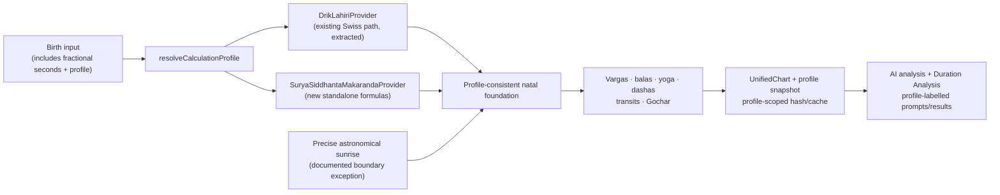

# Design: Sri Surya Siddhanta — Generalized Makaranda Profile

**Status:** Approved design target; no production code has been changed.

## Design Goals

1. Add a standalone SSS/Makaranda computational foundation without regressing the
   existing Swiss/Drik/Lahiri engine.
2. Make every persisted chart reproducible from an explicit, versioned profile.
3. Keep classical calculation logic pure, testable, and independent of app, DB,
   LLM, and JHora runtime code.
4. Deliver the high-risk natal foundation first; thread the selected profile through
   transits, persistence, pipeline, and UI in deliberate subsequent steps.

## Approved Profile

```ts
const SURYA_SIDDHANTA_MAKARANDA_V1 = {
  id: 'surya_siddhanta_makaranda_v1',
  label: 'Sri Surya Siddhanta — Generalized Makaranda',
  astronomy: 'sri_surya_siddhanta_generalized_makaranda',
  ayanamsa: 'sri_surya_siddhanta',
  ayanamsaAdjustmentArcseconds: 0,
  nodeModel: 'mean',
  houseSystem: 'whole_sign',
  sunriseConvention: 'precise_astronomical',
  vimshottari: {
    seed: 'moon_janma_tara',
    division: 'D1',
    firstNakshatra: 'Krittika',
    firstNakshatraLord: 'Sun',
    direction: 'zodiacal_forward',
    yearBasis: 'true_sidereal_solar_revolution',
  },
} as const
```

The profile snapshot stored with a chart includes the above values plus an immutable
implementation version and formula-source identifiers. The snapshot, rather than a
mutable UI label, is the reproduction contract.

## Architecture



### Engine boundaries

```text
engine/compute/
  profiles.ts                         profile IDs, labels, settings snapshots
  astronomy/
    types.ts                          pure provider contracts
    drikLahiri.ts                     extracted existing Swiss calls
    suryaSiddhantaMakaranda.ts        standalone SSS/Makaranda provider
    trueSiderealSolarYear.ts          SSS Sun-root Vimshottari calendar rule
    julianDay.ts                      pure TypeScript civil-time/JD helpers
  planets.ts                          Drik compatibility façade / sunrise boundary only
  index.ts                            resolves profile once; orchestrates derived modules
```

`suryaSiddhantaMakaranda.ts` and its civil-time/JD helpers MUST be pure TypeScript
modules. They may consume a normalized UTC instant and observer coordinates, but
have no native ephemeris (including `swe_julday`), DB, UI, network, or LLM
dependency. They compute the Makaranda day count, mean and corrected places, mean
node, SS ayanamsa, and the profile ascendant according to the validated generalized
formulas. Mean Rahu/Ketu expose retrograde state and a negative uniform
model-derived longitudinal speed.

`drikLahiri.ts` isolates the current `swisseph-v2` setup so all calls that now set
`SE_SIDM_LAHIRI` in `planets.ts`, `transits.ts`, and `gochar.ts` become explicit
provider calls. This is a refactor, not a change in Drik output.

## Core Types

```ts
export type CalculationProfileId =
  | 'drik_lahiri_v1'
  | 'surya_siddhanta_makaranda_v1'

export interface CalculationProfile {
  id: CalculationProfileId
  version: string
  label: string
  astronomy: 'swiss_ephemeris_drik' | 'sri_surya_siddhanta_generalized_makaranda'
  ayanamsa: string
  nodeModel: 'true' | 'mean'
  houseSystem: 'whole_sign'
  sunriseConvention: 'precise_astronomical' | 'jhora_6am'
  vimshottariYearBasis: 'gregorian_mean' | 'true_sidereal_solar_revolution'
}

export interface BirthInstant {
  date: string                 // local civil YYYY-MM-DD
  time: string                 // accepts HH:MM:SS[.sss...]
  timezoneHoursEast: number
  latitude: number
  longitude: number
}

export interface AstronomyProvider {
  readonly profile: CalculationProfile
  getAyanamsa(julianDayUt: number): number
  computeAscendant(julianDayUt: number, latitude: number, longitude: number): Ascendant
  computePlanets(julianDayUt: number, lagnaSignNumber: number): PlanetPosition[]
  longitudeAt(julianDayUt: number, body: Graha): LongitudeSample
}
```

The existing `BirthInput` is extended in a backward-compatible manner: whole-second
inputs remain valid, while fractional seconds are accepted by every route/form/MCP
schema and carried through UTC/JD conversion, identity hashing, and Dasha seed
construction without `Date.UTC` integer-second truncation.

## Calculation Sequence

1. Parse and validate the birth instant, including fractional seconds.
2. Resolve the immutable profile by ID.
3. Convert local civil time to UTC/JD using the supplied offset. Timezone/DST
   resolution remains a caller responsibility exactly as it is today.
4. Ask the selected provider for ayanamsa, Lagna, and graha positions.
5. For SSS/Makaranda, derive Ketu only from mean Rahu + 180°.
6. Run the existing profile-agnostic derived modules on the resulting positions.
7. Compute Vimshottari through a profile-aware calendar strategy.
8. Persist all results together with the profile snapshot.

## Sunrise and Special Lagnas

The product decision retains the current precise-sunrise convention. The design
therefore separates **sunrise instant** from **Sun longitude at sunrise**:

```text
precise sunrise instant       → existing astronomical sunrise helper
SS Sun at that instant         → SuryaSiddhantaMakarandaProvider.longitudeAt()
Drik Sun at that instant       → DrikLahiriProvider.longitudeAt()
```

This prevents a hidden Swiss sidereal-Sun value entering an SSS special-lagna
calculation. `sunriseMode: 'jhora'` remains a legacy Drik presentation option; it
is invalid for SSS. A precise-sunrise calculation failure is surfaced as a typed
error, never as a 06:00 substitution. The selected instant is always the most
recent precise sunrise at or before birth; this includes the preceding civil day's
sunrise for a pre-sunrise birth. The Drik provider's rise search starts from the
birth instant and searches backwards at most 72 hours; absence of a rise in that
window raises `SunriseUnavailableError`. India Bhava Lagna and Hora Lagna are
regression oracles for that rule. On the SSS/precise path, a negative
elapsed-sunrise value is an invariant failure, not a value to normalize by adding
24 hours.

The legacy Drik `jhora` path remains distinct: it explicitly anchors to the most
recent local 06:00 at or before birth. This retains the existing correct treatment
of pre-06:00 births without relying on the SSS invariant or a generic `+24h`
recovery branch.

## Vimshottari Design

`computeVimshottari()` gains a calculation-year strategy argument rather than a
module-global year constant. The SSS strategy receives the SSS provider and maps a
continuous Dasha-year count to UTC by solving an unwrapped SSS-Sun sidereal
longitude target: every 1.0 Dasha year advances the Sun by exactly 360°.

```ts
interface DashaYearStrategy {
  instantAtDashaYears(seed: JulianDayUt, signedDashaYearsFromSeed: number): JulianDayUt
}

// SSS: solve unwrappedSssSunLongitude(t) ===
//      unwrappedSssSunLongitude(seed) + 360 * signedDashaYearsFromSeed
```

The solver brackets a monotonically advancing target, handles 0°/360° rollover,
and converges to sub-second time resolution. It brackets backwards for negative
targets, which are required when deriving the running Mahadasha start before birth.
It never converts Dasha years to days with a constant. Generic Dasha ratios and the
120-year structure remain unchanged; only the mapping between proportional Dasha
years and UTC instants changes.

The JHora configuration is:

```text
Moon / Janma Tara → Rasi (D1) → Krittika allocated to Sun
zodiacal (not antizodiacal), antardasha starts from the running lord and proceeds forward
true sidereal solar years
```

## Persistence and Identity

The eventual Prisma migration adds the following `UnifiedChart` provenance fields:

```text
calculationProfile          String     // stable ID, non-null after backfill
calculationProfileVersion   String     // e.g. "1.0.0"
calculationSettings         Json       // full immutable snapshot
```

The canonical compute identity is intentionally bounded and versioned. It never
hashes the open-ended settings snapshot:

```text
drik_lahiri_v1: exact pre-migration canonical payload (legacy compatibility)
other profile: sha256(canonicalJson({
  hashSchema: 'compute-v2', birthInput, sunriseMode,
  calculationProfile, calculationProfileVersion
}))
```

`canonicalJson` sorts object keys recursively and uses normalized scalar formatting.
All existing computed records backfill to `drik_lahiri_v1` with a snapshot that
documents Lahiri, true nodes, whole-sign houses, and Gregorian mean Vimshottari
years. No existing position, dasha, cache, report, chart, or hash is recomputed;
the Drik legacy-hash branch preserves deduplication for future default-profile
submissions too.

The legacy `Chart` compatibility hash and `Wave1Cache` derive from the canonical
profile-aware chart identity. A profile change is always a separate `UnifiedChart`;
the existing `existingChartId` update flow continues to be for birth-data corrections
within the same profile only.

## API and UI Design

- Compute, Gochar, timeline, applicable Varshaphal, and MCP birth-input routes
  accept `calculationProfile`, initially defaulting to `drik_lahiri_v1`; saved
  chart routes use the chart's profile instead.
- Generated-chart list/detail responses include profile ID and label.
- The generation UI uses a labelled profile selector. Choosing SSS/Makaranda while
  editing a saved Drik chart creates a new independent chart after confirmation.
- Every chart-result surface derives its label from the profile. Components must not
  retain text such as “Sidereal (Lahiri Ayanamsa)” as a universal literal.
- Paste input has `external_unspecified` provenance unless its input contract grows a
  validated declared calculation profile in a separately approved feature.
- Matchmaking rejects a pair whose profile ID or version differs (HTTP 422); it
  does not create a cross-profile compatibility result.
- `ChartInputV1.meta.system` is derived from the profile label/ayanamsa and is no
  longer a global Lahiri literal.

## Transits and Duration Analysis

The initial natal milestone does not expose an SSS chart in a mixed transit view.
Before the SSS profile becomes selectable in the persisted UI, all supported
profile-sensitive compute paths must accept the provider: current transits, degree
Sade Sati, date-ranged Gochar, duration `transitOverlay`, and period scoring.
SSS Varshaphal is explicitly unavailable until its temporal convention is approved.
SSS AD/PD output and Duration Analysis are separately capability-gated until the
provided JHora fractional-boundary fixtures for both levels and both reference
charts have been encoded as passing tests. Before that gate passes, HTTP endpoints return
`422 { code: 'PROFILE_FRACTIONAL_DASHA_UNVALIDATED', feature, calculationProfile }`,
MCP tools return the corresponding structured unsupported result, and UI tabs render
an unavailable state—never an exception or a silently Drik-derived period.

During this gate, `computeVimshottari()` persists an intentionally MD-only SSS
`DashaTree`: every `MahaDasha.antardashas` is `[]`, and
`DashaTree.fractionalDashaStatus` is `'unvalidated'`. The marker is retained by
the mapper and all persistence/retrieval paths. Chart list/detail and natal AI
Analysis remain available, but `chartSummary` omits active AD/PD timing and
states the marker. `get_dasha_tree`, `get_active_dasha`, `/api/timeline`, and
`/api/duration-analysis` check it before calling a slicer, preventing an empty
PD expansion from surfacing as a generic failure.

The analogous initial SSS Chara Dasha and Varshaphal capability state is
`PROFILE_TEMPORAL_CONVENTION_UNRESOLVED`: `/api/compute/varshaphal` responds 422,
`get_chara_dasha` / `compute_varshaphal` MCP tools return a structured unsupported
result, and their UI tabs render unavailable. This makes the intentional deferral
observable without converting it into a route-level 500.

For SSS longitudes, ingress scanning uses repeated pure position evaluations and a
numerical speed/direction estimate. Existing Swiss speed fields remain a Drik-provider
detail; they are not assumed to exist in the SSS formulas. Until an independent SSS
back-test exists, the Duration Analysis scorer returns a visible
`profile_recalibration_pending` status rather than claiming calibrated scores.

## Validation Strategy

`docs/reference/surya-siddhanta-makaranda/` contains the user-supplied source
artifacts and a reviewed transcription; its required two-pass human audit is a
release gate. The two fixtures serve different purposes:

| Fixture | Coverage |
|---|---|
| India | fractional-second birth time, historical epoch, Cancer Moon / Saturn balance, Mars-MD Antardashas, and Mars/Saturn Pratyantardashas |
| Mojo | Taurus Lagna near a sign boundary, Revatī Moon, three retrograde grahas, Venus-MD Antardashas, and Venus/Ketu Pratyantardashas |

Automated tests are split into:

1. Pure formula/unit tests for day count, mean node, ayanamsa, corrections, and
   normalization.
2. India/Mojo natal golden tests for the nine grahas and Lagna. Ayanamsa is
   formula-unit-tested and exposed, but lacks a direct numeric oracle until one is
   supplied.
3. Split Dasha tests: a seeded solar-calendar mapping test for one-second boundary
   precision and lord order, and an end-to-end Moon-to-Dasha test whose tolerance
   is compatible with the natal Moon display tolerance. The latter includes a
   negative test proving the fixed `YEAR_DAYS` mapping fails the India balance.
   The AD/PD fixture tests exercise fractional targets that the integer-year MD
   tests cannot distinguish.
4. Provider-isolation tests that spy on the Drik provider/native bridge to ensure
   an SSS computation does not call it except through the documented sunrise
   instant helper.
5. Profile-identity integration tests for persistence, caches, and UI/API labels.

Screenshot values are displayed to centiseconds of arc, while India stores a
fractional birth second. Tests begin with an absolute one-arcsecond tolerance for
displayed natal values. Because one arcsecond of Moon error can move a 19-year
Vimshottari boundary by roughly 3.5 hours, only a Dasha test seeded with the
accepted Dasha start claims one-second boundary precision; the end-to-end test
initially allows four hours. The differential fixed-day assertion uses a 60-hour
floor: the Gregorian-mean mapping is expected to miss the India balance by about
69.7 hours, so 72 hours would be too tight. A machine-readable JHora export may tighten those
limits later.

The bundle contains JHora AD and PD expansions for both fixtures. Before their
complete displayed boundaries are encoded as passing oracle tests, SSS persists
the explicit MD-only tree described above. That restriction is independent of
(and stricter than) the later score-calibration gate.

## Error Handling

- Unknown profile ID → `ChartValidationError` / HTTP 400; never fall back to Lahiri.
- SSS with `sunriseMode: 'jhora'` → `ChartValidationError` / HTTP 400; a precise
  sunrise failure → typed calculation error; neither falls back to 06:00.
- Unsupported historical range for a profile → typed validation error naming the
  supported range; never use Swiss as an undocumented fallback.
- A fixture mismatch blocks promotion of the SSS profile to UI availability.
- Profile provenance missing from a generated chart blocks profile-sensitive
  analysis/transit requests with a repairable migration error; it does not guess.

## Documentation Impact

The implementation task that first changes behavior updates `Agents.md`, the backend
compute/pipeline skills, `docs/ERD.md`, `docs/HLD.md`, `docs/DFD.md`, `Claude.md`,
`docs/ChartInputV1_schema.md`, the relevant compute documents, and endpoint/MCP
documentation. Until then,
`docs/ROADMAP.md` and this spec truthfully describe the profile as planned.
