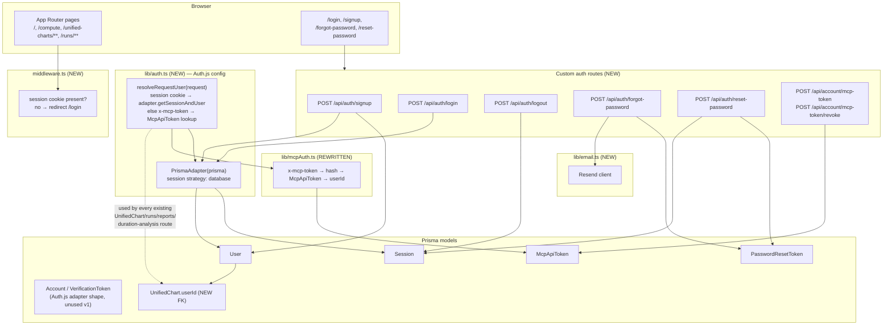

# Design Document: User Management & Chart Ownership

## Overview

This feature adds real user accounts to VedicMojoAI and makes `UnifiedChart`
owned per-user. Today the repo has **zero** auth infrastructure — confirmed by
direct inspection: no `bcrypt`/`argon2`, no `next-auth`/`@auth/*`, no
`middleware.ts`, no rate-limiting library. Everything below is a net-new
addition, not an extension of an existing pattern, though it follows the repo's
existing conventions wherever one exists (Zod validation, the `prisma` singleton
from `lib/db.ts`, custom `Error` subclasses in `lib/errors.ts`, manual
`try/catch` → `NextResponse.json({ error, message }, { status })` in every
route handler).

Per the resolved Decisions in `requirements.md`: **Auth.js (NextAuth) v5** with a
Credentials provider and `@auth/prisma-adapter`, **database-backed sessions**,
**Resend** for email, **bcrypt** for password hashing (NFR-1 allows either;
bcrypt is the more battle-tested choice with no native-binding friction in this
stack), 404-not-403 on cross-account access, open self-serve signup, no email
verification, and the MCP token model from Requirements 7–8 (one non-expiring
token per user, surfaced `lastUsedAt` in the UI).

## Architecture / Affected Modules



## Auth.js integration note (read this before implementing)

> **Implementation correction (post-implementation, see requirements.md
> Decision 1):** the paragraph below was written assuming a Credentials
> provider could simply be *registered but not driven through `signIn()`*.
> That assumption turned out to be wrong: `@auth/core`'s `assertConfig`
> throws `UnsupportedStrategy` on **every** `auth()` call — not just
> `signIn()` — whenever a Credentials provider is present together with
> `session.strategy: 'database'` (its "credentials + database sessions"
> check is a bare config-shape assertion, unconditional on whether
> `signIn()` is ever invoked). This was only caught by live browser testing
> (`GET /api/unified-charts` 401ing on every request). The actual, simpler
> fix: **register zero providers** (`providers: []`). Since credential
> verification and session creation are already fully custom (per the
> bullets below), no code anywhere calls Auth.js's own `signIn()`/`signOut()`
> for credentials, so nothing is lost by not registering the provider at
> all — `providers: []` is not a placeholder, it is the correct final
> config. See `lib/auth.ts`'s file-header comment for the same explanation
> in the code itself.

Auth.js's Credentials provider is **documented as JWT-session-only** when driven
through its own `signIn()`/`signOut()` flow — it has no OAuth "account" to hang a
database session off of automatically. Decision 1 + Decision 2 (Auth.js +
database sessions) are only reconcilable by **not** routing credential auth
through Auth.js's built-in `signIn()` at all, and — per the correction above —
by not registering a Credentials provider in `authConfig.providers` either:

- `lib/auth.ts` configures `PrismaAdapter(prisma)` with `session: { strategy:
  'database' }` and `providers: []`, purely so the adapter's typed functions
  (`createSession`, `getSessionAndUser`, `deleteSession`, `deleteMany`) and the
  standard Auth.js Prisma schema (`Account`, `Session`, `VerificationToken`) are
  available and future-proofed for OAuth (Non-Goal today, but the schema shape
  costs nothing to have in place). Adding an OAuth provider later is additive
  (`providers: [Google(...)]`) and does not reintroduce the credentials/database
  conflict, since that assertion only fires for **Credentials**-type providers.
- The custom routes in Requirements 1–3 (`/api/auth/signup`, `/login`, `/logout`,
  `/forgot-password`, `/reset-password`) **bypass** `signIn()`/`signOut()`
  entirely. They call `prisma`/the adapter's session functions directly:
  `login` verifies the bcrypt hash itself, then calls
  `adapter.createSession({ sessionToken, userId, expires })` and sets the
  session cookie manually (same cookie name/format Auth.js expects —
  `authjs.session-token`, `__Secure-` prefixed in production — so `auth()`
  reads it uniformly elsewhere in the app).
- Reading a session anywhere else (Server Components, route handlers,
  middleware) goes through Auth.js's normal `auth()` helper — only the
  credential-verification and session-creation step is custom.
- This is a known, documented workaround pattern for "Credentials-shaped auth +
  database sessions," not a homegrown auth system — Auth.js's provider
  abstraction (and its Prisma adapter) are still doing all the session
  plumbing; only the sign-in step and the provider registration are custom.

### Self-hosted production deployment (docker-compose): two more env vars required

> **Implementation correction (post-implementation, found via live testing of
> the app's own `docker-compose.yml` stack):** logging in inside the Docker
> container succeeded (`POST /api/auth/login` → 200, `Session` row created),
> but every subsequent authenticated request 401'd — `auth()` couldn't see
> the session that had just been created. Two independent, compounding causes,
> both invisible under `npm run dev` because they only bite when
> `NODE_ENV=production` and there's no Vercel/Cloudflare Pages platform env:
>
> 1. **Cookie `Secure` attribute over plain HTTP.** `lib/auth.ts` used to key
>    `useSecureCookies` off `NODE_ENV === 'production'`. Docker's app service
>    sets `NODE_ENV: production` but is served over plain `http://localhost:3000`
>    (no TLS-terminating proxy) — a browser silently refuses to store a
>    `Secure` cookie over HTTP, so the session cookie the login route set was
>    never actually kept. Fixed by decoupling this from `NODE_ENV` entirely:
>    a new `COOKIE_SECURE` env var (default `false`) now drives it, both for
>    the app's own cookie-setting code (`sessionCookieOptions()`,
>    `SESSION_COOKIE_NAME`) and — critically — for `authConfig.useSecureCookies`
>    passed into `NextAuth()`, since `@auth/core`'s own `defaultCookies()`
>    independently falls back to `url.protocol === 'https:'` whenever
>    `useSecureCookies` is left unset, which would otherwise silently diverge
>    from the cookie name the app's own routes use.
> 2. **`auth()` throwing `UntrustedHost`.** Independent of (1): `@auth/core`
>    only defaults `trustHost` to `true` when `NODE_ENV !== 'production'`
>    (or `AUTH_URL`/`VERCEL`/`CF_PAGES` is set) — none of which apply to a
>    self-hosted docker-compose container. Every `auth()` call therefore threw
>    `UntrustedHost` and resolved no session at all, independent of whether
>    the cookie was even present. Fixed with a new `AUTH_TRUST_HOST=true` env
>    var, set in `docker-compose.yml`'s `app.environment` — safe here because
>    this is a single container with no reverse proxy in front, so Docker's
>    forwarded `Host` header is genuine, not attacker-controlled.
>
> Both env vars are documented in `.env.example`. Anyone running this app in
> production **without** docker-compose (bare `next build && next start`
> behind their own reverse proxy) must set both explicitly for their topology
> (`COOKIE_SECURE=true` once real TLS terminates in front of the app;
> `AUTH_TRUST_HOST=true`, or a proxy-aware alternative, if not on Vercel/CF
> Pages).

## Data Models

```prisma
model User {
  id           String    @id @default(uuid())
  email        String    @unique
  passwordHash String
  name         String?
  createdAt    DateTime  @default(now()) @db.Timestamptz
  updatedAt    DateTime  @updatedAt @db.Timestamptz

  accounts            Account[]
  sessions            Session[]
  passwordResetTokens PasswordResetToken[]
  mcpApiTokens        McpApiToken[]
  unifiedCharts       UnifiedChart[]

  @@map("user")
}

// Auth.js PrismaAdapter standard shape — Account/VerificationToken are unused
// in v1 (no OAuth providers) but kept so the adapter works as documented and
// OAuth can be added later (still a Non-Goal) without a schema migration.
model Account {
  id                String  @id @default(uuid())
  userId            String
  user              User    @relation(fields: [userId], references: [id], onDelete: Cascade)
  type              String
  provider          String
  providerAccountId String
  refresh_token     String?
  access_token      String?
  expires_at        Int?
  token_type        String?
  scope             String?
  id_token          String?
  session_state     String?

  @@unique([provider, providerAccountId])
  @@map("account")
}

model Session {
  id           String   @id @default(uuid())
  sessionToken String   @unique
  userId       String
  user         User     @relation(fields: [userId], references: [id], onDelete: Cascade)
  expires      DateTime @db.Timestamptz

  @@index([userId])
  @@map("session")
}

model VerificationToken {
  identifier String
  token      String   @unique
  expires    DateTime @db.Timestamptz

  @@unique([identifier, token])
  @@map("verification_token")
}

model PasswordResetToken {
  id        String    @id @default(uuid())
  userId    String
  user      User      @relation(fields: [userId], references: [id], onDelete: Cascade)
  tokenHash String    @unique
  expiresAt DateTime  @db.Timestamptz
  usedAt    DateTime? @db.Timestamptz
  createdAt DateTime  @default(now()) @db.Timestamptz

  @@index([userId])
  @@map("password_reset_token")
}

model McpApiToken {
  id         String    @id @default(uuid())
  userId     String
  user       User      @relation(fields: [userId], references: [id], onDelete: Cascade)
  tokenHash  String    @unique
  label      String?
  lastUsedAt DateTime? @db.Timestamptz
  revokedAt  DateTime? @db.Timestamptz
  createdAt  DateTime  @default(now()) @db.Timestamptz

  @@index([userId])
  @@map("mcp_api_token")
}
```

`UnifiedChart` gains (migration step 1, nullable):
```prisma
  userId String?
  user   User?   @relation(fields: [userId], references: [id])
```
then (migration step 2, after backfill): `userId String` / `user User @relation(...)`
— matching Requirement 6.2's additive-then-tighten sequencing.

## Route Design

### `lib/auth.ts` (NEW) — Auth.js config + the ownership helper

```typescript
export const authConfig = {
  adapter: PrismaAdapter(prisma),
  session: { strategy: 'database' },
  providers: [], // NOT Credentials — see "Auth.js integration note" above
}
export const { auth } = NextAuth(authConfig)

export async function resolveRequestUser(request: NextRequest): Promise<string | null> {
  const session = await auth()
  if (session?.user?.id) return session.user.id
  return resolveMcpUser(request) // lib/mcpAuth.ts, Requirement 8
}
```

Every route below replaces ad hoc access with `const userId = await
resolveRequestUser(request); if (!userId) return unauthorized()`.

### Requirement 1 — `POST /api/auth/signup`
Zod schema (`email`, `password` min-8, optional `name`) → `safeParse` (repo's
existing inline-validation shape). Lower-case the email before the uniqueness
check. `bcrypt.hash(password, 12)`. `prisma.user.create(...)`. On success, call
`adapter.createSession` + set cookie (see integration note), return `201`.
Duplicate email → `409` with the repo's `{ error, message }` shape (never
`ChartValidationError`-style field errors here — Requirement 1.2 wants a clear,
specific "already registered" message, unlike login/forgot-password which stay
generic).

### Requirement 2 — `POST /api/auth/login`, `POST /api/auth/logout`
`login`: look up by lower-cased email, `bcrypt.compare`; **on any failure
(unknown email OR wrong password) return the identical generic 401** — the
specific reason is never branched on in the response, only in a `console.error`
for debugging. Rate-limited (see Rate Limiting below). On success: create a
`Session` row + set cookie exactly as signup does.
`logout`: read the session cookie, `prisma.session.delete({ where: {
sessionToken } })`, clear the cookie.

### Requirement 3 — `POST /api/auth/forgot-password`, `POST /api/auth/reset-password`
`forgot-password`: always responds with the same generic message. Only when the
email resolves to a real `User` does it: generate a random token, store
`sha256(token)` + a ~45-minute `expiresAt` in `PasswordResetToken`, and call
`lib/email.ts`'s `sendPasswordResetEmail(user.email, token)` (Resend).
`reset-password`: hash the incoming token, look up an unexpired/unused
`PasswordResetToken`, verify, `bcrypt.hash` the new password onto `User`, set
`usedAt`, and — satisfying Requirement 3.5 — `prisma.session.deleteMany({
where: { userId } })` to kill every other active session in the same
transaction as the password update.

### Requirement 5 — ownership enforcement on existing routes
Every currently-open `UnifiedChart`-adjacent route gets the same three-line
change: resolve `userId`, 401 if none, and either filter (`GET` list) or verify
`unifiedChart.userId === userId` before proceeding (404 on mismatch, per
Decision 5). Concretely:
- `app/api/unified-charts/route.ts` (`GET`) — add `userId` to the existing
  Prisma `where` object it already builds from query params.
- `app/api/unified-charts/from-compute/route.ts`,
  `app/api/unified-charts/from-paste/route.ts` — stamp `userId` on create,
  sourced from `resolveRequestUser`, never from the request body.
- `app/api/unified-charts/[id]/route.ts` (`GET`/`PATCH`/`DELETE`) — add the
  ownership check before the existing `findUnique`/mutation logic (this file
  already does a `findUnique`-before-mutate for `PATCH`; the ownership check
  slots into that same existence check).
- `app/api/unified-charts/[id]/analyze/route.ts` — check ownership on the
  resolved `UnifiedChart` before starting a pipeline run.
- `app/api/runs/[id]/route.ts`, `app/api/runs/[id]/report-content/route.ts` —
  resolve the run's `unifiedChart` via `PipelineRun.unifiedChartId`, check
  ownership.
- `app/api/reports/route.ts` — filter by owned `unifiedChartId`s.
- `app/api/duration-analysis/route.ts`, `app/api/duration-analysis/[id]/route.ts`
  — same pattern via `DurationAnalysis.unifiedChartId`.
- `app/api/timeline/route.ts`, `app/api/knowledge/route.ts`,
  `app/api/knowledge/[type]/[name]/route.ts` — already call `requireMcpToken`;
  swap that call for `resolveRequestUser` so session-cookie browser callers and
  MCP-token callers both work.

### `middleware.ts` (NEW)
Guards **UI page routes only** (`/`, `/compute/**`, `/unified-charts/**`,
`/runs/**`, `/duration-analysis/**`, `/duration-computation/**`) — checks for
the session cookie's presence (cheap, no DB hit in middleware per Next.js edge
constraints) and redirects to `/login` if absent; the real ownership/session
validity check still happens in each route handler via `resolveRequestUser`,
consistent with how `lib/mcpAuth.ts` was already per-route rather than
per-middleware. API routes are **not** matched by middleware — they 401
themselves, matching Requirement 2.5's UI-redirect-vs-API-401 split.

### Requirement 6 — `prisma/backfill-owner.ts` (NEW)
Idempotent script, run once post-deploy: takes an email via CLI arg or env var,
`upsert`s that one `User` row, then `updateMany` on every `UnifiedChart` with
`userId: null` to that user's id. Safe to re-run (a second run finds no
`userId: null` rows left). Same spirit as the existing `db:migrate-saved`
script.

### Requirements 7–8 — MCP token issuance + `lib/mcpAuth.ts` rewrite
`app/api/account/mcp-token/route.ts` (`POST`, session-only — `resolveRequestUser`
must resolve via the session branch, an MCP token can never mint another MCP
token): `crypto.randomBytes(32)`, `sha256` for `tokenHash`, revoke any existing
non-revoked token for that user in the same transaction, return the raw value
once. A sibling `POST .../revoke` sets `revokedAt`. `lib/mcpAuth.ts` is
rewritten from a boolean gate to an identity resolver:

```typescript
export async function resolveMcpUser(request: NextRequest): Promise<string | null> {
  const provided = request.headers.get('x-mcp-token')?.trim()
  if (provided) {
    const tokenHash = sha256(provided)
    const token = await prisma.mcpApiToken.findFirst({
      where: { tokenHash, revokedAt: null },
    })
    if (token) {
      prisma.mcpApiToken.update({ where: { id: token.id }, data: { lastUsedAt: new Date() } }).catch(() => {})
      return token.userId
    }
    return null // invalid/revoked token present ⇒ never fall through to dev bypass
  }
  if (process.env.NODE_ENV !== 'production' && process.env.MCP_DEV_USER_EMAIL) {
    const devUser = await prisma.user.findUnique({ where: { email: process.env.MCP_DEV_USER_EMAIL } })
    return devUser?.id ?? null
  }
  return null
}
```

This directly implements Requirement 8.8/8.9: no token header + non-production +
configured dev user ⇒ named dev identity; anything else unresolved ⇒ `null` ⇒
caller 401s. **No changes to `mcp/src/http.ts` or `mcp/src/tools.ts`** — MCP still
sends whatever value lives in its local `MCP_TOKEN` env var as `x-mcp-token`;
that value now needs to be a per-user token generated via
`POST /api/account/mcp-token` instead of the old shared secret. `mcp/README.md`
gets a documentation update on how to obtain that token (log in on the web app →
account settings → "Generate MCP Token" → copy into the MCP server's `.env`).

## Error Handling

Follows the existing `lib/errors.ts` shape — no new centralized wrapper, since
none exists today. New subclasses: `EmailAlreadyRegisteredError`,
`InvalidResetTokenError`. Critically, **login and forgot-password never let the
specific error type reach the response** — both routes catch broadly and always
emit the one generic message (NFR-2); the specific error is only used for
server-side logging (`console.error`, matching existing routes' pattern).

## Rate Limiting

No rate-limiting library exists in the repo (confirmed: no Upstash, nothing in
`lib/`). Given this app's actual scale (NFR-1 of the base spec: ~10
reports/month, single-instance deployment), a minimal `lib/rateLimit.ts` — an
in-memory sliding-window counter keyed by `(route, ip-or-email)` — is sufficient
for v1 and needs no new infrastructure dependency. **Known limitation, stated
explicitly rather than silently accepted:** this doesn't survive a process
restart and doesn't work across multiple instances; if the app is ever deployed
with more than one replica, this needs to move to a shared store (Redis/Upstash,
or a DB-backed counter table). Flagged for `tasks.md`, not solved further here.

## Testing Strategy

Following the repo's Vitest convention (`tests/*.test.ts`):
- **Password hashing round-trip**: hash → compare succeeds/fails correctly.
- **Reset-token lifecycle**: generate → hash stored not raw → valid use succeeds
  once → replay fails → expired fails.
- **`resolveRequestUser` unit tests**: session present → resolves; no session,
  valid MCP token → resolves + updates `lastUsedAt`; no session, revoked MCP
  token → null; no session, no token, dev env + `MCP_DEV_USER_EMAIL` → resolves;
  same but production → null.
- **Ownership regression tests** on the routes listed in Requirement 5: user A
  cannot read/mutate/delete user B's `UnifiedChart` (expect `404`), can their
  own (expect success).
- **`tests/mcp-cost-guard.test.ts`**: no change required — re-run as-is to
  confirm it still passes, since this design adds zero new `mcp/src` call
  sites (Requirement 8.7).
- **Migration/backfill test**: running `backfill-owner.ts` twice is a no-op the
  second time (idempotency, Requirement 6.3).

## Documentation

Updated in the same change, per `Claude.md`'s documentation-maintenance table:
`docs/ERD.md` (all six new models + `UnifiedChart.userId`), `docs/HLD.md` (auth
layer, middleware, `resolveRequestUser` as a cross-cutting concern),
`.kiro/skills/database-prisma.md` (new models follow existing conventions —
confirms rather than changes the skill), `.env.example`
(`RESEND_API_KEY`, `AUTH_SECRET`, `MCP_DEV_USER_EMAIL`), `mcp/README.md` (token
acquisition flow), and `docs/USER_STORIES_v1.md` §1.5/§1.3 per NFR-6 (the
"no auth" non-goal is now superseded).
