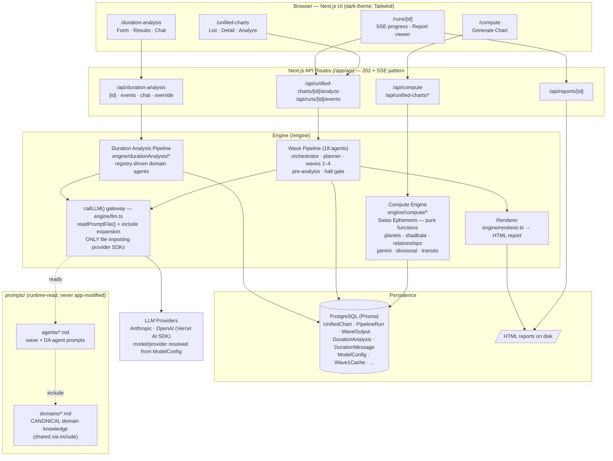
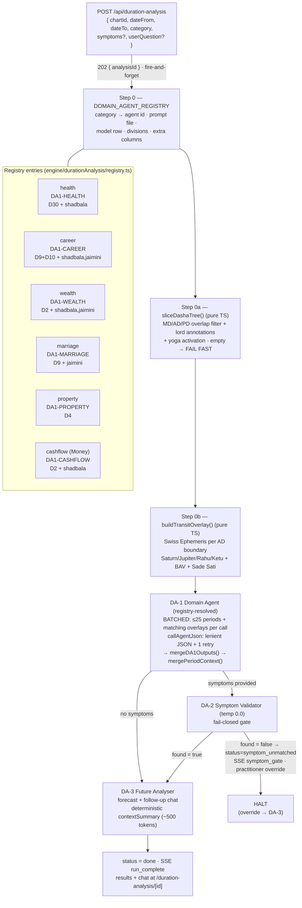
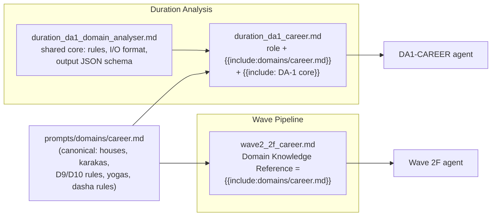

# VedicMojoAI — Architecture Diagram

**Version:** 1.0
**Last updated:** 2026-07-11

Standalone architectural view of the whole system. Detail lives in
[HLD.md](HLD.md) (components), [DFD.md](DFD.md) (data flows), [ERD.md](ERD.md)
(data model), and [Agents.md](../Agents.md) (agent catalogue). Update this
diagram alongside those documents (see `Agents.md → Documentation Maintenance`).

Diagrams are Mermaid — rendered natively by GitHub and VS Code.

---

## 1. System Overview

---

## 2. Duration Analysis — Domain-Agent Pipeline

One registry entry per life domain selects the agent, its prompt, its model row,
and exactly the chart data it needs.

---

## 3. Prompt Composition — Single Source of Domain Knowledge

`prompts/domains/*.md` is the only place domain astrology rules live. Both
pipelines include the same fragment, expanded by `readPromptFile()` at load time.

Same pattern for health, wealth, marriage, property, and cashflow (2C/2D/2E/2G
on the wave side; cashflow is duration-only, mirroring Wave 3A's liquidity focus).

---

## 4. Key Architectural Rules

| Rule | Where enforced |
|---|---|
| All model calls go through `callLLM()`; no provider SDK imports elsewhere | `engine/llm.ts` |
| Duration LLM calls additionally go through `callAgentJson()` (lenient parse + 1 retry) | `engine/durationAnalysis/agentJson.ts` |
| Models/providers resolved at runtime from `model_config` (one row per agent) | `prisma/seed.ts`, orchestrators |
| Compute modules are pure functions — no DB, no side effects | `engine/compute/*`, `engine/durationAnalysis/{slicer,transitOverlay,extractor,registry}` |
| Long operations return 202 immediately; progress over SSE | all pipeline routes |
| Per-category logic lives ONLY in `DOMAIN_AGENT_REGISTRY` | `engine/durationAnalysis/registry.ts` |
| Domain astrology lives ONLY in `prompts/domains/` | prompt include composition |
